# BDD Loop Workflow

AquaTrack follows a strict **Behavior-Driven Development (BDD)** loop ensuring all features are defined, tested, and implemented correctly.

## The Three Phases

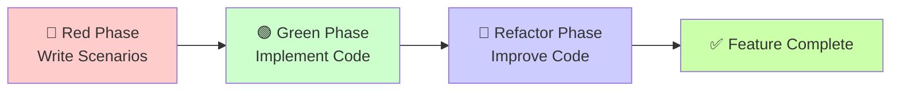

## Complete BDD Loop Flow

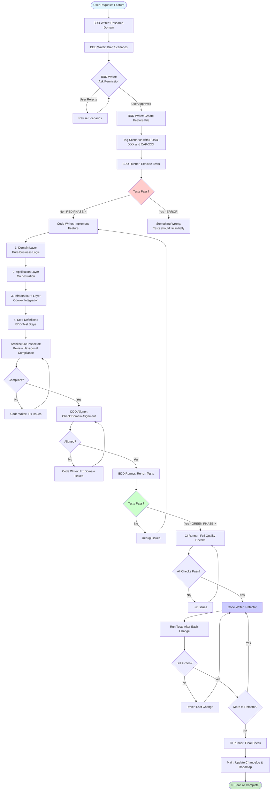

## Phase 1: Red Phase - Write Scenarios

**Goal**: Define expected behavior BEFORE writing any code

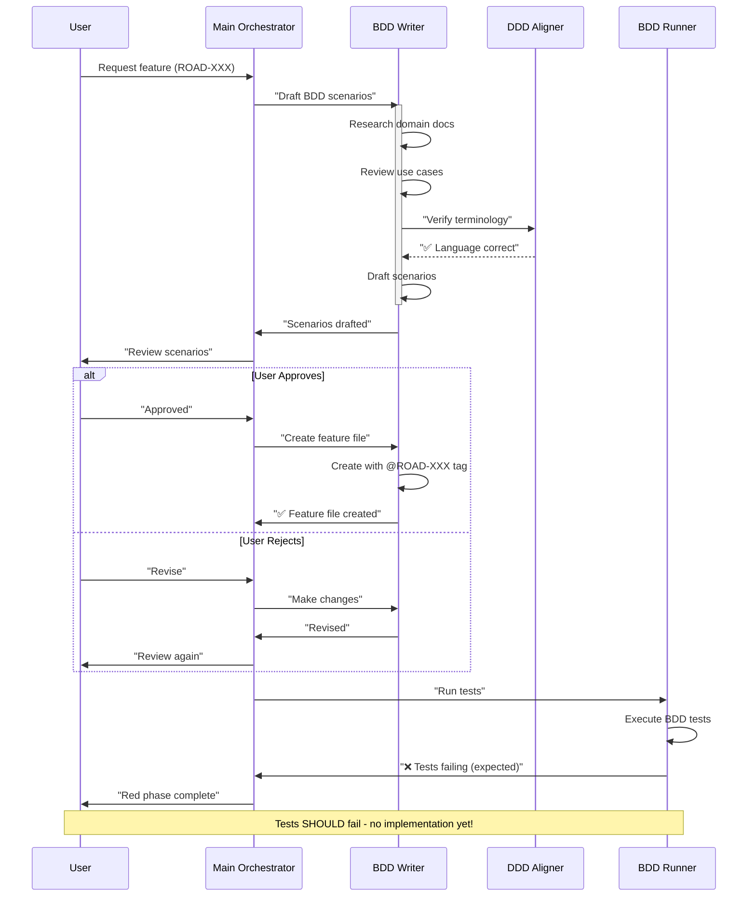

### Red Phase Checklist

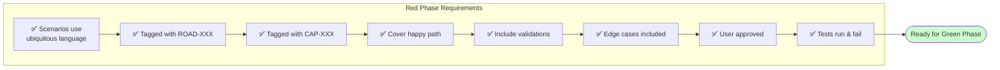

## Phase 2: Green Phase - Implement Feature

**Goal**: Make tests pass by implementing the feature correctly

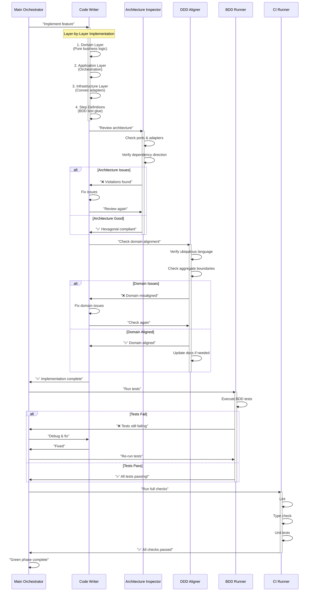

### Implementation Layers

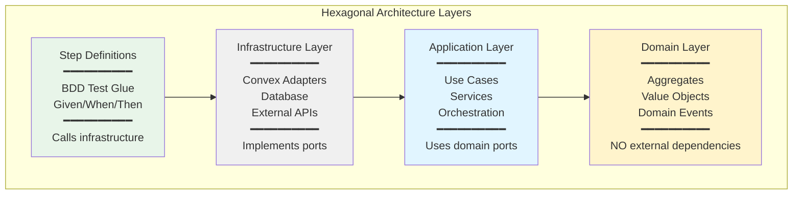

### Green Phase Checklist

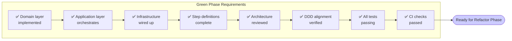

## Phase 3: Refactor Phase - Improve Code

**Goal**: Clean up code while keeping tests green

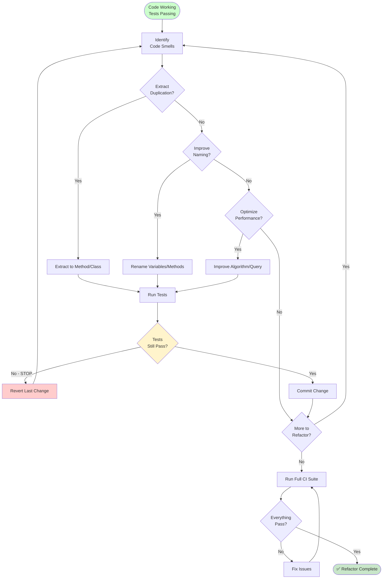

### Refactoring Examples

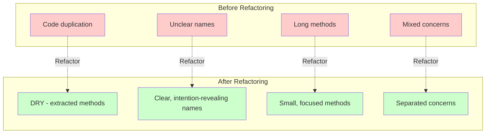

### Refactor Phase Checklist

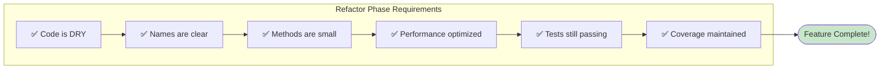

## Complete Example: Implementing ROAD-005 (Bot Authentication)

### Timeline Visualization

```mermaid
gantt
    title Bot Authentication Implementation (ROAD-005)
    dateFormat HH:mm
    axisFormat %H:%M

    section Red Phase
    Research domain docs       :00:00, 5m
    Draft scenarios           :00:05, 5m
    Get user approval         :00:10, 2m
    Create feature file       :00:12, 3m
    Run tests (fail)          :00:15, 2m

    section Green Phase
    Implement domain layer    :00:17, 8m
    Implement app layer       :00:25, 5m
    Implement infrastructure  :00:30, 7m
    Implement step defs       :00:37, 5m
    Architecture review       :00:42, 3m
    DDD alignment check       :00:45, 3m
    Run tests (pass)          :00:48, 2m

    section Refactor Phase
    Extract duplications      :00:50, 5m
    Improve naming            :00:55, 3m
    Optimize queries          :00:58, 4m
    Final CI check            :01:02, 3m
```

**Total Time**: ~65 minutes from start to completion

### Feature Flow with Agents

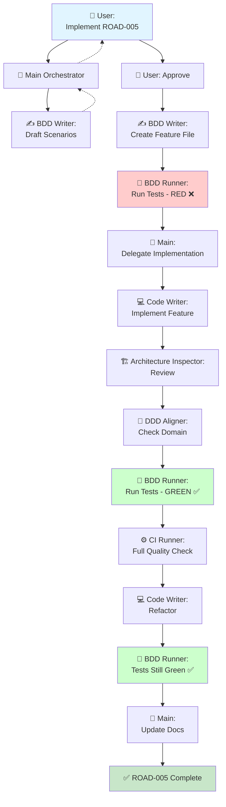

## Key Principles

### 1. Tests Drive Implementation

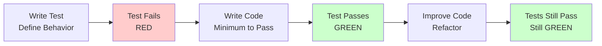

### 2. Never Skip Phases

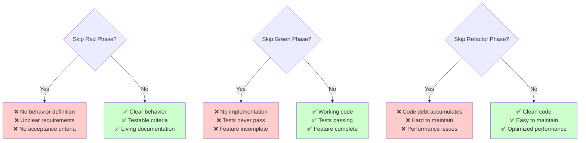

### 3. Always Keep Tests Green

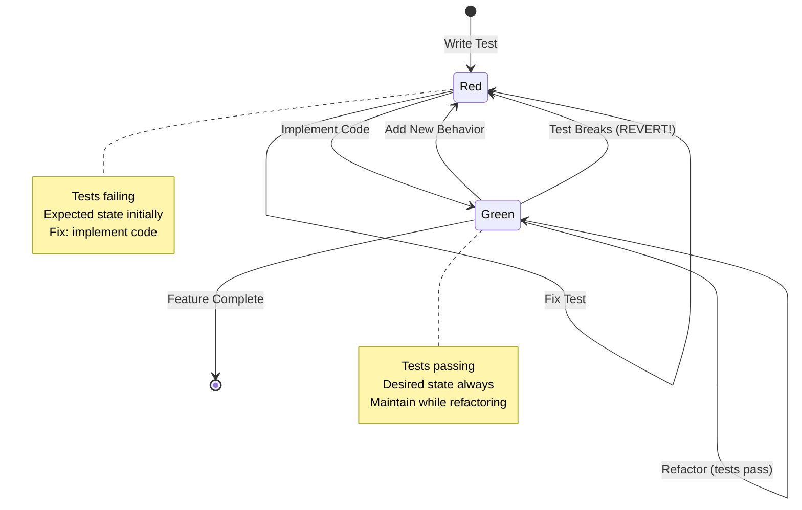

## Running the BDD Loop

### Commands by Phase

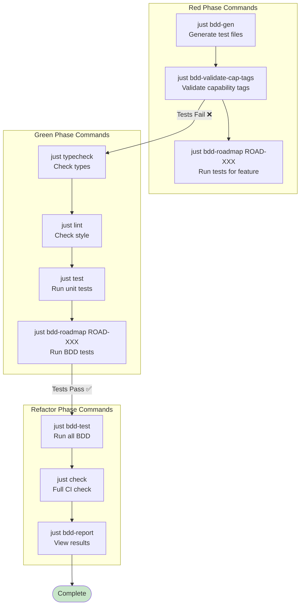

## Success Metrics

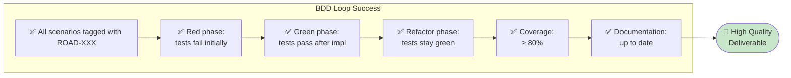

## Next Steps

- [Learn about Agent Coordination](./coordination)
- [Read Agent Workflows](./workflows)
- [View Quick Reference](./quick-reference)

---

**Related**: [Multi-Agent Overview](./overview) • [DDD Documentation](../ddd/domain-overview)
