# Agent Coordination Patterns

How agents work together to deliver features efficiently through structured communication and delegation patterns.

## Coordination Architecture

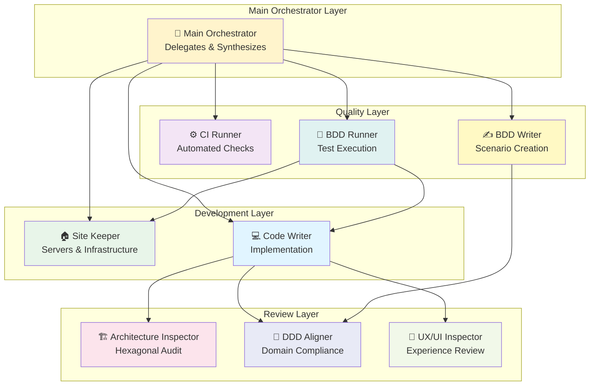

## Delegation Patterns

### Pattern 1: Simple Request-Response

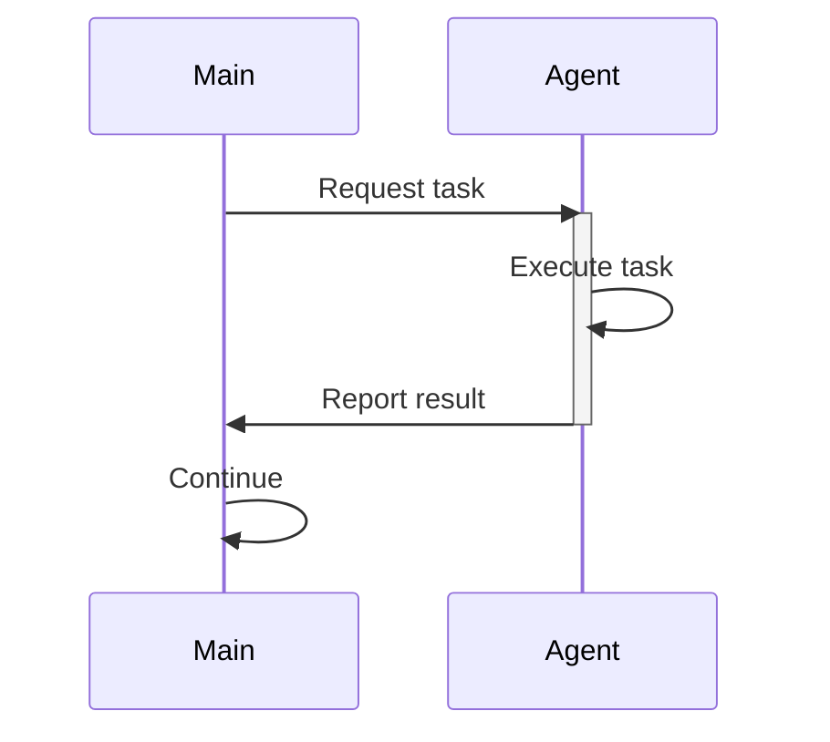

**Example**:
```
Main → Site Keeper: "Ensure servers are running"
Site Keeper: [Checks, fixes, starts if needed]
Site Keeper → Main: "✅ Servers up (Next.js:3001, Convex:connected)"
```

### Pattern 2: Delegated Review

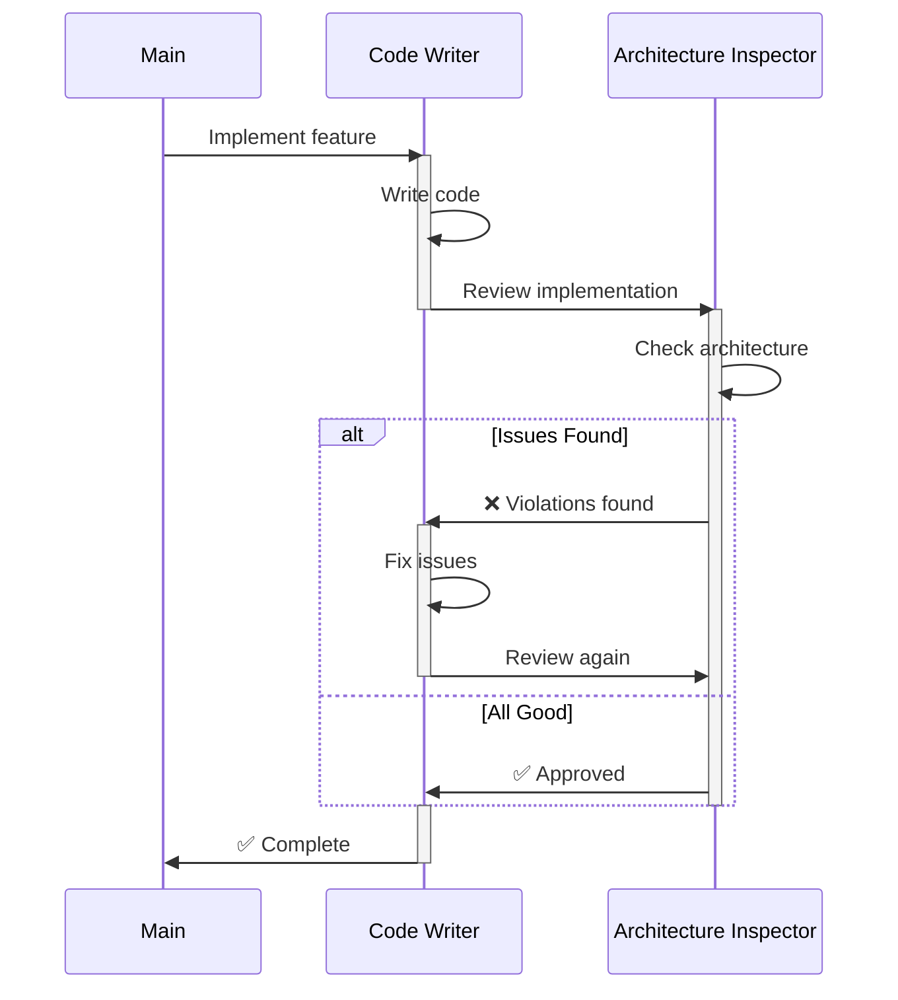

### Pattern 3: Parallel Execution

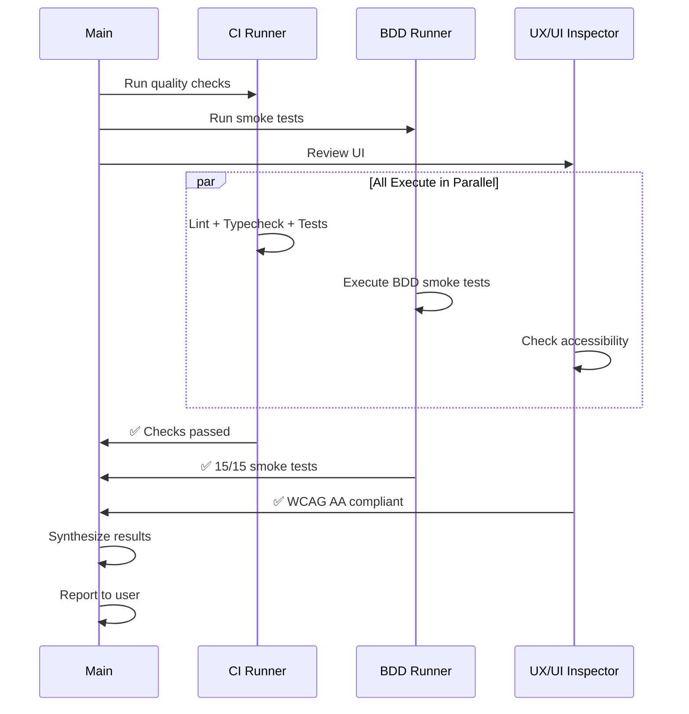

### Pattern 4: Escalation Chain

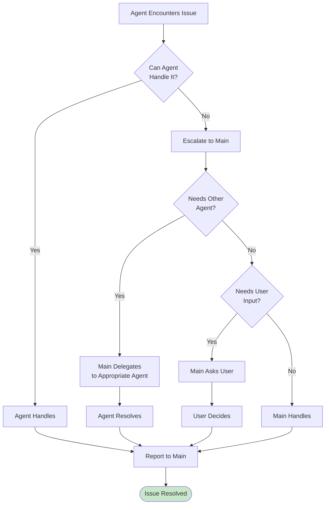

## Complete Feature Workflow

### Full Implementation Flow with All Agents

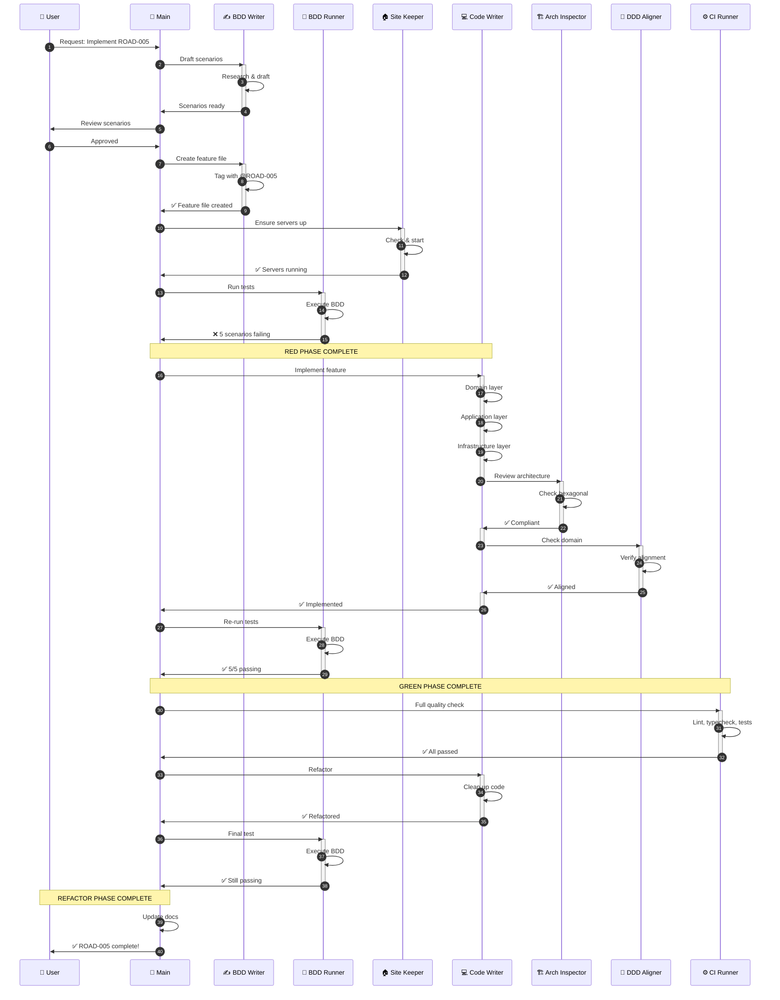

## Coordination Scenarios

### Scenario 1: Test Failure Triage

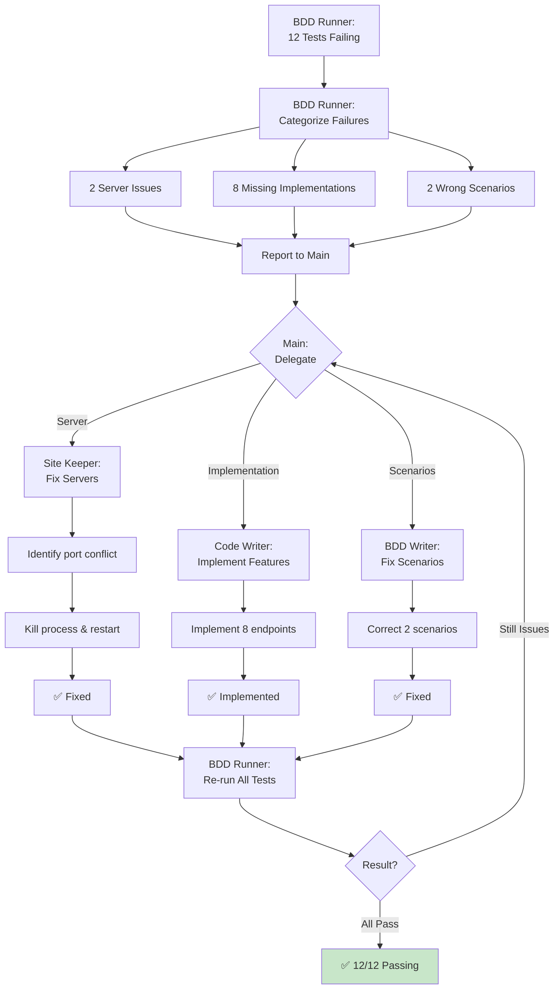

### Scenario 2: UI Feature with Reviews

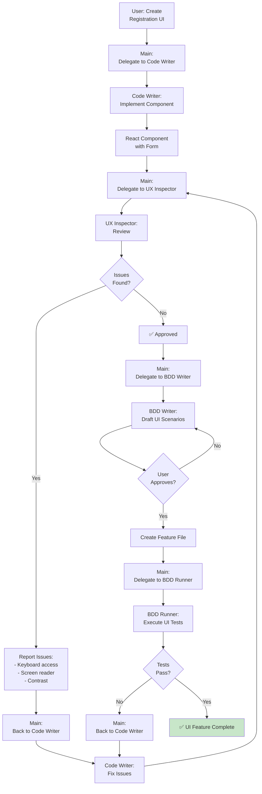

### Scenario 3: Parallel Quality Checks

```mermaid
gantt
    title Parallel vs Sequential Quality Checks
    dateFormat mm:ss

    section Sequential (Slow)
    CI: Lint+Type+Test  :00:00, 05:00
    BDD: Smoke Tests    :05:00, 03:00
    UX: Accessibility   :08:00, 02:00

    section Parallel (Fast)
    CI: Lint+Type+Test  :10:00, 05:00
    BDD: Smoke Tests    :10:00, 03:00
    UX: Accessibility   :10:00, 02:00
```

Sequential: **10 minutes total**
Parallel: **5 minutes total** (2x faster!)

## Communication Protocols

### Status Reporting Format

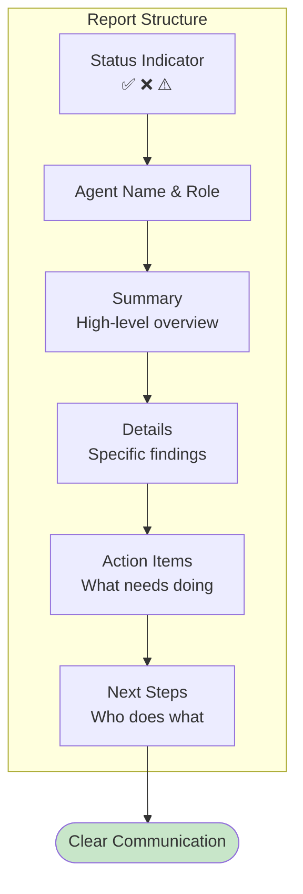

### Example: Good Report

```
✅ Architecture Inspector Report: Hexagonal Compliance Verified

Summary:
  Reviewed bot authentication implementation.
  All hexagonal patterns correctly applied.

Details:
  ✅ Domain layer: No external dependencies
  ✅ Ports defined: BotRepository, EventPublisher
  ✅ Adapters implement ports correctly
  ✅ Dependency arrows point inward

Files Reviewed:
  - src/supplier-identity/domain/SupplierAccount.ts:1-85
  - src/supplier-identity/domain/ports/BotRepository.ts:1-12
  - convex/botIdentity/mutations.ts:42-67

Action Items:
  None - implementation is clean

Next Steps:
  1. Code Writer proceeds to DDD alignment check
  2. Then ready for testing
```

### Communication Flow

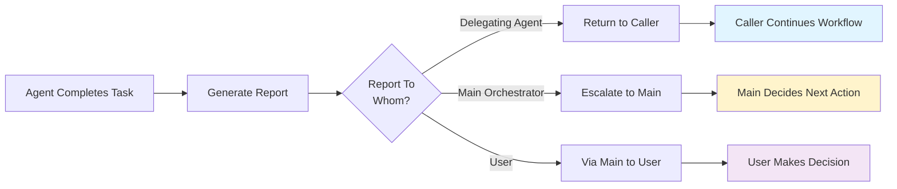

## Conflict Resolution

### Handling Agent Disagreements

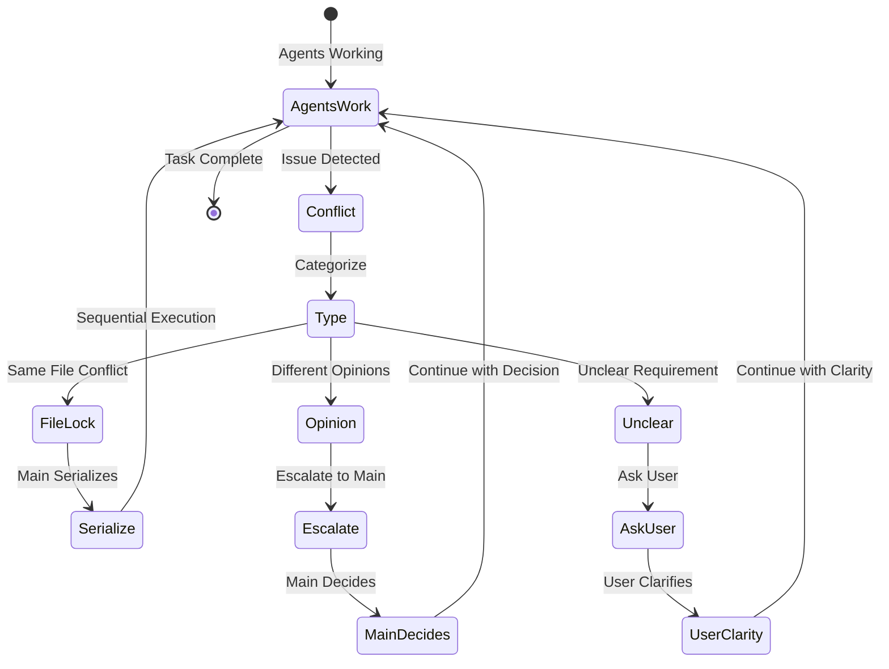

### Example Conflicts

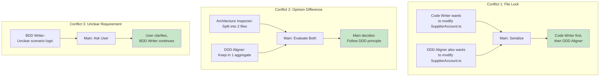

## Coordination Best Practices

### Do's and Don'ts

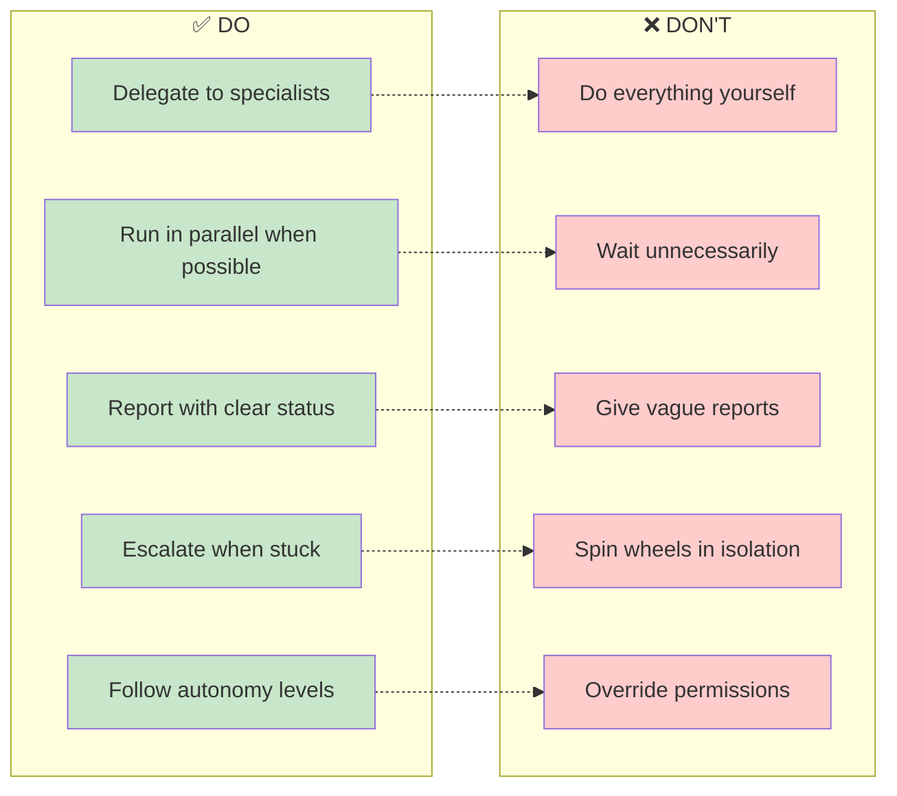

## Success Metrics

### Effective Coordination

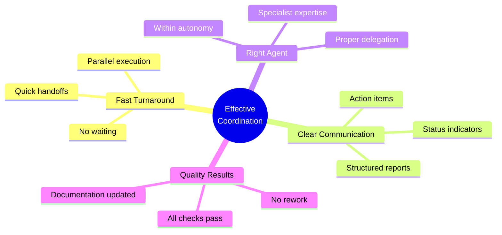

## Next Steps

- [Understand the BDD Loop](./bdd-loop)
- [Read Workflow Examples](./workflows)
- [View Quick Reference](./quick-reference)

---

**Related**: [Multi-Agent Overview](./overview) • [Just Commands](./quick-reference)
