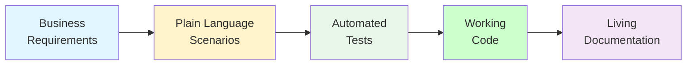
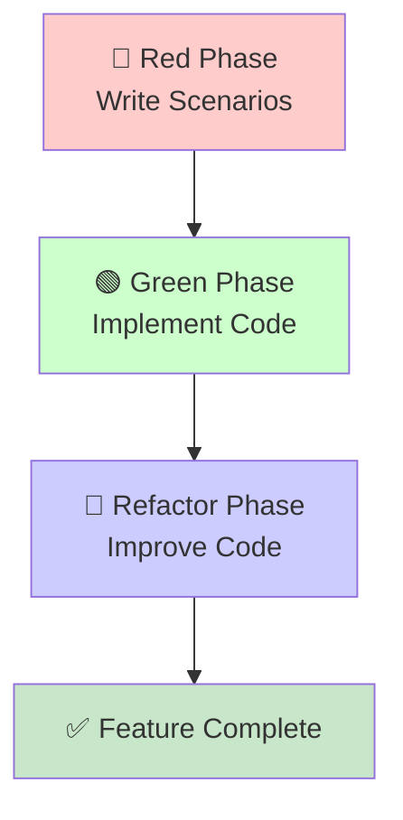
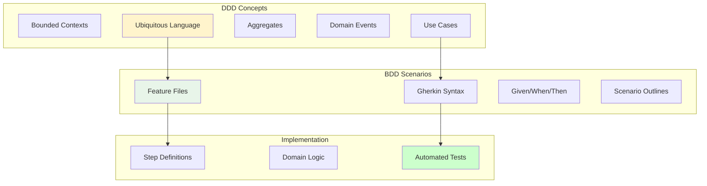
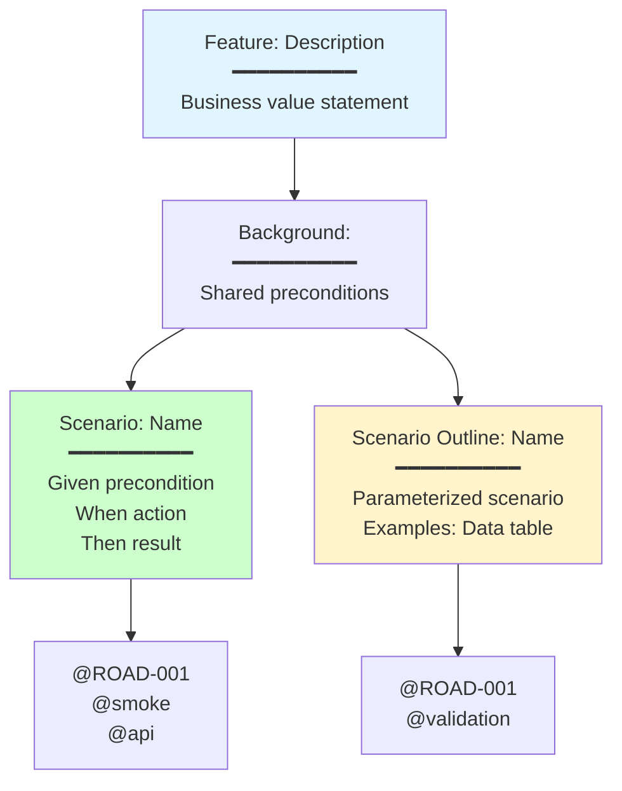
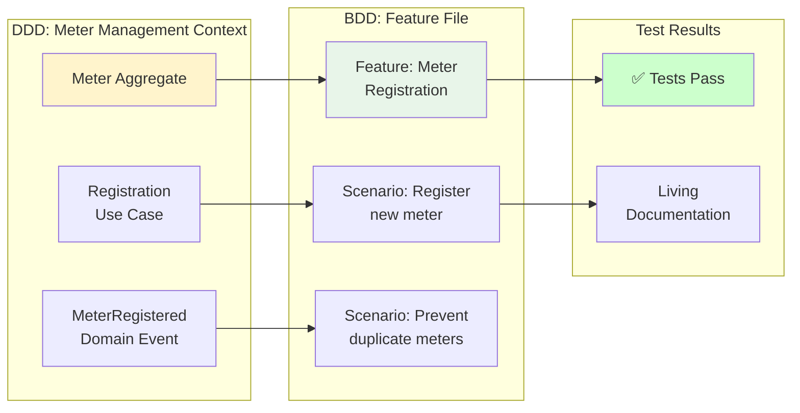
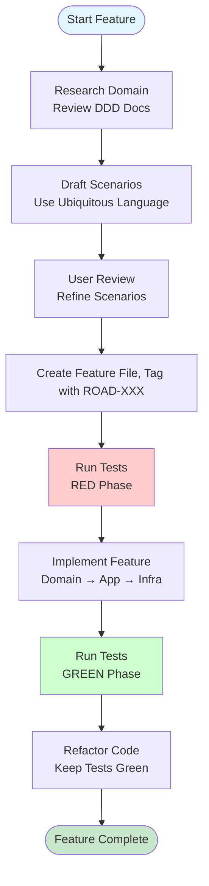

# Behavior-Driven Development (BDD) Overview

AquaTrack uses **Behavior-Driven Development (BDD)** to ensure all features are defined, tested, and implemented correctly. BDD bridges the gap between business requirements and technical implementation.

## What is BDD?

BDD is an agile software development technique that encourages collaboration among developers, QA, and non-technical participants in a software project. It extends Test-Driven Development (TDD) by writing test cases in a natural language that non-programmers can read.



## The BDD Cycle

PrimaDemo follows a strict **Red-Green-Refactor** cycle:

### 1. Red Phase - Write Scenarios
Define expected behavior **before** writing any code. Tests should fail initially.

### 2. Green Phase - Implement Feature
Make tests pass by implementing the feature correctly.

### 3. Refactor Phase - Improve Code
Clean up code while keeping tests green.



## BDD at AquaTrack

### Our Approach

We integrate BDD with **Domain-Driven Design (DDD)** to ensure our tests reflect real business behavior:



### Key Benefits

1. **Shared Understanding** - Business and technical teams speak the same language
2. **Living Documentation** - Feature files document system behavior
3. **Regression Safety** - Automated tests catch breaking changes
4. **DDD Alignment** - Tests use domain terminology from ubiquitous language
5. **Quality Assurance** - Every feature has acceptance criteria

## Gherkin: The Language of BDD

We use **Gherkin** syntax to write scenarios in plain English:

```gherkin
Feature: Meter Registration
  As a customer
  I want to register my water meter
  So that I can track consumption

  Scenario: Successfully register a new meter
    Given a customer with a valid address
    When they submit registration with meter number "WM-001"
    Then a new meter should be created
    And the meter should have a unique ID
    And the registration timestamp should be recorded
```

### Gherkin Structure



## Feature Organization

Our BDD scenarios are organized by domain area:

```
stack-tests/features/
├── api/
│   ├── meter-management/      # Meter registration, readings, alerts
│   ├── customer-management/   # Customer enrollment, profiles, billing
│   ├── water-supply/          # Supply scheduling, pressure management
│   └── billing-settlement/    # Meter verification, billing, payments
├── ui/
│   ├── meter-registration-ui/ # UI flows for meter registration
│   ├── dashboard-ui/          # Dashboard and reporting UI
│   └── billing-management-ui/ # Billing UI
└── hybrid/
    └── end-to-end-meter-flow/ # Full user journeys
```

## Connecting DDD and BDD

BDD scenarios directly map to DDD concepts:

| DDD Concept | BDD Application |
|-------------|-----------------|
| **Bounded Context** | Feature file organization by domain area |
| **Ubiquitous Language** | Scenario vocabulary matches domain terms |
| **Aggregates** | Scenarios test aggregate behavior and invariants |
| **Domain Events** | Scenarios verify events are published |
| **Use Cases** | Each use case has corresponding feature file |

### AquaTrack Domain Example

Water infrastructure systems include meters, customers, readings, and billing—each representing key domain concepts.

### Example Mapping



## Running BDD Tests

### Quick Commands

```bash
# Install dependencies
just bdd-install

# Run all BDD tests
just bdd-test

# Run tests for specific roadmap item
just bdd-roadmap ROAD-001

# Run with visible browser (UI tests)
just bdd-headed

# Generate test report
just bdd-report
```

### Test Categories

| Command | Description |
|---------|-------------|
| `just bdd-api` | API tests only |
| `just bdd-ui` | UI tests only |
| `just bdd-hybrid` | E2E tests only |
| `just bdd-tag @smoke` | Tests tagged with @smoke |
| `just bdd-gen` | Generate step definitions |

## The Complete Workflow



## Capability Testing

BDD tests are tagged with capability identifiers to ensure coverage:

```gherkin
@CAP-001 @CAP-002
Feature: Bot Registration
  # Tests authentication (CAP-001) and audit logging (CAP-002) capabilities
```

See [Capability Tags](./capability-tags) for full tagging guide.

## Next Steps

- [Learn Gherkin Syntax](./gherkin-syntax) - Full Gherkin reference guide
- [View Feature Index](./feature-index) - Browse all feature files
- [DDD-BDD Mapping](./ddd-bdd-mapping) - See how domain concepts map to tests
- [Capability Tags](./capability-tags) - Test tagging by system capability
- [BDD Loop Workflow](../agents/bdd-loop) - Detailed development workflow
- [Agent Coordination](../agents/coordination) - How agents automate BDD

---

**Related**: [DDD Overview](../ddd/domain-overview) • [Ubiquitous Language](../ddd/ubiquitous-language) • [Use Cases](../ddd/use-cases) • [Capabilities](../capabilities/index)
