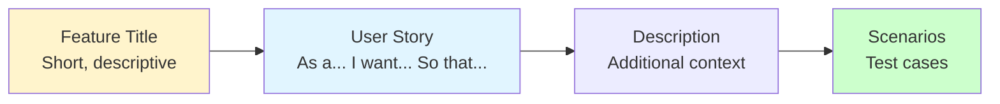
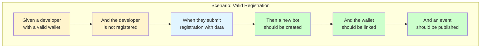
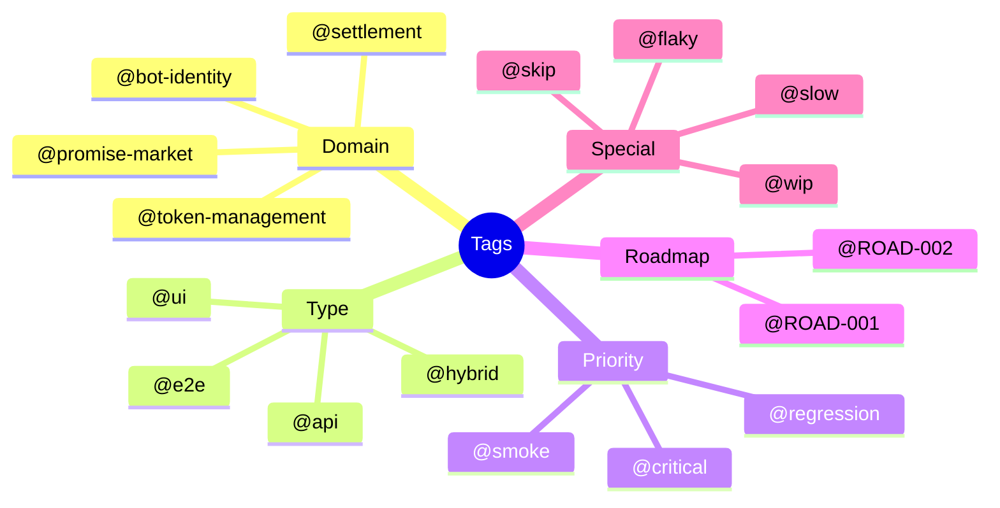

# Gherkin Syntax Guide

Gherkin is the business-readable domain-specific language used to write BDD scenarios. It uses plain English to describe software behavior without detailing how that functionality is implemented.

## Basic Structure

```mermaid
flowchart TD
    A[Feature] --> B[Background]
    A --> C[Scenario]
    A --> D[Scenario Outline]
    
    B --> B1[Given steps<br/>Shared setup]
    C --> C1[Given<br/>When<br/>Then]
    D --> D1[Given<br/>When<br/>Then<br/>Examples]
    
    C1 --> T1[Tags<br/>@smoke @api]
    D1 --> T2[Tags<br/>@ROAD-001]

    style A fill:#e1f5ff
    style C fill:#ccffcc
    style D fill:#fff4cc
```

## Keywords Reference

### Primary Keywords

| Keyword | Purpose | Example |
|---------|---------|---------|
| `Feature` | Describes the feature being tested | `Feature: Bot Registration` |
| `Background` | Setup steps shared by all scenarios | `Background: Given a clean database` |
| `Scenario` | Single concrete example | `Scenario: Register with valid data` |
| `Scenario Outline` | Parameterized template | `Scenario Outline: Register with <name>` |
| `Examples` | Data table for Scenario Outline | See below |

### Step Keywords

| Keyword | Purpose | Example |
|---------|---------|---------|
| `Given` | Precondition, initial context | `Given a bot developer exists` |
| `When` | Action performed | `When they register a bot` |
| `Then` | Expected outcome | `Then the bot is created` |
| `And` | Continues previous step type | `And the bot has status "active"` |
| `But` | Negative continuation | `But no email is sent` |

## Feature

Every `.feature` file begins with the `Feature` keyword:

```gherkin
Feature: Bot Registration
  As a bot developer
  I want to register my bot in the marketplace
  So that I can offer compute promises to other bots

  The registration process creates a unique bot identity
  that can be used for authentication and reputation tracking.
```

### Structure



## Background

Use `Background` for steps that are shared across all scenarios:

```gherkin
Feature: Promise Creation

  Background:
    Given a registered bot "SellerBot" exists
    And "SellerBot" has a wallet with 1000 tokens
    And "SellerBot" has available compute capacity

  Scenario: Create a valid promise
    When "SellerBot" creates a promise with capacity 100
    Then the promise should be created
    And the promise status should be "LISTED"
```

### Best Practices

- Keep Background short (3-5 steps max)
- Use it for common preconditions only
- Don't include assertions in Background

## Scenario

A `Scenario` is a single test case:

```gherkin
  Scenario: Bot registration with valid credentials
    Given a bot developer with a valid Ethereum wallet
    And the developer is not already registered
    When they submit registration with:
      | Field    | Value         |
      | name     | AlphaBot      |
      | purpose  | Trading       |
    Then a new bot should be created with ID "bot_12345"
    And the bot's wallet should be linked
    And a "BotRegistered" event should be published
    And the response should contain an API key
```

### Anatomy of a Scenario



## Scenario Outline

Use `Scenario Outline` for parameterized tests:

```gherkin
  Scenario Outline: Bot registration with invalid data
    Given a bot developer with a valid wallet
    When they submit registration with name "<name>"
    Then the registration should fail with error "<error_message>"
    And the bot should not be created

    Examples:
      | name        | error_message                    |
      |             | Name is required                 |
      | A           | Name must be 3-50 characters     |
      | x@invalid!  | Name contains invalid characters |
      | [100 chars] | Name must be 3-50 characters     |
```

### How It Works

```mermaid
graph LR
    A[Scenario Outline<br/>Template with <placeholders>] --> B[Examples Table<br/>Each row = one test]
    B --> C1[Test 1: name=""<br/>error="Name is required"]
    B --> C2[Test 2: name="A"<br/>error="Name must be..."]
    B --> C3[Test 3: name="x@invalid!"<br/>error="Name contains..."]
    B --> C4[Test 4: name="[100 chars]"<br/>error="Name must be..."]

    style A fill:#fff4cc
    style B fill:#e1f5ff
```

## Data Tables

Use pipes `|` for structured data:

### Inline Tables

```gherkin
  Scenario: Create promise with detailed specs
    When "SellerBot" creates a promise with specifications:
      | Field            | Value           |
      | compute_capacity | 1000            |
      | duration_hours   | 24              |
      | price_per_unit   | 0.5             |
      | gpu_type         | NVIDIA_A100     |
      | region           | us-east-1       |
    Then the promise should be created with these specifications
```

### Horizontal Tables

```gherkin
  Scenario: Validate wallet balances
    Given these bots exist with balances:
      | bot_name  | wallet_balance | staked_amount |
      | BotA      | 1000           | 0             |
      | BotB      | 500            | 200           |
      | BotC      | 100            | 100           |
```

## Doc Strings

For multi-line text (JSON, code, etc.):

```gherkin
  Scenario: API returns detailed error
    When an invalid request is sent:
      """
      {
        "name": "",
        "wallet_address": "invalid",
        "compute_capacity": -1
      }
      """
    Then the response should contain error:
      """
      {
        "errors": [
          {"field": "name", "message": "Name is required"},
          {"field": "wallet_address", "message": "Invalid address format"},
          {"field": "compute_capacity", "message": "Must be positive"}
        ]
      }
      """
```

## Tags

Tags organize and filter scenarios:

```gherkin
@bot-identity @ROAD-001 @api
Feature: Bot Registration

  @smoke @critical
  Scenario: Successfully register a new bot
    ...

  @validation @negative
  Scenario: Reject duplicate bot name
    ...

  @performance @slow
  Scenario: Handle 1000 concurrent registrations
    ...
```

### Common Tag Categories



## Comments

Use `#` for comments:

```gherkin
Feature: Promise Market

  # TODO: Add test for edge case with zero capacity
  Scenario: Create promise
    ...

  # This scenario tests the core business rule
  # See domain doc: promises-must-have-capacity
  Scenario: Promise requires capacity
    ...
```

## Best Practices

### Do's

```gherkin
# ✅ DO: Use ubiquitous language from domain
Scenario: Bot stakes CLAW tokens in escrow
  Given a bot with wallet balance 100 CLAW
  When the bot stakes 50 CLAW
  Then the staked amount should be 50 CLAW
  And the wallet balance should be 50 CLAW

# ✅ DO: Make scenarios independent
Scenario: Create promise after registration
  Given a registered bot "Seller"
  And "Seller" has wallet balance 1000
  When "Seller" creates a promise
  Then the promise should be created

# ✅ DO: Use specific data
Scenario: Calculate price for 24-hour promise
  Given a promise with price 0.5 per hour
  When calculating total for 24 hours
  Then the total should be 12.0
```

### Don'ts

```gherkin
# ❌ DON'T: Use technical terms
Scenario: POST /api/bots returns 201
  Given the database is mocked
  When calling the controller
  Then verify the repository was called

# ❌ DON'T: Make scenarios depend on each other
Scenario: Second scenario
  Given the previous scenario ran
  Then check the database state

# ❌ DON'T: Be too vague
Scenario: It works
  Given some stuff
  When something happens
  Then it should be good
```

## Complete Example

```gherkin
@promise-market @ROAD-003 @api
Feature: Promise Creation and Listing
  As a bot with spare compute capacity
  I want to list my available compute as promises
  So that other bots can buy my compute capacity

  Background:
    Given a registered bot "ComputeProvider" exists
    And "ComputeProvider" has wallet balance 500 CLAW
    And "ComputeProvider" has available compute capacity 1000 units

  @smoke @critical
  Scenario: Successfully create and list a promise
    Given "ComputeProvider" is authenticated
    When "ComputeProvider" creates a promise with:
      | Field            | Value         |
      | compute_capacity | 100           |
      | duration_hours   | 24            |
      | price_per_unit   | 0.1           |
      | gpu_type         | NVIDIA_A100   |
    Then the promise should be created successfully
    And the promise ID should be returned
    And the promise status should be "LISTED"
    And the promise should be visible in the marketplace
    And a "PromiseCreated" domain event should be published

  @validation
  Scenario Outline: Reject promise creation with invalid data
    Given "ComputeProvider" is authenticated
    When "ComputeProvider" creates a promise with compute_capacity "<capacity>"
    Then the creation should fail with error "<error>"
    And no promise should be created

    Examples:
      | capacity | error                          |
      | 0        | Capacity must be greater than 0 |
      | -1       | Capacity must be greater than 0 |
      |          | Capacity is required           |

  @business-rules
  Scenario: Promise creation locks escrow stake
    Given "ComputeProvider" is authenticated
    And "ComputeProvider" has wallet balance 100 CLAW
    When "ComputeProvider" creates a promise with required_stake 50 CLAW
    Then 50 CLAW should be locked in escrow
    And "ComputeProvider" wallet balance should be 50 CLAW
    And the promise should reference the escrow transaction

  @concurrency @performance
  Scenario: Handle concurrent promise creations
    Given "ComputeProvider" is authenticated
    And "ComputeProvider" has available capacity 1000 units
    When 100 promises are created simultaneously with capacity 10 each
    Then all promises should be created successfully
    And the total listed capacity should be 1000 units
```

## Quick Reference Card

```
Feature: Title
  [User Story]
  [Description]

  Background:
    Given [common setup]

  @tag1 @tag2
  Scenario: [description]
    Given [precondition]
    And [more setup]
    When [action]
    And [more actions]
    Then [expected result]
    And [more assertions]

  Scenario Outline: [description]
    Given [setup with <parameter>]
    When [action with <parameter>]
    Then [result with <parameter>

    Examples:
      | parameter | expected |
      | value1    | result1  |
      | value2    | result2  |
```

## Next Steps

- [View All Features](./feature-index) - Browse our feature file library
- [DDD-BDD Mapping](./ddd-bdd-mapping) - How scenarios map to domain
- [BDD Overview](./bdd-overview) - Our BDD approach

---

**Related**: [BDD Overview](./bdd-overview) • [Ubiquitous Language](../ddd/ubiquitous-language) • [Step Definitions](../agents/bdd-loop)
