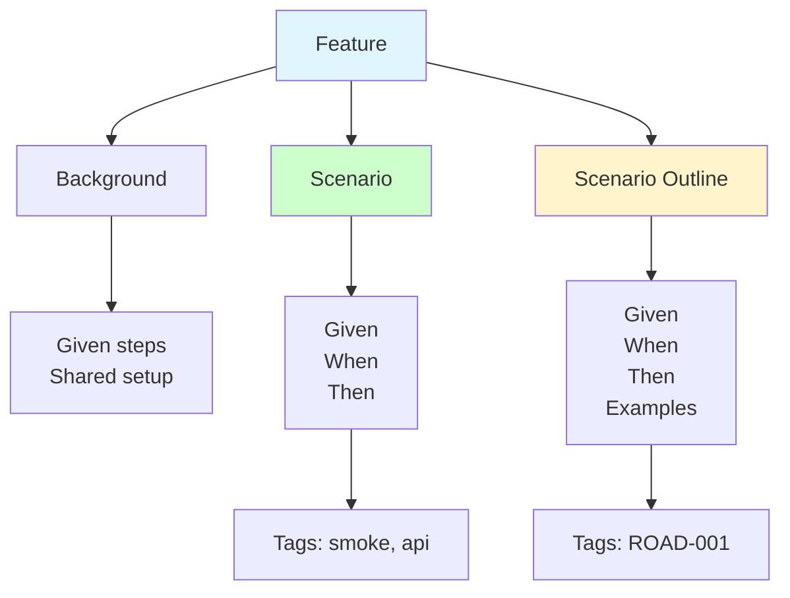
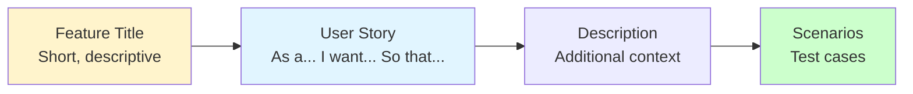
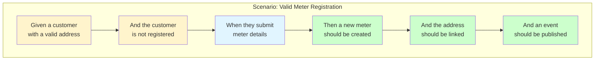
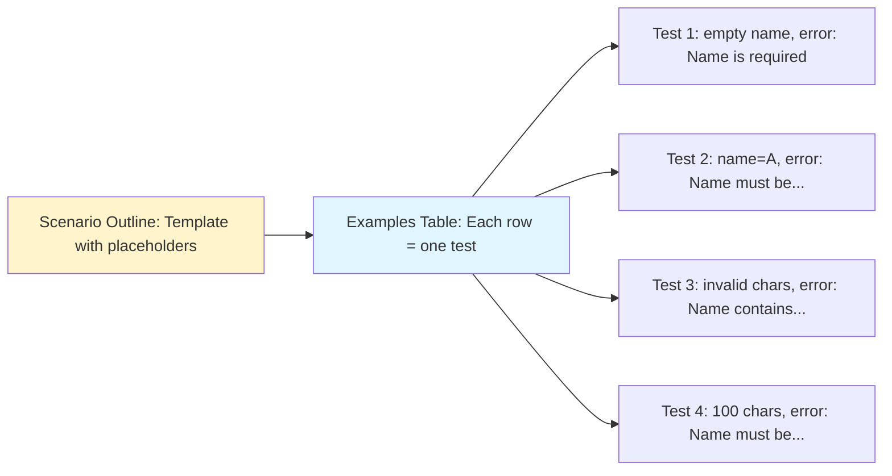
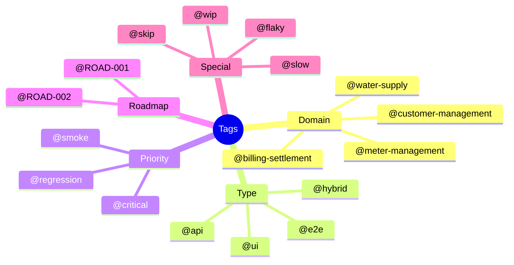

# Gherkin Syntax Guide

Gherkin is the business-readable domain-specific language used to write BDD scenarios. It uses plain English to describe software behavior without detailing how that functionality is implemented.

## Basic Structure



## Keywords Reference

### Primary Keywords

| Keyword | Purpose | Example |
|---------|---------|---------|
| `Feature` | Describes the feature being tested | `Feature: Bot Registration` |
| `Background` | Setup steps shared by all scenarios | `Background: Given a clean database` |
| `Scenario` | Single concrete example | `Scenario: Register with valid data` |
| `Scenario Outline` | Parameterized template | `Scenario Outline: Register with <name>` |
| `Examples` | Data table for Scenario Outline | See below |

### Step Keywords

| Keyword | Purpose | Example |
|---------|---------|---------|
| `Given` | Precondition, initial context | `Given a bot developer exists` |
| `When` | Action performed | `When they register a bot` |
| `Then` | Expected outcome | `Then the bot is created` |
| `And` | Continues previous step type | `And the bot has status "active"` |
| `But` | Negative continuation | `But no email is sent` |

## Feature

Every `.feature` file begins with the `Feature` keyword:

```gherkin
Feature: Meter Registration
  As a water customer
  I want to register my water meter
  So that I can track consumption and billing

  The registration process creates a unique meter identity
  that can be used for reading collection and usage tracking.
```

### Structure



## Background

Use `Background` for steps that are shared across all scenarios:

```gherkin
Feature: Meter Reading Collection

  Background:
    Given a registered meter "WM-001" exists
    And the meter is in "ACTIVE" status
    And readings collection is enabled

  Scenario: Submit a meter reading
    When a reading of 1234 units is submitted for meter "WM-001"
    Then the reading should be recorded
    And the reading status should be "CONFIRMED"
```

### Best Practices

- Keep Background short (3-5 steps max)
- Use it for common preconditions only
- Don't include assertions in Background

## Scenario

A `Scenario` is a single test case:

```gherkin
  Scenario: Meter registration with valid details
    Given a customer with a valid service address
    And the customer is not already registered for this address
    When they submit registration with:
      | Field         | Value         |
      | meter_number  | WM-001        |
      | location      | 123 Main St   |
    Then a new meter should be created with ID "meter_12345"
    And the meter's location should be linked
    And a "MeterRegistered" event should be published
    And the response should contain a meter ID
```

### Anatomy of a Scenario



## Scenario Outline

Use `Scenario Outline` for parameterized tests:

```gherkin
  Scenario Outline: Meter registration with invalid data
    Given a customer with a valid address
    When they submit registration with meter number "<number>"
    Then the registration should fail with error "<error_message>"
    And the meter should not be created

    Examples:
      | number      | error_message                         |
      |             | Meter number is required              |
      | 1           | Meter number must be 3-20 characters  |
      | x@invalid!  | Meter number contains invalid chars   |
      | [100 chars] | Meter number must be 3-20 characters  |
```

### How It Works



## Data Tables

Use pipes `|` for structured data:

### Inline Tables

```gherkin
  Scenario: Submit meter reading with detailed data
    When a reading is submitted with specifications:
      | Field              | Value           |
      | meter_number       | WM-001          |
      | reading_value      | 1500            |
      | timestamp          | 2026-02-03      |
      | collection_method  | AUTOMATED       |
      | location           | Main Residence  |
    Then the reading should be recorded with this data
```

### Horizontal Tables

```gherkin
  Scenario: Validate customer accounts
    Given these customers exist with details:
      | customer_name | account_status | outstanding_balance |
      | CustomerA     | ACTIVE         | 0                   |
      | CustomerB     | ACTIVE         | 150                 |
      | CustomerC     | SUSPENDED      | 300                 |
```

## Doc Strings

For multi-line text (JSON, code, etc.):

```gherkin
  Scenario: API returns detailed error
    When an invalid request is sent:
      """
      {
        "meter_number": "",
        "service_address": "invalid",
        "reading_value": -1
      }
      """
    Then the response should contain error:
      """
      {
        "errors": [
          {"field": "meter_number", "message": "Meter number is required"},
          {"field": "service_address", "message": "Invalid address format"},
          {"field": "reading_value", "message": "Must be non-negative"}
        ]
      }
      """
```

## Tags

Tags organize and filter scenarios:

```gherkin
@meter-management @ROAD-001 @api
Feature: Meter Registration

  @smoke @critical
  Scenario: Successfully register a new meter
    ...

  @validation @negative
  Scenario: Reject duplicate meter number
    ...

  @performance @slow
  Scenario: Handle 1000 concurrent registrations
    ...
```

### Common Tag Categories



## Comments

Use `#` for comments:

```gherkin
Feature: Water Supply Management

  # TODO: Add test for edge case with zero volume
  Scenario: Schedule water supply
    ...

  # This scenario tests the core business rule
  # See domain doc: supply-must-have-capacity
  Scenario: Supply requires sufficient capacity
    ...
```

## Best Practices

### Do's

```gherkin
# ✅ DO: Use ubiquitous language from domain
Scenario: Customer submits meter reading
  Given a customer with balance 100 credits
  When they submit a reading
  Then the reading is recorded
  And the balance remains 100 credits

# ✅ DO: Make scenarios independent
Scenario: Submit reading after meter registration
  Given a registered meter "WM-001"
  And the meter is in "ACTIVE" status
  When "WM-001" receives a reading
  Then the reading should be recorded

# ✅ DO: Use specific data
Scenario: Calculate consumption for period
  Given a meter with previous reading 500
  When current reading is 700
  Then the consumption should be 200 units
```

### Don'ts

```gherkin
# ❌ DON'T: Use technical terms
Scenario: POST /api/meters returns 201
  Given the database is mocked
  When calling the controller
  Then verify the repository was called

# ❌ DON'T: Make scenarios depend on each other
Scenario: Second scenario
  Given the previous scenario ran
  Then check the database state

# ❌ DON'T: Be too vague
Scenario: It works
  Given some stuff
  When something happens
  Then it should be good
```

## Complete Example

```gherkin
@water-supply @ROAD-003 @api
Feature: Water Supply Scheduling and Delivery
  As a water utility
  I want to schedule and deliver water to service areas
  So that customers receive consistent water service

  Background:
    Given a registered service area "District-001" exists
    And the district has capacity 5000 units/day
    And supply schedules are enabled

  @smoke @critical
  Scenario: Successfully schedule water supply
    Given the utility is authenticated
    When the utility schedules supply with:
      | Field            | Value         |
      | supply_volume    | 1000          |
      | duration_hours   | 24            |
      | pressure_level   | MEDIUM        |
      | start_time       | 2026-02-04    |
    Then the supply should be scheduled successfully
    And the supply ID should be returned
    And the supply status should be "SCHEDULED"
    And the supply should be visible in the system
    And a "SupplyScheduled" domain event should be published

  @validation
  Scenario Outline: Reject supply with invalid data
    Given the utility is authenticated
    When the utility schedules supply with volume "<volume>"
    Then the scheduling should fail with error "<error>"
    And no supply should be scheduled

    Examples:
      | volume | error                        |
      | 0      | Volume must be greater than 0 |
      | -1     | Volume must be greater than 0 |
      |        | Volume is required           |

  @business-rules
  Scenario: Supply scheduling reserves capacity
    Given the utility is authenticated
    And the district has available capacity 2000 units
    When the utility schedules supply with volume 1000 units
    Then 1000 units should be reserved
    And the district available capacity should be 1000 units
    And the supply should reference the capacity reservation

  @concurrency @performance
  Scenario: Handle concurrent supply scheduling
    Given the utility is authenticated
    And the district has available capacity 5000 units
    When 50 supplies are scheduled simultaneously with volume 100 each
    Then all supplies should be scheduled successfully
    And the total scheduled volume should be 5000 units
```

## Quick Reference Card

```
Feature: Title
  [User Story]
  [Description]

  Background:
    Given [common setup]

  @tag1 @tag2
  Scenario: [description]
    Given [precondition]
    And [more setup]
    When [action]
    And [more actions]
    Then [expected result]
    And [more assertions]

  Scenario Outline: [description]
    Given [setup with <parameter>]
    When [action with <parameter>]
    Then [result with <parameter>

    Examples:
      | parameter | expected |
      | value1    | result1  |
      | value2    | result2  |
```

## Next Steps

- [View All Features](./feature-index) - Browse our feature file library
- [DDD-BDD Mapping](./ddd-bdd-mapping) - How scenarios map to domain
- [BDD Overview](./bdd-overview) - Our BDD approach

---

**Related**: [BDD Overview](./bdd-overview) • [Ubiquitous Language](../ddd/ubiquitous-language) • [Step Definitions](../agents/bdd-loop)
