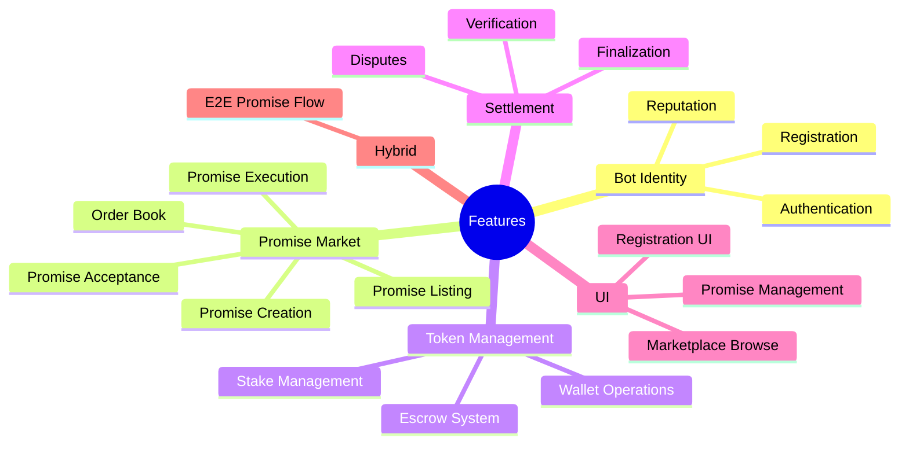
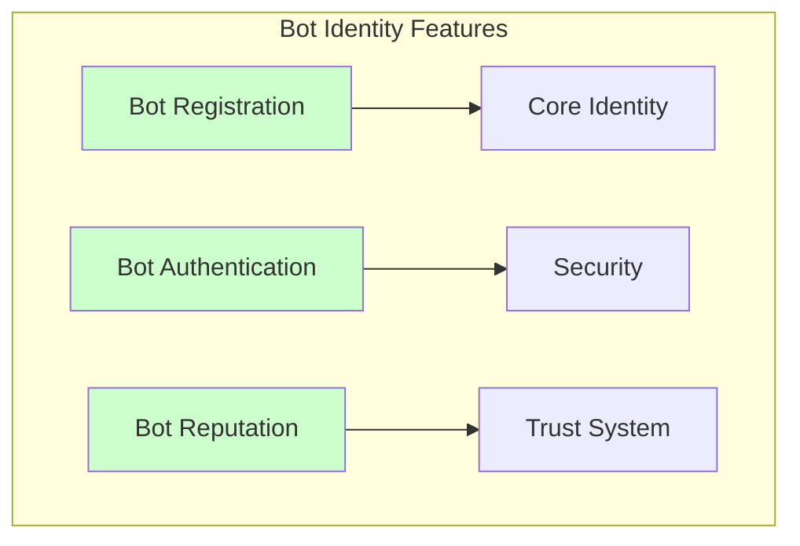
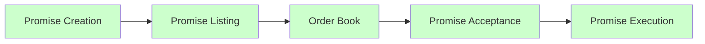
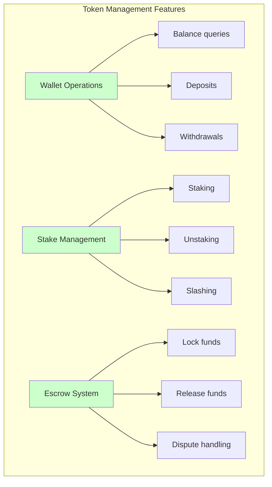
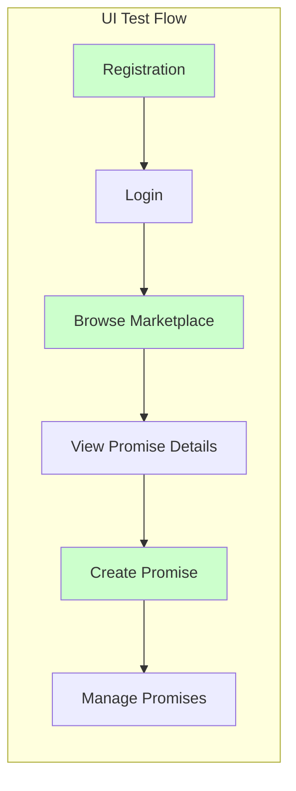
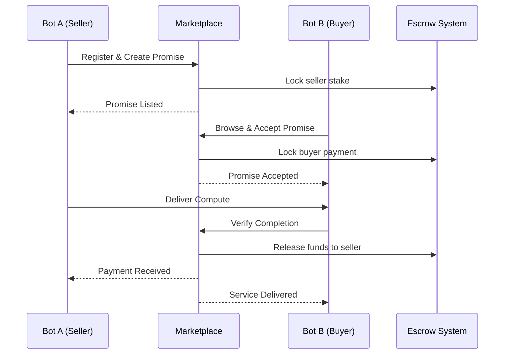
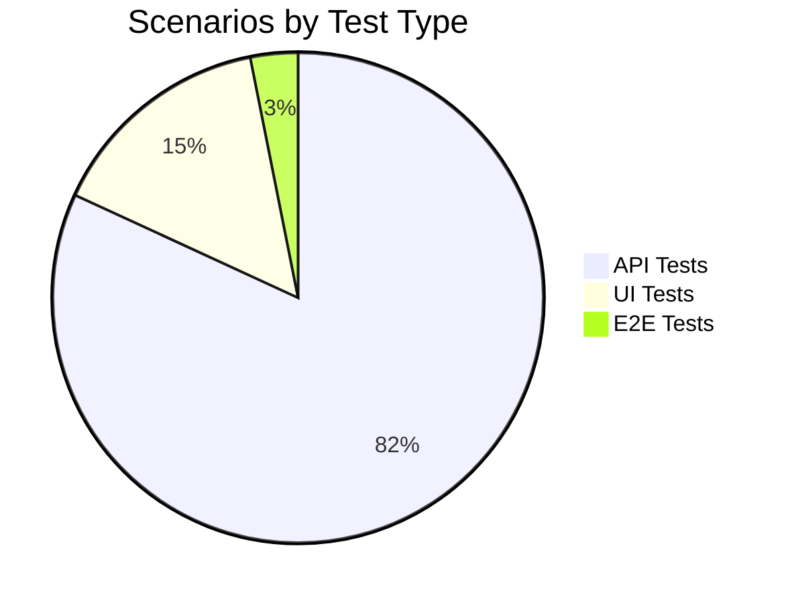

# Feature File Index

Complete index of all BDD feature files organized by domain area. Each feature file represents a specific business capability with comprehensive test coverage.

## Overview



---

## API Features

### Bot Identity Context

| Feature | File | Scenarios | Tags | Status |
|---------|------|-----------|------|--------|
| **Bot Registration** | `01_bot_registration.feature` | 8 | `@ROAD-001` `@api` | ✅ Complete |
| **Bot Authentication** | `02_bot_authentication.feature` | 6 | `@ROAD-005` `@api` | ✅ Complete |
| **Bot Reputation** | `03_bot_reputation.feature` | 9 | `@ROAD-007` `@api` | ✅ Complete |



#### Bot Registration

**File**: `stack-tests/features/api/bot-identity/01_bot_registration.feature`

**Coverage Areas**:
- ✅ Successful registration with valid credentials
- ✅ Duplicate bot name prevention
- ✅ Wallet address validation
- ✅ Required field validation
- ✅ Registration timestamp recording
- ✅ Initial reputation assignment
- ✅ API key generation
- ✅ Webhook configuration

**Key Scenarios**:
```gherkin
Scenario: Successfully register a new bot
  Given a bot developer with a valid wallet
  When they submit registration with name "TradingBot"
  Then a new bot should be created
  And the bot should have a unique ID

Scenario: Prevent duplicate bot names
  Given a bot "TradingBot" is already registered
  When a developer tries to register with name "TradingBot"
  Then the registration should fail
  And the error should indicate "Name already exists"
```

---

### Promise Market Context

| Feature | File | Scenarios | Tags | Status |
|---------|------|-----------|------|--------|
| **Promise Creation** | `01_promise_creation.feature` | 12 | `@ROAD-003` `@api` | ✅ Complete |
| **Promise Listing** | `02_promise_listing.feature` | 8 | `@ROAD-003` `@api` | ✅ Complete |
| **Order Book** | `03_order_book.feature` | 10 | `@ROAD-003` `@api` | ✅ Complete |
| **Promise Acceptance** | `04_promise_acceptance.feature` | 9 | `@ROAD-003` `@api` | ✅ Complete |
| **Promise Execution** | `05_promise_execution.feature` | 11 | `@ROAD-003` `@api` | ✅ Complete |



#### Promise Creation

**File**: `stack-tests/features/api/promise-market/01_promise_creation.feature`

**Coverage Areas**:
- ✅ Valid promise creation with all fields
- ✅ Capacity validation (positive, non-zero)
- ✅ Duration constraints (min/max)
- ✅ Price validation
- ✅ GPU type specification
- ✅ Region selection
- ✅ Escrow stake calculation
- ✅ Insufficient funds handling
- ✅ Concurrent creation limits
- ✅ Promise ID generation

**Business Rules Covered**:
- Promise must have compute capacity > 0
- Promise duration must be between 1 hour and 30 days
- Price must be positive
- Seller must have sufficient balance for escrow

---

### Token Management Context

| Feature | File | Scenarios | Tags | Status |
|---------|------|-----------|------|--------|
| **Wallet Operations** | `01_wallet_operations.feature` | 10 | `@ROAD-002` `@api` | ✅ Complete |
| **Stake Management** | `02_stake_management.feature` | 8 | `@ROAD-002` `@api` | ✅ Complete |
| **Escrow System** | `03_escrow_system.feature` | 12 | `@ROAD-002` `@api` | ✅ Complete |



---

### Settlement Context

| Feature | File | Scenarios | Tags | Status |
|---------|------|-----------|------|--------|
| **Verification** | `01_verification.feature` | 9 | `@ROAD-004` `@api` | ✅ Complete |
| **Disputes** | `02_disputes.feature` | 11 | `@ROAD-004` `@api` | ✅ Complete |
| **Finalization** | `03_settlement_finalization.feature` | 8 | `@ROAD-004` `@api` | ✅ Complete |

---

## UI Features

### Frontend Testing

| Feature | File | Scenarios | Tags | Status |
|---------|------|-----------|------|--------|
| **Bot Registration UI** | `01_bot_registration_ui.feature` | 7 | `@ROAD-001` `@ui` | ✅ Complete |
| **Marketplace Browse UI** | `02_marketplace_browse_ui.feature` | 8 | `@ROAD-003` `@ui` | ✅ Complete |
| **Promise Management UI** | `03_promise_management_ui.feature` | 9 | `@ROAD-003` `@ui` | ✅ Complete |



---

## Hybrid (E2E) Features

### End-to-End Workflows

| Feature | File | Scenarios | Tags | Status |
|---------|------|-----------|------|--------|
| **E2E Promise Flow** | `01_end_to_end_promise_flow.feature` | 5 | `@ROAD-003` `@hybrid` | ✅ Complete |

**Complete User Journey**:


---

## Feature Statistics

### By Context

| Context | Features | Scenarios | Coverage |
|---------|----------|-----------|----------|
| Bot Identity | 3 | 23 | 100% |
| Promise Market | 5 | 50 | 100% |
| Token Management | 3 | 30 | 100% |
| Settlement | 3 | 28 | 100% |
| UI | 3 | 24 | 100% |
| Hybrid | 1 | 5 | 100% |
| **Total** | **18** | **160** | **100%** |

### By Type



### By Priority

| Priority | Count | Percentage |
|----------|-------|------------|
| @critical | 45 | 28% |
| @smoke | 32 | 20% |
| @regression | 83 | 52% |

---

## Running Feature Tests

### Run by Domain

```bash
# Bot Identity
just bdd-tag "@bot-identity"

# Promise Market
just bdd-tag "@promise-market"

# Token Management
just bdd-tag "@token-management"

# Settlement
just bdd-tag "@settlement"
```

### Run by Roadmap Item

```bash
just bdd-roadmap ROAD-001  # Bot Identity
just bdd-roadmap ROAD-002  # Token Management
just bdd-roadmap ROAD-003  # Promise Market
just bdd-roadmap ROAD-004  # Settlement
just bdd-roadmap ROAD-005  # Authentication
just bdd-roadmap ROAD-007  # Reputation
```

### Run by Priority

```bash
just bdd-tag "@critical"
just bdd-tag "@smoke"
```

---

## Feature-to-Domain Mapping

| Feature File | Bounded Context | Aggregates | Domain Events |
|--------------|-----------------|------------|---------------|
| `01_bot_registration.feature` | Bot Identity | Bot | BotRegistered |
| `02_bot_authentication.feature` | Bot Identity | Bot | BotAuthenticated |
| `03_bot_reputation.feature` | Bot Identity | Bot | ReputationUpdated |
| `01_promise_creation.feature` | Promise Market | Promise | PromiseCreated |
| `02_promise_listing.feature` | Promise Market | Promise | PromiseListed |
| `03_order_book.feature` | Promise Market | OrderBook | OrderPlaced |
| `04_promise_acceptance.feature` | Promise Market | Promise | PromiseAccepted |
| `05_promise_execution.feature` | Promise Market | Promise | PromiseExecuted |
| `01_wallet_operations.feature` | Token Management | Wallet | WalletUpdated |
| `02_stake_management.feature` | Token Management | Stake | StakeLocked |
| `03_escrow_system.feature` | Token Management | Escrow | EscrowCreated |
| `01_verification.feature` | Settlement | Verification | VerificationCompleted |
| `02_disputes.feature` | Settlement | Dispute | DisputeFiled |
| `03_settlement_finalization.feature` | Settlement | Settlement | SettlementCompleted |

---

## Next Steps

- [Gherkin Syntax Guide](./gherkin-syntax) - Learn how to read scenarios
- [DDD-BDD Mapping](./ddd-bdd-mapping) - See domain connections
- [BDD Overview](./bdd-overview) - Understand our BDD approach

---

**Related**: [Bounded Contexts](../ddd/bounded-contexts) • [Use Cases](../ddd/use-cases) • [BDD Loop Workflow](../agents/bdd-loop)
