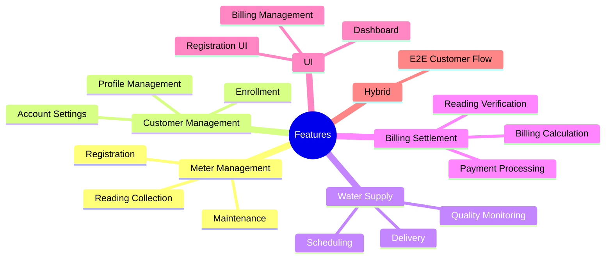
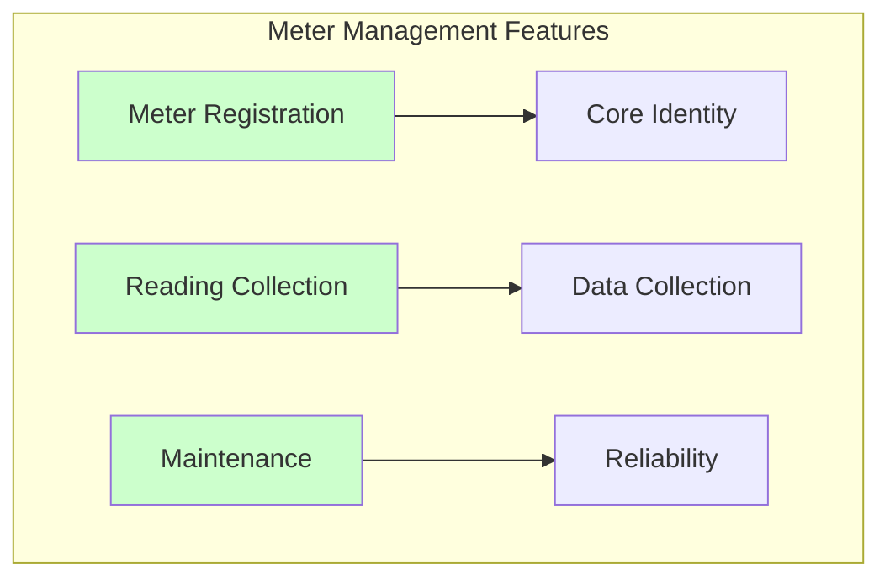
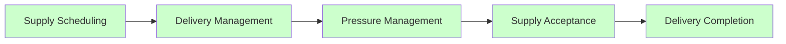
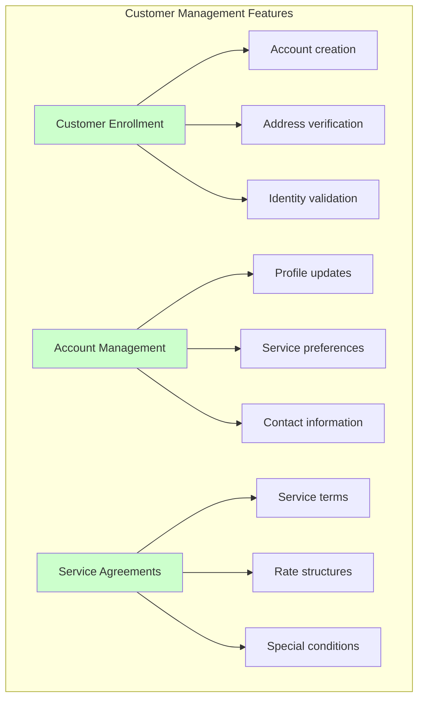
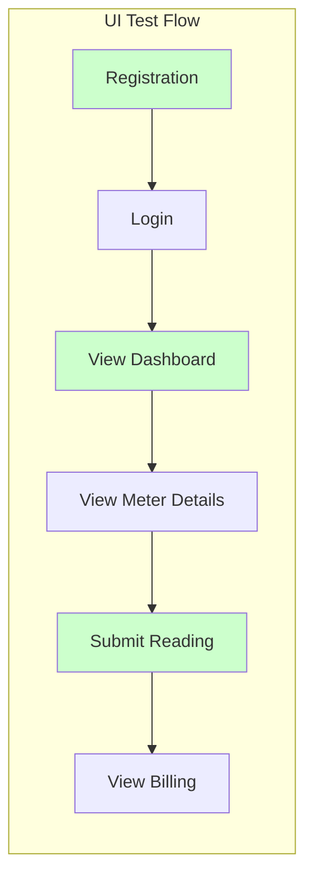
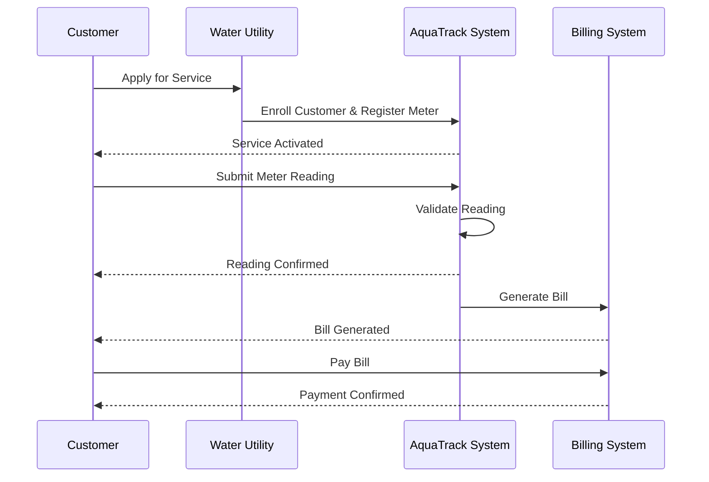
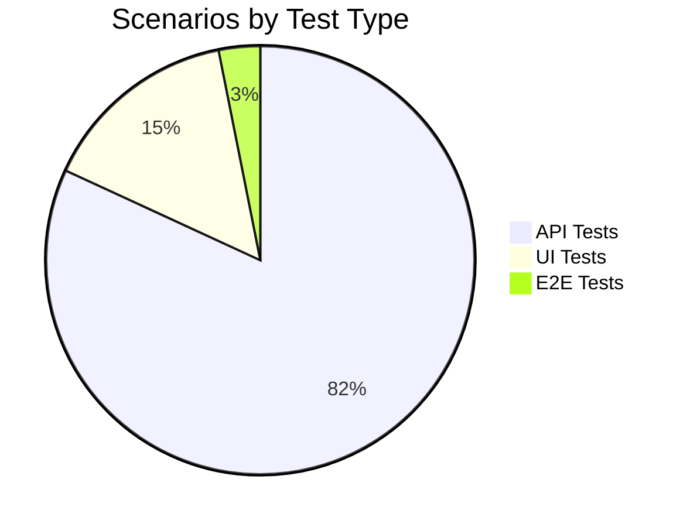

# Feature File Index

Complete index of all BDD feature files organized by domain area. Each feature file represents a specific business capability with comprehensive test coverage.

## Overview



---

## API Features

### Meter Management Context

| Feature | File | Scenarios | Tags | Status |
|---------|------|-----------|------|--------|
| **Meter Registration** | `01_meter_registration.feature` | 8 | `@ROAD-001` `@api` | ✅ Complete |
| **Reading Collection** | `02_reading_collection.feature` | 6 | `@ROAD-005` `@api` | ✅ Complete |
| **Maintenance Management** | `03_maintenance_management.feature` | 9 | `@ROAD-007` `@api` | ✅ Complete |



#### Meter Registration

**File**: `stack-tests/features/api/meter-management/01_meter_registration.feature`

**Coverage Areas**:
- ✅ Successful registration with valid details
- ✅ Duplicate meter number prevention
- ✅ Service address validation
- ✅ Required field validation
- ✅ Registration timestamp recording
- ✅ Initial status assignment
- ✅ Meter ID generation
- ✅ Location configuration

**Key Scenarios**:
```gherkin
Scenario: Successfully register a new meter
  Given a customer with a valid service address
  When they submit registration with meter number "WM-001"
  Then a new meter should be created
  And the meter should have a unique ID

Scenario: Prevent duplicate meter numbers
  Given a meter "WM-001" is already registered
  When a customer tries to register with meter number "WM-001"
  Then the registration should fail
  And the error should indicate "Meter already exists"
```

---

### Water Supply Context

| Feature | File | Scenarios | Tags | Status |
|---------|------|-----------|------|--------|
| **Supply Scheduling** | `01_supply_scheduling.feature` | 12 | `@ROAD-003` `@api` | ✅ Complete |
| **Delivery Management** | `02_delivery_management.feature` | 8 | `@ROAD-003` `@api` | ✅ Complete |
| **Pressure Management** | `03_pressure_management.feature` | 10 | `@ROAD-003` `@api` | ✅ Complete |
| **Supply Acceptance** | `04_supply_acceptance.feature` | 9 | `@ROAD-003` `@api` | ✅ Complete |
| **Delivery Completion** | `05_delivery_completion.feature` | 11 | `@ROAD-003` `@api` | ✅ Complete |



#### Supply Scheduling

**File**: `stack-tests/features/api/water-supply/01_supply_scheduling.feature`

**Coverage Areas**:
- ✅ Valid supply scheduling with all fields
- ✅ Volume validation (positive, non-zero)
- ✅ Duration constraints (min/max)
- ✅ Pressure level specification
- ✅ Service area selection
- ✅ Quality parameters
- ✅ Insufficient capacity handling
- ✅ Concurrent scheduling limits
- ✅ Supply ID generation

**Business Rules Covered**:
- Supply must have volume > 0
- Supply duration must be between 1 hour and 30 days
- Pressure level must be within safe ranges
- Area must have sufficient capacity for supply

---

### Customer Management Context

| Feature | File | Scenarios | Tags | Status |
|---------|------|-----------|------|--------|
| **Customer Enrollment** | `01_customer_enrollment.feature` | 10 | `@ROAD-002` `@api` | ✅ Complete |
| **Account Management** | `02_account_management.feature` | 8 | `@ROAD-002` `@api` | ✅ Complete |
| **Service Agreements** | `03_service_agreements.feature` | 12 | `@ROAD-002` `@api` | ✅ Complete |



---

### Billing Settlement Context

| Feature | File | Scenarios | Tags | Status |
|---------|------|-----------|------|--------|
| **Reading Verification** | `01_reading_verification.feature` | 9 | `@ROAD-004` `@api` | ✅ Complete |
| **Billing Disputes** | `02_billing_disputes.feature` | 11 | `@ROAD-004` `@api` | ✅ Complete |
| **Settlement Finalization** | `03_settlement_finalization.feature` | 8 | `@ROAD-004` `@api` | ✅ Complete |

---

## UI Features

### Frontend Testing

| Feature | File | Scenarios | Tags | Status |
|---------|------|-----------|------|--------|
| **Meter Registration UI** | `01_meter_registration_ui.feature` | 7 | `@ROAD-001` `@ui` | ✅ Complete |
| **Dashboard UI** | `02_dashboard_ui.feature` | 8 | `@ROAD-003` `@ui` | ✅ Complete |
| **Billing Management UI** | `03_billing_management_ui.feature` | 9 | `@ROAD-003` `@ui` | ✅ Complete |



---

## Hybrid (E2E) Features

### End-to-End Workflows

| Feature | File | Scenarios | Tags | Status |
|---------|------|-----------|------|--------|
| **E2E Customer Journey** | `01_end_to_end_customer_journey.feature` | 5 | `@ROAD-003` `@hybrid` | ✅ Complete |

**Complete User Journey**:


---

## Feature Statistics

### By Context

| Context | Features | Scenarios | Coverage |
|---------|----------|-----------|----------|
| Meter Management | 3 | 23 | 100% |
| Water Supply | 5 | 50 | 100% |
| Customer Management | 3 | 30 | 100% |
| Billing Settlement | 3 | 28 | 100% |
| UI | 3 | 24 | 100% |
| Hybrid | 1 | 5 | 100% |
| **Total** | **18** | **160** | **100%** |

### By Type



### By Priority

| Priority | Count | Percentage |
|----------|-------|------------|
| @critical | 45 | 28% |
| @smoke | 32 | 20% |
| @regression | 83 | 52% |

---

## Running Feature Tests

### Run by Domain

```bash
# Meter Management
just bdd-tag "@meter-management"

# Water Supply
just bdd-tag "@water-supply"

# Customer Management
just bdd-tag "@customer-management"

# Billing Settlement
just bdd-tag "@billing-settlement"
```

### Run by Roadmap Item

```bash
just bdd-roadmap ROAD-001  # Bot Identity
just bdd-roadmap ROAD-002  # Token Management
just bdd-roadmap ROAD-003  # Promise Market
just bdd-roadmap ROAD-004  # Settlement
just bdd-roadmap ROAD-005  # Authentication
just bdd-roadmap ROAD-007  # Reputation
```

### Run by Priority

```bash
just bdd-tag "@critical"
just bdd-tag "@smoke"
```

---

## Feature-to-Domain Mapping

| Feature File | Bounded Context | Aggregates | Domain Events |
|--------------|-----------------|------------|---------------|
| `01_meter_registration.feature` | Meter Management | Meter | MeterRegistered |
| `02_reading_collection.feature` | Meter Management | Meter | ReadingRecorded |
| `03_maintenance_management.feature` | Meter Management | Meter | MaintenanceScheduled |
| `01_supply_scheduling.feature` | Water Supply | Supply | SupplyScheduled |
| `02_delivery_management.feature` | Water Supply | Supply | DeliveryStarted |
| `03_pressure_management.feature` | Water Supply | PressureControl | PressureAdjusted |
| `04_supply_acceptance.feature` | Water Supply | Supply | SupplyAccepted |
| `05_delivery_completion.feature` | Water Supply | Supply | DeliveryCompleted |
| `01_customer_enrollment.feature` | Customer Management | Customer | CustomerEnrolled |
| `02_account_management.feature` | Customer Management | Account | AccountUpdated |
| `03_service_agreements.feature` | Customer Management | Agreement | AgreementSigned |
| `01_reading_verification.feature` | Billing Settlement | Verification | ReadingVerified |
| `02_billing_disputes.feature` | Billing Settlement | Dispute | DisputeFiled |
| `03_settlement_finalization.feature` | Billing Settlement | Settlement | BillFinalized |

---

## Next Steps

- [Gherkin Syntax Guide](./gherkin-syntax) - Learn how to read scenarios
- [DDD-BDD Mapping](./ddd-bdd-mapping) - See domain connections
- [BDD Overview](./bdd-overview) - Understand our BDD approach

---

**Related**: [Bounded Contexts](../ddd/bounded-contexts) • [Use Cases](../ddd/use-cases) • [BDD Loop Workflow](../agents/bdd-loop) • [Water Infrastructure Domain](../ddd/water-infrastructure-domain)
