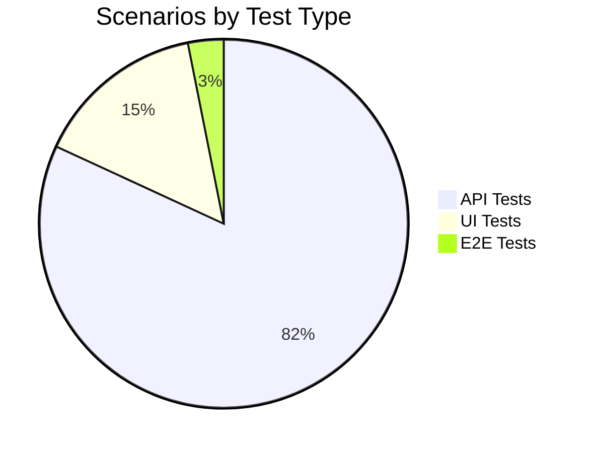
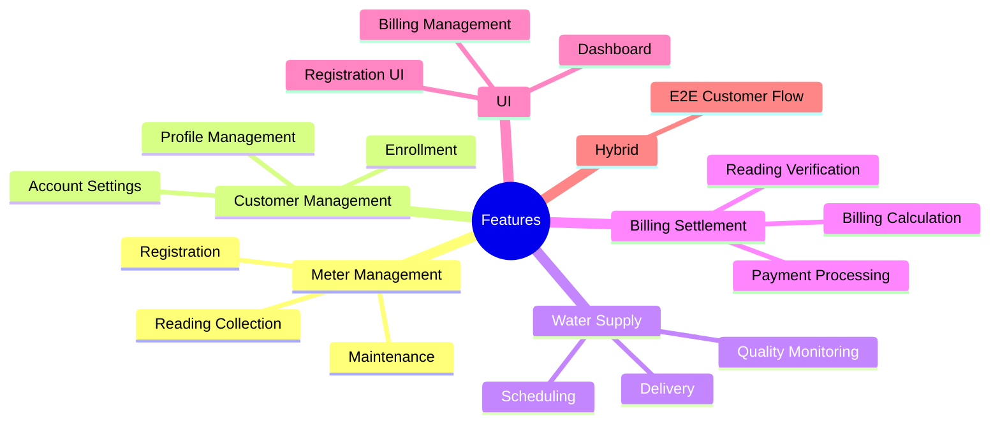
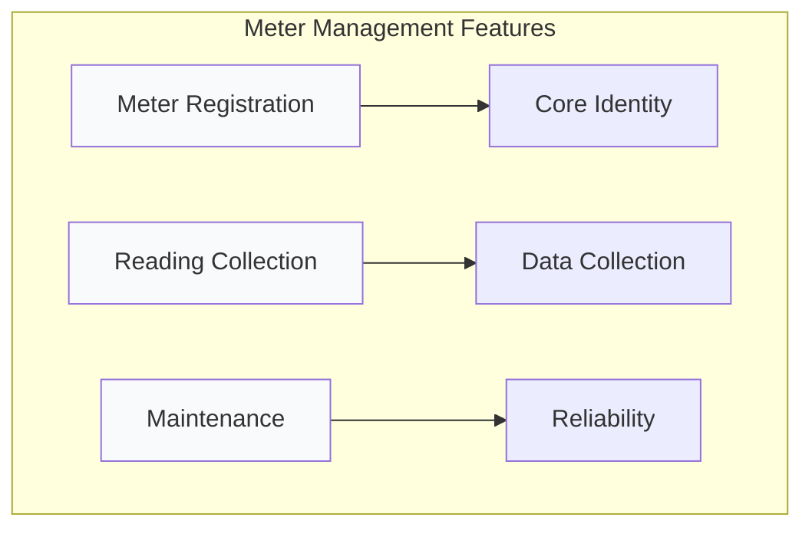
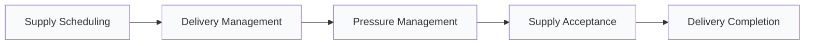
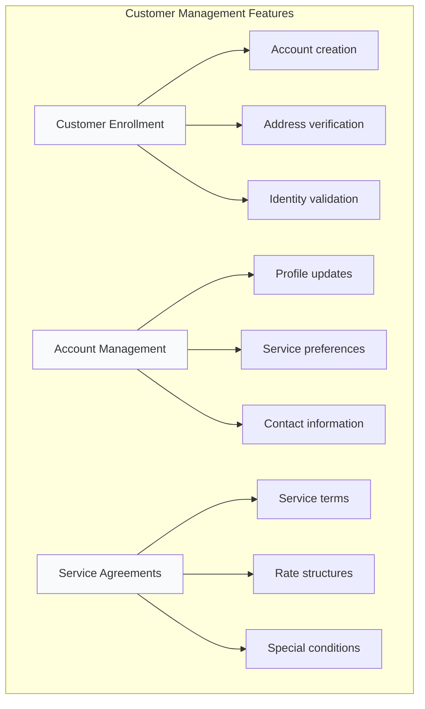
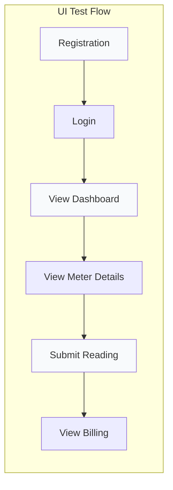
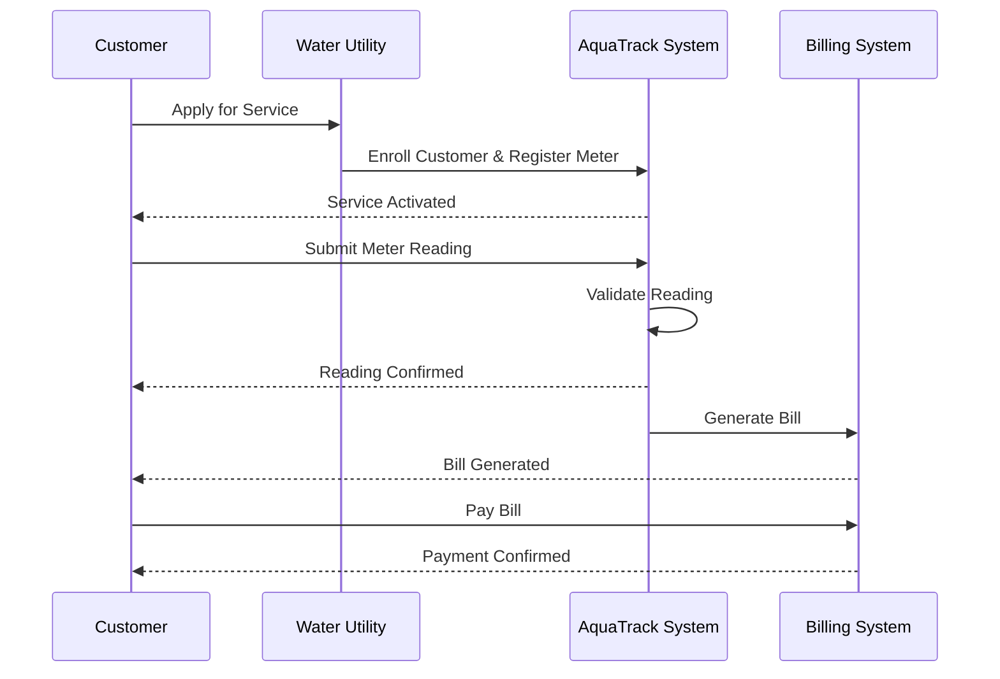

# Feature File Index

Complete index of all BDD feature files organized by domain area. Each feature file represents a specific business capability with comprehensive test coverage.

---

## System Specs At a Glance

<div style={{
  display: 'grid',
  gridTemplateColumns: 'repeat(auto-fit, minmax(200px, 1fr))',
  gap: '16px',
  marginBottom: '32px'
}}>
  <div style={{
    padding: '20px',
    borderRadius: '8px',
    backgroundColor: '#f8fafc',
    border: '1px solid #e2e8f0',
    textAlign: 'center'
  }}>
    <div style={{ fontSize: '28px', fontWeight: 'bold', color: '#0f172a', marginBottom: '8px' }}>18</div>
    <div style={{ fontSize: '14px', color: '#64748b', fontWeight: '500' }}>Total Features</div>
    <div style={{ fontSize: '12px', color: '#94a3b8', marginTop: '4px' }}>Across all domains</div>
  </div>
  
  <div style={{
    padding: '20px',
    borderRadius: '8px',
    backgroundColor: '#f8fafc',
    border: '1px solid #e2e8f0',
    textAlign: 'center'
  }}>
    <div style={{ fontSize: '28px', fontWeight: 'bold', color: '#0f172a', marginBottom: '8px' }}>160</div>
    <div style={{ fontSize: '14px', color: '#64748b', fontWeight: '500' }}>Test Scenarios</div>
    <div style={{ fontSize: '12px', color: '#94a3b8', marginTop: '4px' }}>Comprehensive coverage</div>
  </div>
  
  <div style={{
    padding: '20px',
    borderRadius: '8px',
    backgroundColor: '#f8fafc',
    border: '1px solid #e2e8f0',
    textAlign: 'center'
  }}>
    <div style={{ fontSize: '28px', fontWeight: 'bold', color: '#0f172a', marginBottom: '8px' }}>100%</div>
    <div style={{ fontSize: '14px', color: '#64748b', fontWeight: '500' }}>Test Coverage</div>
    <div style={{ fontSize: '12px', color: '#94a3b8', marginTop: '4px' }}>All features covered</div>
  </div>
  
  <div style={{
    padding: '20px',
    borderRadius: '8px',
    backgroundColor: '#f8fafc',
    border: '1px solid #e2e8f0',
    textAlign: 'center'
  }}>
    <div style={{ fontSize: '28px', fontWeight: 'bold', color: '#0f172a', marginBottom: '8px' }}>6</div>
    <div style={{ fontSize: '14px', color: '#64748b', fontWeight: '500' }}>Test Categories</div>
    <div style={{ fontSize: '12px', color: '#94a3b8', marginTop: '4px' }}>API, UI, E2E + more</div>
  </div>
</div>

---

## Quick Navigation

<div style={{
  display: 'grid',
  gridTemplateColumns: 'repeat(auto-fit, minmax(150px, 1fr))',
  gap: '12px',
  marginBottom: '28px'
}}>
  <a href="#meter-management-context" style={{
    padding: '12px 16px',
    borderRadius: '6px',
    backgroundColor: '#f1f5f9',
    border: '1px solid #cbd5e1',
    textDecoration: 'none',
    color: '#334155',
    fontWeight: '500',
    fontSize: '13px',
    textAlign: 'center'
  }}>Meter Management</a>
  
  <a href="#water-supply-context" style={{
    padding: '12px 16px',
    borderRadius: '6px',
    backgroundColor: '#f1f5f9',
    border: '1px solid #cbd5e1',
    textDecoration: 'none',
    color: '#3b82f6',
    fontWeight: '500',
    fontSize: '13px',
    textAlign: 'center'
  }}>Water Supply</a>
  
  <a href="#customer-management-context" style={{
    padding: '12px 16px',
    borderRadius: '6px',
    backgroundColor: '#f8fafc',
    border: '1px solid #e2e8f0',
    textDecoration: 'none',
    color: '#0f172a',
    fontWeight: '500',
    fontSize: '13px',
    textAlign: 'center'
  }}>Customer Management</a>
  
  <a href="#billing-settlement-context" style={{
    padding: '12px 16px',
    borderRadius: '6px',
    backgroundColor: '#f8fafc',
    border: '1px solid #cbd5e1',
    textDecoration: 'none',
    color: '#475569',
    fontWeight: '500',
    fontSize: '13px',
    textAlign: 'center'
  }}>Billing Settlement</a>
  
  <a href="#ui-features" style={{
    padding: '12px 16px',
    borderRadius: '6px',
    backgroundColor: '#f8fafc',
    border: '1px solid #e2e8f0',
    textDecoration: 'none',
    color: '#0f172a',
    fontWeight: '500',
    fontSize: '13px',
    textAlign: 'center'
  }}>UI Features</a>
  
  <a href="#hybrid-e2e-features" style={{
    padding: '12px 16px',
    borderRadius: '6px',
    backgroundColor: '#f8fafc',
    border: '1px solid #e2e8f0',
    textDecoration: 'none',
    color: '#475569',
    fontWeight: '500',
    fontSize: '13px',
    textAlign: 'center'
  }}>E2E Workflows</a>
</div>

---

## Feature Organization

<div style={{
  display: 'grid',
  gridTemplateColumns: 'repeat(auto-fit, minmax(240px, 1fr))',
  gap: '20px',
  marginBottom: '32px'
}}>
  <div style={{
    padding: '20px',
    borderRadius: '8px',
    backgroundColor: '#f8fafc',
    border: '1px solid #e2e8f0', borderLeft: '4px solid #3b82f6',
    boxShadow: '0 1px 3px rgba(0,0,0,0.1)'
  }}>
    <div style={{ fontSize: '16px', fontWeight: '700', color: '#0f172a', marginBottom: '12px' }}>Meter Management</div>
    <div style={{ marginBottom: '8px' }}>
      <span style={{ display: 'inline-block', fontSize: '12px', color: '#64748b', marginRight: '8px' }}>Features:</span>
      <span style={{ fontWeight: '600', color: '#334155' }}>3</span>
    </div>
    <div style={{ marginBottom: '8px' }}>
      <span style={{ display: 'inline-block', fontSize: '12px', color: '#64748b', marginRight: '8px' }}>Scenarios:</span>
      <span style={{ fontWeight: '600', color: '#334155' }}>23</span>
    </div>
    <div style={{ marginBottom: '12px' }}>
      <span style={{ display: 'inline-block', fontSize: '12px', color: '#64748b', marginRight: '8px' }}>Coverage:</span>
      <span style={{ fontWeight: '600', color: '#0f172a' }}>✓ 100%</span>
    </div>
    <div style={{ fontSize: '12px', color: '#475569', lineHeight: '1.6' }}>
      <div>• Registration</div>
      <div>• Reading Collection</div>
      <div>• Maintenance</div>
    </div>
  </div>
  
  <div style={{
    padding: '20px',
    borderRadius: '8px',
    backgroundColor: '#f8fafc',
    border: '1px solid #e2e8f0', borderLeft: '4px solid #3b82f6',
    boxShadow: '0 1px 3px rgba(0,0,0,0.1)'
  }}>
    <div style={{ fontSize: '16px', fontWeight: '700', color: '#0f172a', marginBottom: '12px' }}>Water Supply</div>
    <div style={{ marginBottom: '8px' }}>
      <span style={{ display: 'inline-block', fontSize: '12px', color: '#64748b', marginRight: '8px' }}>Features:</span>
      <span style={{ fontWeight: '600', color: '#475569' }}>5</span>
    </div>
    <div style={{ marginBottom: '8px' }}>
      <span style={{ display: 'inline-block', fontSize: '12px', color: '#64748b', marginRight: '8px' }}>Scenarios:</span>
      <span style={{ fontWeight: '600', color: '#475569' }}>50</span>
    </div>
    <div style={{ marginBottom: '12px' }}>
      <span style={{ display: 'inline-block', fontSize: '12px', color: '#64748b', marginRight: '8px' }}>Coverage:</span>
      <span style={{ fontWeight: '600', color: '#0f172a' }}>✓ 100%</span>
    </div>
    <div style={{ fontSize: '12px', color: '#475569', lineHeight: '1.6' }}>
      <div>• Scheduling</div>
      <div>• Delivery</div>
      <div>• Pressure Management</div>
    </div>
  </div>
  
  <div style={{
    padding: '20px',
    borderRadius: '8px',
    backgroundColor: '#f8fafc',
    border: '1px solid #e2e8f0', borderLeft: '4px solid #3b82f6',
    boxShadow: '0 1px 3px rgba(0,0,0,0.1)'
  }}>
    <div style={{ fontSize: '16px', fontWeight: '700', color: '#0f172a', marginBottom: '12px' }}>Customer Management</div>
    <div style={{ marginBottom: '8px' }}>
      <span style={{ display: 'inline-block', fontSize: '12px', color: '#64748b', marginRight: '8px' }}>Features:</span>
      <span style={{ fontWeight: '600', color: '#334155' }}>3</span>
    </div>
    <div style={{ marginBottom: '8px' }}>
      <span style={{ display: 'inline-block', fontSize: '12px', color: '#64748b', marginRight: '8px' }}>Scenarios:</span>
      <span style={{ fontWeight: '600', color: '#334155' }}>30</span>
    </div>
    <div style={{ marginBottom: '12px' }}>
      <span style={{ display: 'inline-block', fontSize: '12px', color: '#64748b', marginRight: '8px' }}>Coverage:</span>
      <span style={{ fontWeight: '600', color: '#0f172a' }}>✓ 100%</span>
    </div>
    <div style={{ fontSize: '12px', color: '#475569', lineHeight: '1.6' }}>
      <div>• Enrollment</div>
      <div>• Account Management</div>
      <div>• Service Agreements</div>
    </div>
  </div>
  
  <div style={{
    padding: '20px',
    borderRadius: '8px',
    backgroundColor: '#f8fafc',
    border: '1px solid #e2e8f0', borderLeft: '4px solid #3b82f6',
    boxShadow: '0 1px 3px rgba(0,0,0,0.1)'
  }}>
    <div style={{ fontSize: '16px', fontWeight: '700', color: '#475569', marginBottom: '12px' }}>Billing Settlement</div>
    <div style={{ marginBottom: '8px' }}>
      <span style={{ display: 'inline-block', fontSize: '12px', color: '#64748b', marginRight: '8px' }}>Features:</span>
      <span style={{ fontWeight: '600', color: '#334155' }}>3</span>
    </div>
    <div style={{ marginBottom: '8px' }}>
      <span style={{ display: 'inline-block', fontSize: '12px', color: '#64748b', marginRight: '8px' }}>Scenarios:</span>
      <span style={{ fontWeight: '600', color: '#334155' }}>28</span>
    </div>
    <div style={{ marginBottom: '12px' }}>
      <span style={{ display: 'inline-block', fontSize: '12px', color: '#64748b', marginRight: '8px' }}>Coverage:</span>
      <span style={{ fontWeight: '600', color: '#0f172a' }}>✓ 100%</span>
    </div>
    <div style={{ fontSize: '12px', color: '#475569', lineHeight: '1.6' }}>
      <div>• Reading Verification</div>
      <div>• Billing Disputes</div>
      <div>• Settlement</div>
    </div>
  </div>
  
  <div style={{
    padding: '20px',
    borderRadius: '8px',
    backgroundColor: '#f8fafc',
    border: '1px solid #e2e8f0', borderLeft: '4px solid #3b82f6',
    boxShadow: '0 1px 3px rgba(0,0,0,0.1)'
  }}>
    <div style={{ fontSize: '16px', fontWeight: '700', color: '#0f172a', marginBottom: '12px' }}>UI Tests</div>
    <div style={{ marginBottom: '8px' }}>
      <span style={{ display: 'inline-block', fontSize: '12px', color: '#64748b', marginRight: '8px' }}>Features:</span>
      <span style={{ fontWeight: '600', color: '#334155' }}>3</span>
    </div>
    <div style={{ marginBottom: '8px' }}>
      <span style={{ display: 'inline-block', fontSize: '12px', color: '#64748b', marginRight: '8px' }}>Scenarios:</span>
      <span style={{ fontWeight: '600', color: '#334155' }}>24</span>
    </div>
    <div style={{ marginBottom: '12px' }}>
      <span style={{ display: 'inline-block', fontSize: '12px', color: '#64748b', marginRight: '8px' }}>Coverage:</span>
      <span style={{ fontWeight: '600', color: '#0f172a' }}>✓ 100%</span>
    </div>
    <div style={{ fontSize: '12px', color: '#475569', lineHeight: '1.6' }}>
      <div>• Registration UI</div>
      <div>• Dashboard</div>
      <div>• Billing UI</div>
    </div>
  </div>
  
  <div style={{
    padding: '20px',
    borderRadius: '8px',
    backgroundColor: '#f8fafc',
    border: '1px solid #e2e8f0', borderLeft: '4px solid #3b82f6',
    boxShadow: '0 1px 3px rgba(0,0,0,0.1)'
  }}>
    <div style={{ fontSize: '16px', fontWeight: '700', color: '#475569', marginBottom: '12px' }}>E2E Workflows</div>
    <div style={{ marginBottom: '8px' }}>
      <span style={{ display: 'inline-block', fontSize: '12px', color: '#64748b', marginRight: '8px' }}>Features:</span>
      <span style={{ fontWeight: '600', color: '#334155' }}>1</span>
    </div>
    <div style={{ marginBottom: '8px' }}>
      <span style={{ display: 'inline-block', fontSize: '12px', color: '#64748b', marginRight: '8px' }}>Scenarios:</span>
      <span style={{ fontWeight: '600', color: '#334155' }}>5</span>
    </div>
    <div style={{ marginBottom: '12px' }}>
      <span style={{ display: 'inline-block', fontSize: '12px', color: '#64748b', marginRight: '8px' }}>Coverage:</span>
      <span style={{ fontWeight: '600', color: '#0f172a' }}>✓ 100%</span>
    </div>
    <div style={{ fontSize: '12px', color: '#475569', lineHeight: '1.6' }}>
      <div>• Customer Journey</div>
      <div>• Full Workflows</div>
      <div>• Integration Tests</div>
    </div>
  </div>
</div>

---

## Test Distribution & Priorities

<div style={{
  display: 'grid',
  gridTemplateColumns: '1fr 1fr',
  gap: '28px',
  marginBottom: '32px'
}}>
  <div>
    <h3 style={{ marginBottom: '16px', fontSize: '16px', fontWeight: '600' }}>Scenarios by Type</h3>
    

  </div>
  
  <div>
    <h3 style={{ marginBottom: '16px', fontSize: '16px', fontWeight: '600' }}>Priority Distribution</h3>
    
    <div style={{ marginBottom: '16px' }}>
      <div style={{ display: 'flex', justifyContent: 'space-between', marginBottom: '6px' }}>
        <span style={{ fontSize: '14px', fontWeight: '500', color: '#475569' }}>Critical</span>
        <span style={{ fontSize: '14px', fontWeight: '600', color: '#0f172a' }}>45 (28%)</span>
      </div>
      <div style={{
        width: '100%',
        height: '8px',
        backgroundColor: '#e2e8f0',
        borderRadius: '4px',
        overflow: 'hidden'
      }}>
        <div style={{
          width: '28%',
          height: '100%',
          backgroundColor: '#3b82f6'
        }}></div>
      </div>
    </div>
    
    <div style={{ marginBottom: '16px' }}>
      <div style={{ display: 'flex', justifyContent: 'space-between', marginBottom: '6px' }}>
        <span style={{ fontSize: '14px', fontWeight: '500', color: '#475569' }}>Smoke Tests</span>
        <span style={{ fontSize: '14px', fontWeight: '600', color: '#64748b' }}>32 (20%)</span>
      </div>
      <div style={{
        width: '100%',
        height: '8px',
        backgroundColor: '#e2e8f0',
        borderRadius: '4px',
        overflow: 'hidden'
      }}>
        <div style={{
          width: '20%',
          height: '100%',
          backgroundColor: '#64748b'
        }}></div>
      </div>
    </div>
    
    <div>
      <div style={{ display: 'flex', justifyContent: 'space-between', marginBottom: '6px' }}>
        <span style={{ fontSize: '14px', fontWeight: '500', color: '#475569' }}>Regression</span>
        <span style={{ fontSize: '14px', fontWeight: '600', color: '#0f172a' }}>83 (52%)</span>
      </div>
      <div style={{
        width: '100%',
        height: '8px',
        backgroundColor: '#e2e8f0',
        borderRadius: '4px',
        overflow: 'hidden'
      }}>
        <div style={{
          width: '52%',
          height: '100%',
          backgroundColor: '#3b82f6'
        }}></div>
      </div>
    </div>
  </div>
</div>

---

## Overview



---

## API Features

### Meter Management Context {#meter-management-context}

| Feature | File | Scenarios | Tags | Status |
|---------|------|-----------|------|--------|
| **Meter Registration** | `01_meter_registration.feature` | 8 | `@ROAD-001` `@api` | ✅ Complete |
| **Reading Collection** | `02_reading_collection.feature` | 6 | `@ROAD-005` `@api` | ✅ Complete |
| **Maintenance Management** | `03_maintenance_management.feature` | 9 | `@ROAD-007` `@api` | ✅ Complete |



#### Meter Registration

**File**: `stack-tests/features/api/meter-management/01_meter_registration.feature`

**Coverage Areas**:
- ✅ Successful registration with valid details
- ✅ Duplicate meter number prevention
- ✅ Service address validation
- ✅ Required field validation
- ✅ Registration timestamp recording
- ✅ Initial status assignment
- ✅ Meter ID generation
- ✅ Location configuration

**Key Scenarios**:
```gherkin
Scenario: Successfully register a new meter
  Given a customer with a valid service address
  When they submit registration with meter number "WM-001"
  Then a new meter should be created
  And the meter should have a unique ID

Scenario: Prevent duplicate meter numbers
  Given a meter "WM-001" is already registered
  When a customer tries to register with meter number "WM-001"
  Then the registration should fail
  And the error should indicate "Meter already exists"
```

---

### Water Supply Context {#water-supply-context}

| Feature | File | Scenarios | Tags | Status |
|---------|------|-----------|------|--------|
| **Supply Scheduling** | `01_supply_scheduling.feature` | 12 | `@ROAD-003` `@api` | ✅ Complete |
| **Delivery Management** | `02_delivery_management.feature` | 8 | `@ROAD-003` `@api` | ✅ Complete |
| **Pressure Management** | `03_pressure_management.feature` | 10 | `@ROAD-003` `@api` | ✅ Complete |
| **Supply Acceptance** | `04_supply_acceptance.feature` | 9 | `@ROAD-003` `@api` | ✅ Complete |
| **Delivery Completion** | `05_delivery_completion.feature` | 11 | `@ROAD-003` `@api` | ✅ Complete |



#### Supply Scheduling

**File**: `stack-tests/features/api/water-supply/01_supply_scheduling.feature`

**Coverage Areas**:
- ✅ Valid supply scheduling with all fields
- ✅ Volume validation (positive, non-zero)
- ✅ Duration constraints (min/max)
- ✅ Pressure level specification
- ✅ Service area selection
- ✅ Quality parameters
- ✅ Insufficient capacity handling
- ✅ Concurrent scheduling limits
- ✅ Supply ID generation

**Business Rules Covered**:
- Supply must have volume > 0
- Supply duration must be between 1 hour and 30 days
- Pressure level must be within safe ranges
- Area must have sufficient capacity for supply

---

### Customer Management Context {#customer-management-context}

| Feature | File | Scenarios | Tags | Status |
|---------|------|-----------|------|--------|
| **Customer Enrollment** | `01_customer_enrollment.feature` | 10 | `@ROAD-002` `@api` | ✅ Complete |
| **Account Management** | `02_account_management.feature` | 8 | `@ROAD-002` `@api` | ✅ Complete |
| **Service Agreements** | `03_service_agreements.feature` | 12 | `@ROAD-002` `@api` | ✅ Complete |



---

### Billing Settlement Context {#billing-settlement-context}

| Feature | File | Scenarios | Tags | Status |
|---------|------|-----------|------|--------|
| **Reading Verification** | `01_reading_verification.feature` | 9 | `@ROAD-004` `@api` | ✅ Complete |
| **Billing Disputes** | `02_billing_disputes.feature` | 11 | `@ROAD-004` `@api` | ✅ Complete |
| **Settlement Finalization** | `03_settlement_finalization.feature` | 8 | `@ROAD-004` `@api` | ✅ Complete |

---

## UI Features {#ui-features}

### Frontend Testing

| Feature | File | Scenarios | Tags | Status |
|---------|------|-----------|------|--------|
| **Meter Registration UI** | `01_meter_registration_ui.feature` | 7 | `@ROAD-001` `@ui` | ✅ Complete |
| **Dashboard UI** | `02_dashboard_ui.feature` | 8 | `@ROAD-003` `@ui` | ✅ Complete |
| **Billing Management UI** | `03_billing_management_ui.feature` | 9 | `@ROAD-003` `@ui` | ✅ Complete |



---

## Hybrid (E2E) Features {#hybrid-e2e-features}

### End-to-End Workflows

| Feature | File | Scenarios | Tags | Status |
|---------|------|-----------|------|--------|
| **E2E Customer Journey** | `01_end_to_end_customer_journey.feature` | 5 | `@ROAD-003` `@hybrid` | ✅ Complete |

**Complete User Journey**:


---

## Running Feature Tests

### Run by Domain

```bash
# Meter Management
just bdd-tag "@meter-management"

# Water Supply
just bdd-tag "@water-supply"

# Customer Management
just bdd-tag "@customer-management"

# Billing Settlement
just bdd-tag "@billing-settlement"
```

### Run by Roadmap Item

```bash
just bdd-roadmap ROAD-001  # Meter Registration
just bdd-roadmap ROAD-002  # Customer Enrollment
just bdd-roadmap ROAD-003  # Usage Tracking & Supply
just bdd-roadmap ROAD-004  # Billing & Settlement
just bdd-roadmap ROAD-005  # Reading Collection
just bdd-roadmap ROAD-007  # Maintenance Management
```

### Run by Priority

```bash
just bdd-tag "@critical"
just bdd-tag "@smoke"
```

---

## Feature-to-Domain Mapping

| Feature File | Bounded Context | Aggregates | Domain Events | Owning Team |
|:-------------|:----------------|:-----------|:--------------|:------------|
| `01_meter_registration.feature` | Meter Operations | Meter | MeterRegistered | Field Services |
| `02_reading_collection.feature` | Usage Tracking | MeterReading | ReadingRecorded | Operations |
| `03_maintenance_management.feature` | Meter Operations | MaintenanceSchedule | MaintenanceScheduled | Field Services |
| `01_supply_scheduling.feature` | Usage Tracking | UsagePeriod | SupplyScheduled | Operations |
| `02_delivery_management.feature` | Usage Tracking | UsagePeriod | DeliveryStarted | Operations |
| `03_pressure_management.feature` | Usage Tracking | ConsumptionRecord | PressureAdjusted | Operations |
| `04_supply_acceptance.feature` | Usage Tracking | UsagePeriod | SupplyAccepted | Operations |
| `05_delivery_completion.feature` | Usage Tracking | UsagePeriod | DeliveryCompleted | Operations |
| `01_customer_enrollment.feature` | Customer Account Mgmt | CustomerAccount | AccountCreated | Customer Services |
| `02_account_management.feature` | Customer Account Mgmt | AccountStatus | StatusChanged | Customer Services |
| `03_service_agreements.feature` | Customer Account Mgmt | ServiceDeposit | DepositReleased | Customer Services |
| `01_reading_verification.feature` | Billing & Payments | Invoice | ReadingVerified | Finance |
| `02_billing_disputes.feature` | Billing & Payments | Invoice | DisputeFiled | Finance |
| `03_settlement_finalization.feature` | Billing & Payments | Payment | BillFinalized | Finance |

---

## Persona Coverage {#persona-coverage}

Which personas are tested by which feature domains:

| Persona | Meter Operations | Usage Tracking | Customer Account Mgmt | Billing & Payments | UI | E2E |
|:--------|:---:|:---:|:---:|:---:|:---:|:---:|
| [PER-001 Utility Admin](/docs/personas/PER-001-utility-administrator) | -- | Reviews | Manages | Oversees | Dashboard | -- |
| [PER-002 Treatment Operator](/docs/personas/PER-002-treatment-operator) | Coordinates | Monitors | -- | -- | Dashboard | -- |
| [PER-003 Residential Customer](/docs/personas/PER-003-residential-customer) | Requests service | Views usage | Enrolls | Pays bills | Registration, Billing | Full journey |
| [PER-004 Commercial Customer](/docs/personas/PER-004-commercial-customer) | Requests service | Monitors usage | Manages accounts | Manages payments | Dashboard, Billing | -- |
| [PER-005 Meter Technician](/docs/personas/PER-005-meter-technician) | Installs, calibrates | Records readings | -- | -- | Registration | -- |

---

## Capability Coverage {#capability-coverage}

Which capabilities are exercised by which BDD feature domains:

| Capability | Meter Operations | Usage Tracking | Customer Account Mgmt | Billing & Payments | UI | E2E |
|:-----------|:---:|:---:|:---:|:---:|:---:|:---:|
| [CAP-001 Portal Auth](/docs/capabilities/CAP-001) | Auth required | Auth required | Auth required | Auth required | Login flows | Full auth |
| [CAP-002 Usage Logging](/docs/capabilities/CAP-002) | Meter events | Reading events | Account events | Billing events | Audit trail | Full audit |
| [CAP-003 Usage Alerts](/docs/capabilities/CAP-003) | -- | Threshold alerts | -- | Payment alerts | Alert display | Alert flow |
| [CAP-004 Anomaly Detection](/docs/capabilities/CAP-004) | Tamper detection | Usage anomalies | -- | -- | -- | -- |
| [CAP-005 Self-Service Portal](/docs/capabilities/CAP-005) | -- | Usage dashboard | Account portal | Billing portal | All UI tests | Portal journey |
| [CAP-006 Service Coverage](/docs/capabilities/CAP-006) | -- | -- | Address validation | -- | Registration UI | Enrollment |
| [CAP-007 System Integration](/docs/capabilities/CAP-007) | SCADA feeds | -- | -- | Payment gateway | -- | -- |
| [CAP-008 Meter Certification](/docs/capabilities/CAP-008) | Calibration | Reading validation | -- | -- | -- | -- |

---

## Compliance Validation {#compliance-validation}

### ADR Validation

BDD features validate that architecture decisions are correctly implemented:

| ADR | Decision | Validated By Features | Status |
|:----|:---------|:---------------------|:-------|
| ADR-001 | Domain-Driven Design | All API features (aggregate boundaries, domain events) | Covered |
| ADR-002 | Modular Monolith | Feature isolation per bounded context | Covered |
| ADR-003 | Convex Backend | All API features (Convex function calls) | Covered |
| ADR-004 | Next.js Frontend | All UI features | Covered |
| ADR-005 | Event-Driven Communication | Domain event publishing in all API features | Covered |
| ADR-006 | Aggregate Consistency | Validation rules in registration, enrollment, billing | Covered |
| ADR-009 | API Key Authentication | Auth-gated scenarios across all features | Covered |
| ADR-015 | Eventual Consistency | Cross-context data flow in E2E journey | Partial |
| ADR-021 | Clerk Authentication | Login/session scenarios in UI features | Covered |

### NFR Validation

BDD features assert NFR compliance:

| NFR | Requirement | Validated By | How |
|:----|:-----------|:-------------|:----|
| NFR-PERF-001 | API response < 200ms | API features | Response time assertions |
| NFR-SEC-001 | Token on every request | All API features | Auth-required scenarios |
| NFR-SEC-003 | Immutable audit log | Usage logging scenarios | Log verification steps |
| NFR-SEC-004 | Rate limiting | Anomaly detection features | Rate limit assertions |
| NFR-REL-001 | 99.9% delivery rate | Alert features | Delivery confirmation steps |
| NFR-A11Y-001 | WCAG 2.1 AA | UI features | Accessibility checks |

---

## Team Ownership {#team-ownership}

Feature files are owned by the team that owns the corresponding bounded context:

<div style={{
  display: 'grid',
  gridTemplateColumns: 'repeat(auto-fit, minmax(250px, 1fr))',
  gap: '16px',
  marginBottom: '24px'
}}>
  <div style={{ padding: '16px 20px', borderRadius: '8px', border: '1px solid #e2e8f0', borderLeft: '4px solid #3b82f6', backgroundColor: '#f8fafc' }}>
    <div style={{ fontSize: '14px', fontWeight: '700', color: '#0f172a', marginBottom: '8px' }}>Customer Services</div>
    <div style={{ fontSize: '12px', color: '#64748b', lineHeight: '1.8' }}>
      &#x2022; Customer enrollment (10 scenarios)<br/>
      &#x2022; Account management (8 scenarios)<br/>
      &#x2022; Service agreements (12 scenarios)
    </div>
    <div style={{ fontSize: '11px', color: '#94a3b8', marginTop: '8px', paddingTop: '8px', borderTop: '1px solid #e2e8f0' }}>30 scenarios | 3 feature files</div>
  </div>

  <div style={{ padding: '16px 20px', borderRadius: '8px', border: '1px solid #e2e8f0', borderLeft: '4px solid #3b82f6', backgroundColor: '#f8fafc' }}>
    <div style={{ fontSize: '14px', fontWeight: '700', color: '#0f172a', marginBottom: '8px' }}>Operations</div>
    <div style={{ fontSize: '12px', color: '#64748b', lineHeight: '1.8' }}>
      &#x2022; Supply scheduling (12 scenarios)<br/>
      &#x2022; Delivery management (8 scenarios)<br/>
      &#x2022; Pressure management (10 scenarios)<br/>
      &#x2022; Supply acceptance (9 scenarios)<br/>
      &#x2022; Delivery completion (11 scenarios)
    </div>
    <div style={{ fontSize: '11px', color: '#94a3b8', marginTop: '8px', paddingTop: '8px', borderTop: '1px solid #e2e8f0' }}>50 scenarios | 5 feature files</div>
  </div>

  <div style={{ padding: '16px 20px', borderRadius: '8px', border: '1px solid #e2e8f0', borderLeft: '4px solid #3b82f6', backgroundColor: '#f8fafc' }}>
    <div style={{ fontSize: '14px', fontWeight: '700', color: '#0f172a', marginBottom: '8px' }}>Finance</div>
    <div style={{ fontSize: '12px', color: '#64748b', lineHeight: '1.8' }}>
      &#x2022; Reading verification (9 scenarios)<br/>
      &#x2022; Billing disputes (11 scenarios)<br/>
      &#x2022; Settlement finalization (8 scenarios)
    </div>
    <div style={{ fontSize: '11px', color: '#94a3b8', marginTop: '8px', paddingTop: '8px', borderTop: '1px solid #e2e8f0' }}>28 scenarios | 3 feature files</div>
  </div>

  <div style={{ padding: '16px 20px', borderRadius: '8px', border: '1px solid #e2e8f0', borderLeft: '4px solid #3b82f6', backgroundColor: '#f8fafc' }}>
    <div style={{ fontSize: '14px', fontWeight: '700', color: '#0f172a', marginBottom: '8px' }}>Field Services</div>
    <div style={{ fontSize: '12px', color: '#64748b', lineHeight: '1.8' }}>
      &#x2022; Meter registration (8 scenarios)<br/>
      &#x2022; Reading collection (6 scenarios)<br/>
      &#x2022; Maintenance management (9 scenarios)
    </div>
    <div style={{ fontSize: '11px', color: '#94a3b8', marginTop: '8px', paddingTop: '8px', borderTop: '1px solid #e2e8f0' }}>23 scenarios | 3 feature files</div>
  </div>
</div>

---

## Next Steps

- [Gherkin Syntax Guide](./gherkin-syntax) -- Learn how to read scenarios
- [DDD-BDD Mapping](./ddd-bdd-mapping) -- See domain connections
- [BDD Overview](./bdd-overview) -- Understand our BDD approach

---

**Related**: [Domain Overview](/docs/ddd/domain-overview) | [Capabilities](/docs/capabilities/) | [Teams & Ownership](/docs/teams-overview) | [Users & Personas](/docs/users-overview) | [ADR Catalog](/docs/adr/README) | [NFR Index](/docs/nfr/)
