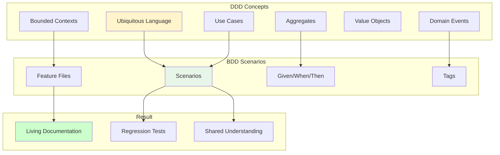
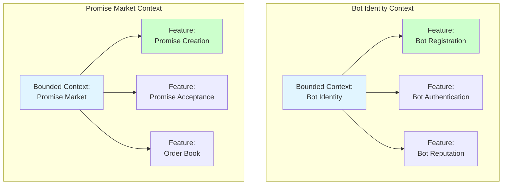
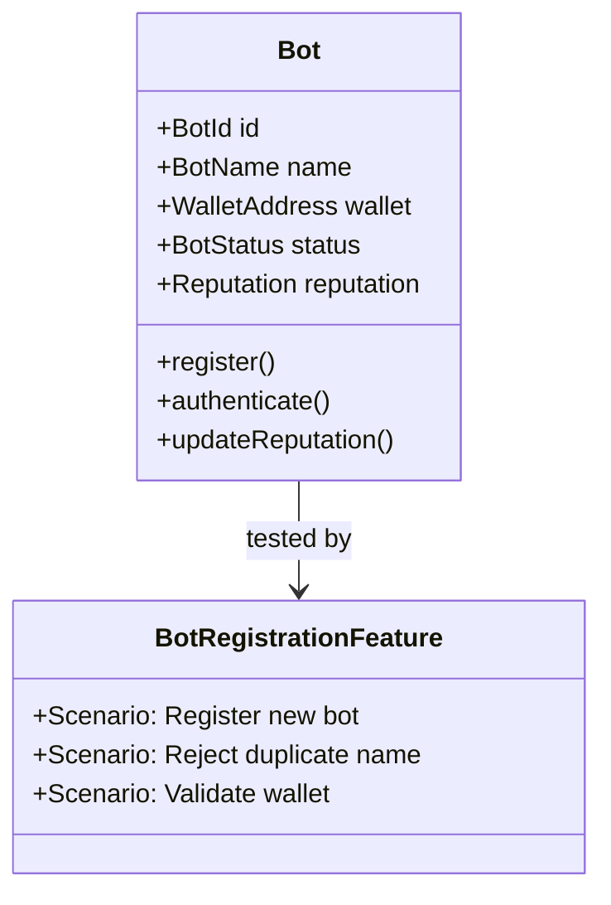
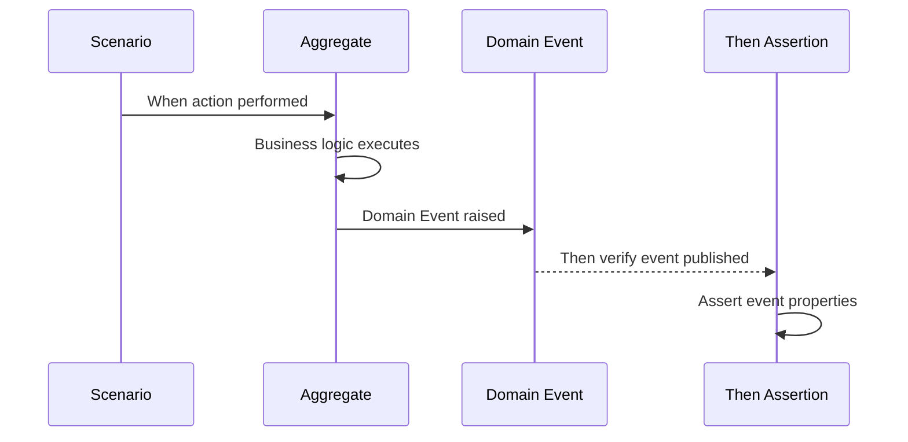
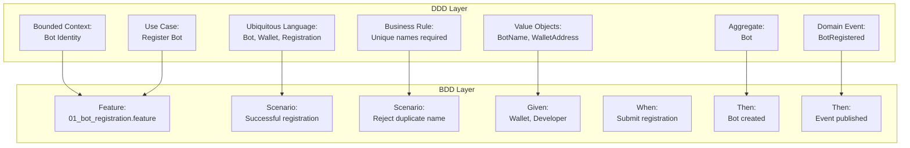

# DDD-BDD Mapping

This document shows how **Domain-Driven Design (DDD)** concepts map to **Behavior-Driven Development (BDD)** scenarios. Understanding this mapping ensures our tests accurately reflect business behavior.

## Overview



## Mapping Table

| DDD Concept | BDD Representation | Example |
|-------------|-------------------|---------|
| **Bounded Context** | Feature file organization | `features/api/bot-identity/` |
| **Ubiquitous Language** | Scenario vocabulary | `When a Bot registers` |
| **Aggregate** | Test subject | `Given a registered Bot` |
| **Aggregate Root** | Entity under test | `Then the Bot status changes` |
| **Domain Event** | Then assertion | `Then BotRegistered event published` |
| **Value Object** | Data in tables | `\| wallet_address \| 0x123... \|` |
| **Use Case** | Feature description | `Feature: Bot Registration` |
| **Business Rule** | Scenario validation | `Then reject duplicate names` |
| **Invariant** | Assertion in Then | `Then balance remains unchanged` |

---

## Bounded Context → Feature Organization

Each Bounded Context has its own directory of features:



### Directory Structure

```
stack-tests/features/api/
├── bot-identity/           # Bot Identity Bounded Context
│   ├── 01_bot_registration.feature
│   ├── 02_bot_authentication.feature
│   └── 03_bot_reputation.feature
├── promise-market/         # Promise Market Bounded Context
│   ├── 01_promise_creation.feature
│   ├── 02_promise_listing.feature
│   ├── 03_order_book.feature
│   ├── 04_promise_acceptance.feature
│   └── 05_promise_execution.feature
├── token-management/       # Token Management Bounded Context
│   ├── 01_wallet_operations.feature
│   ├── 02_stake_management.feature
│   └── 03_escrow_system.feature
└── settlement/            # Settlement Bounded Context
    ├── 01_verification.feature
    ├── 02_disputes.feature
    └── 03_settlement_finalization.feature
```

---

## Ubiquitous Language → Scenario Vocabulary

BDD scenarios MUST use terms from the Ubiquitous Language:

### Correct Usage ✅

```gherkin
Feature: Promise Creation

  Scenario: Bot creates a compute Promise
    Given a registered Bot "SellerBot"
    And "SellerBot" has available compute Capacity
    When "SellerBot" creates a Promise with:
      | compute_capacity | 100 units |
      | duration_hours   | 24        |
      | price_per_unit   | 0.5 CLAW  |
    Then a PromiseCreated Domain Event should be published
    And the Promise should be Listed in the Order Book
```

### Incorrect Usage ❌

```gherkin
# ❌ Using technical/implementation terms
Scenario: POST creates compute offer
  Given user exists in database
  When POST /api/offers with JSON body
  Then HTTP 201 returned
  And database row inserted
  And Redis cache updated
```

### Language Mapping Reference

| Domain Term | Use In Scenarios | Don't Use |
|-------------|------------------|-----------|
| Bot | `Given a registered Bot` | user, account, entity |
| Promise | `When a Promise is created` | offer, contract, listing |
| Capacity | `compute Capacity` | resources, limit, quota |
| Order Book | `listed in the Order Book` | marketplace, exchange |
| CLAW Token | `CLAW tokens` | tokens, currency, money |
| Stake | `lock Stake` | deposit, collateral |
| Escrow | `funds in Escrow` | holding, vault |
| Reputation | `Reputation Score` | rating, trust score |

---

## Aggregates → Test Subjects

Each Aggregate is the primary subject of its scenarios:

### Bot Aggregate



#### Example Scenarios

```gherkin
Feature: Bot Registration

  Scenario: Successfully register a new Bot
    Given a developer with a valid Wallet
    When they submit Bot Registration with name "AlphaBot"
    Then a new Bot should be created
    And the Bot should have a unique BotId
    And the Bot status should be "ACTIVE"

  Scenario: Bot Registration publishes Domain Event
    Given a developer with a valid Wallet
    When they complete Bot Registration
    Then a BotRegistered Domain Event should be published
    And the event should contain the BotId
```

### Promise Aggregate

```gherkin
Feature: Promise Lifecycle

  Scenario: Promise aggregate maintains invariants
    Given a Bot "Seller" with 1000 CLAW tokens
    And "Seller" has available Capacity of 100 units
    When "Seller" creates a Promise requiring 50 CLAW Stake
    Then the Promise should be created
    And the Promise aggregate should enforce:
      | Invariant                          | Status |
      | Stake locked in Escrow             | ✓      |
      | Capacity deducted from available   | ✓      |
      | Promise status is LISTED           | ✓      |
      | Seller balance reduced by 50       | ✓      |
```

---

## Domain Events → Then Assertions

Domain Events are verified in the `Then` steps:



### Event Verification Patterns

```gherkin
# Pattern 1: Basic event verification
Then a BotRegistered Domain Event should be published

# Pattern 2: Event with properties
Then a PromiseCreated Domain Event should be published with:
  | Property       | Value         |
  | promise_id     | promise_123   |
  | seller_bot_id  | bot_456       |
  | capacity       | 100 units     |

# Pattern 3: Multiple events
Then the following Domain Events should be published:
  | Event              | Order |
  | PromiseAccepted    | 1     |
  | EscrowLocked       | 2     |
  | NotificationSent   | 3     |

# Pattern 4: No unexpected events
Then only the expected Domain Events should be published
And no other Domain Events should occur
```

### Event-to-Scenario Mapping

| Domain Event | Feature File | Scenario Example |
|--------------|--------------|------------------|
| BotRegistered | `01_bot_registration.feature` | `Then BotRegistered event published` |
| BotAuthenticated | `02_bot_authentication.feature` | `Then authentication event with token` |
| ReputationUpdated | `03_bot_reputation.feature` | `Then reputation change event emitted` |
| PromiseCreated | `01_promise_creation.feature` | `Then PromiseCreated event published` |
| PromiseListed | `02_promise_listing.feature` | `Then listing event with market data` |
| PromiseAccepted | `04_promise_acceptance.feature` | `Then acceptance event with both parties` |
| EscrowLocked | `03_escrow_system.feature` | `Then escrow locked event with amount` |
| SettlementCompleted | `03_settlement_finalization.feature` | `Then settlement event with final amounts` |

---

## Value Objects → Data Tables

Value Objects appear as data in scenario tables:

### Wallet Address (Value Object)

```gherkin
  Scenario Outline: Validate wallet addresses
    When registering with wallet address "<address>"
    Then the registration should be "<result>"

    Examples:
      | address                                    | result    |
      | 0x742d35Cc6634C0532925a3b844Bc9e7595f0bEb5 | valid     |
      | 0x123                                      | invalid   |
      | not-an-address                             | invalid   |
      |                                            | invalid   |
```

### Money/CLAW Tokens (Value Object)

```gherkin
  Scenario: Stake calculation
    Given a Bot with wallet balance:
      | currency | amount |
      | CLAW     | 1000   |
    When creating a Promise requiring Stake:
      | currency | amount |
      | CLAW     | 100    |
    Then the locked Stake should be:
      | currency | amount |
      | CLAW     | 100    |
```

### Compute Capacity (Value Object)

```gherkin
  Scenario: Promise capacity validation
    Given a Bot with available Capacity:
      | unit  | amount |
      | GPU   | 10     |
      | CPU   | 100    |
    When creating a Promise with:
      | resource | required |
      | GPU      | 5        |
    Then the remaining Capacity should be:
      | unit | amount |
      | GPU  | 5      |
      | CPU  | 100    |
```

---

## Use Cases → Feature Descriptions

Each Use Case becomes a Feature:

### Use Case to Feature Mapping

| Use Case | Feature File | User Story |
|----------|--------------|------------|
| UC-001: Register Bot | `01_bot_registration.feature` | As a developer, I want to register my bot... |
| UC-002: Authenticate Bot | `02_bot_authentication.feature` | As a bot, I want to authenticate... |
| UC-003: Create Promise | `01_promise_creation.feature` | As a bot, I want to offer compute capacity... |
| UC-004: Accept Promise | `04_promise_acceptance.feature` | As a bot, I want to buy compute capacity... |
| UC-005: Execute Promise | `05_promise_execution.feature` | As a seller, I want to deliver compute... |
| UC-006: Settle Payment | `03_settlement_finalization.feature` | As a participant, I want to complete settlement... |

### Example Use Case → Feature

**Use Case: Create Promise**
```
Primary Actor: Bot (Seller)
Goal: Create a compute capacity promise
Preconditions: Bot is registered and authenticated
Success: Promise created and listed in order book
```

**Feature File:**
```gherkin
Feature: Promise Creation
  As a Bot with spare compute capacity
  I want to create a Promise
  So that other Bots can purchase my capacity

  Background:
    Given a registered Bot "SellerBot"
    And "SellerBot" is authenticated
    And "SellerBot" has available compute Capacity

  Scenario: Successfully create a Promise
    When "SellerBot" creates a Promise with valid specifications
    Then the Promise should be created
    And the Promise should be listed in the Order Book
    And a PromiseCreated Domain Event should be published
```

---

## Business Rules → Scenario Validations

Business Rules are explicitly tested in scenarios:

### Rule: Promise Capacity Must Be Positive

```gherkin
  Scenario Outline: Reject promise with invalid capacity
    When creating a Promise with capacity "<capacity>"
    Then the creation should fail with error "<error>"
    And the error should reference business rule "PROMISE-001"

    Examples:
      | capacity | error                         |
      | 0        | Capacity must be positive     |
      | -1       | Capacity must be positive     |
      | -100     | Capacity must be positive     |
```

### Rule: Bot Must Have Sufficient Stake

```gherkin
  Scenario: Insufficient stake prevents promise creation
    Given a Bot "PoorBot" with wallet balance 10 CLAW
    When "PoorBot" attempts to create a Promise requiring 100 CLAW Stake
    Then the creation should fail with error "Insufficient stake"
    And the error should reference business rule "PROMISE-002"
    And no Promise should be created
    And no Stake should be locked
```

### Rule: Duplicate Bot Names Not Allowed

```gherkin
  Scenario: Enforce unique bot names
    Given a Bot named "AlphaBot" is already registered
    When a developer attempts to register with name "AlphaBot"
    Then the registration should fail
    And the error should indicate "Name already exists"
    And the error should reference business rule "BOT-001"
```

---

## Complete Example: Registration Flow

Here's how all DDD concepts come together in BDD:



### Complete Feature Example

```gherkin
@bot-identity @ROAD-001 @api
Feature: Bot Registration
  As a bot developer
  I want to register my bot
  So that I can participate in the marketplace

  # Business Rule: BOT-001 - Bot names must be unique
  # Business Rule: BOT-002 - Valid wallet address required

  Background:
    Given the Bot Identity context is initialized

  Scenario: Successfully register a new Bot
    # Value Object: WalletAddress
    Given a developer with Wallet address "0x742d35Cc6634C0532925a3b844Bc9e7595f0bEb5"
    # Aggregate: Bot (not yet created)
    And no Bot with name "TradingBot" exists
    # Use Case: Register Bot
    When the developer submits Bot Registration with:
      | Field        | Value          |
      | BotName      | TradingBot     |
      | WalletAddress| 0x742d...0bEb5 |
    # Aggregate verification
    Then a new Bot should be created
    And the Bot should have a unique BotId
    And the Bot status should be "PENDING_VERIFICATION"
    # Domain Event verification
    And a BotRegistered Domain Event should be published
    And the event should contain the BotId and BotName
    # Value Object verification
    And the Bot's WalletAddress should be "0x742d...0bEb5"

  Scenario: Enforce unique Bot names (BOT-001)
    Given a Bot "TradingBot" is already registered
    When a developer attempts to register with name "TradingBot"
    Then the registration should fail
    And the error should reference business rule "BOT-001"
    And no new Bot should be created
    And no BotRegistered Domain Event should be published
```

---

## Validation Checklist

When writing BDD scenarios, verify they correctly represent DDD concepts:


### Quick Validation Questions

1. **Ubiquitous Language**: Are we using domain terms like "Bot", "Promise", "Stake" instead of technical terms?
2. **Aggregate Focus**: Is the scenario testing the aggregate root's behavior?
3. **Event Verification**: Are we asserting domain events are published?
4. **Business Rules**: Are business rules explicitly tested and referenced?
5. **Context Organization**: Is the feature in the correct bounded context directory?
6. **Use Case Alignment**: Does the feature map to a documented use case?

---

## Next Steps

- [Review Bounded Contexts](../ddd/bounded-contexts) - Understand our domain organization
- [Study Ubiquitous Language](../ddd/ubiquitous-language) - Learn domain terminology
- [Explore Use Cases](../ddd/use-cases) - See documented use cases
- [Browse Feature Files](./feature-index) - View all BDD scenarios

---

**Related**: [BDD Overview](./bdd-overview) • [Gherkin Syntax](./gherkin-syntax) • [Aggregates & Entities](../ddd/aggregates-entities)
