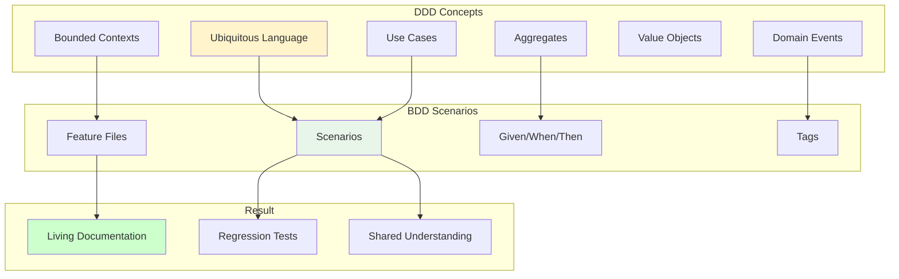
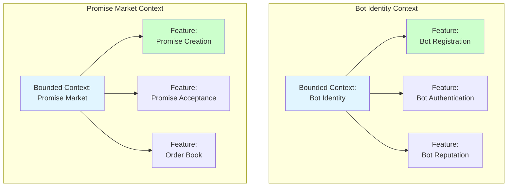
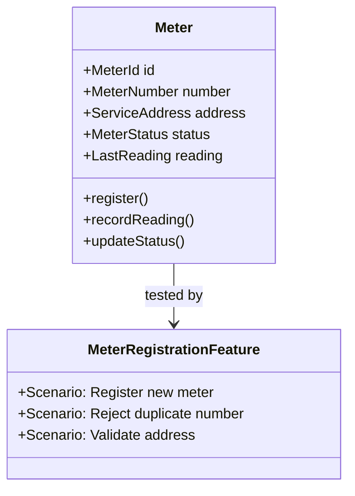
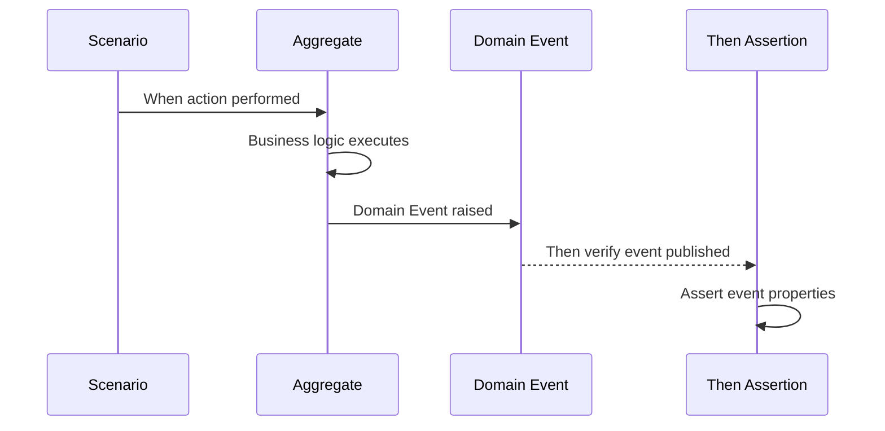
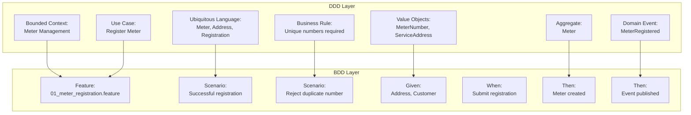
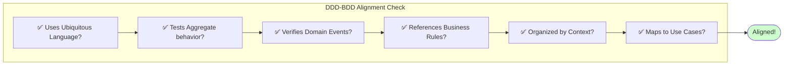

# DDD-BDD Mapping

This document shows how **Domain-Driven Design (DDD)** concepts map to **Behavior-Driven Development (BDD)** scenarios. Understanding this mapping ensures our tests accurately reflect business behavior.

## Overview



## Mapping Table

| DDD Concept | BDD Representation | Example |
|-------------|-------------------|---------|
| **Bounded Context** | Feature file organization | `features/api/meter-management/` |
| **Ubiquitous Language** | Scenario vocabulary | `When a Meter registers` |
| **Aggregate** | Test subject | `Given a registered Meter` |
| **Aggregate Root** | Entity under test | `Then the Meter status changes` |
| **Domain Event** | Then assertion | `Then MeterRegistered event published` |
| **Value Object** | Data in tables | `\| service_address \| 123 Main St \|` |
| **Use Case** | Feature description | `Feature: Meter Registration` |
| **Business Rule** | Scenario validation | `Then reject duplicate meters` |
| **Invariant** | Assertion in Then | `Then volume remains unchanged` |

---

## Bounded Context → Feature Organization

Each Bounded Context has its own directory of features:



### Directory Structure

```
stack-tests/features/api/
├── meter-management/       # Meter Management Bounded Context
│   ├── 01_meter_registration.feature
│   ├── 02_reading_collection.feature
│   └── 03_maintenance_management.feature
├── water-supply/           # Water Supply Bounded Context
│   ├── 01_supply_scheduling.feature
│   ├── 02_delivery_management.feature
│   ├── 03_pressure_management.feature
│   ├── 04_supply_acceptance.feature
│   └── 05_delivery_completion.feature
├── customer-management/    # Customer Management Bounded Context
│   ├── 01_customer_enrollment.feature
│   ├── 02_account_management.feature
│   └── 03_service_agreements.feature
└── billing-settlement/     # Billing Settlement Bounded Context
    ├── 01_reading_verification.feature
    ├── 02_billing_disputes.feature
    └── 03_settlement_finalization.feature
```

---

## Ubiquitous Language → Scenario Vocabulary

BDD scenarios MUST use terms from the Ubiquitous Language:

### Correct Usage ✅

```gherkin
Feature: Water Supply Scheduling

  Scenario: Utility schedules water Supply
    Given a registered service Area "District-001"
    And the Area has available capacity
    When the Utility schedules a Supply with:
      | supply_volume  | 1000 units |
      | duration_hours | 24         |
      | pressure_level | MEDIUM     |
    Then a SupplyScheduled Domain Event should be published
    And the Supply should be listed in the Schedule
```

### Incorrect Usage ❌

```gherkin
# ❌ Using technical/implementation terms
Scenario: POST creates water supply
  Given customer exists in database
  When POST /api/supplies with JSON body
  Then HTTP 201 returned
  And database row inserted
  And Redis cache updated
```

### Language Mapping Reference

| Domain Term | Use In Scenarios | Don't Use |
|-------------|------------------|-----------|
| Meter | `Given a registered Meter` | device, sensor, equipment |
| Supply | `When a Supply is scheduled` | delivery, shipment, transaction |
| Capacity | `available Capacity` | resources, limit, quota |
| Schedule | `listed in the Schedule` | calendar, timetable, plan |
| Service Area | `for Service Area "District-001"` | zone, region, territory |
| Reading | `submit a Reading` | measurement, value, data point |
| Pressure | `Pressure Level` | PSI, force, strength |
| Customer | `Customer account` | user, subscriber, account holder |

---

## Aggregates → Test Subjects

Each Aggregate is the primary subject of its scenarios:

### Meter Aggregate



#### Example Scenarios

```gherkin
Feature: Meter Registration

  Scenario: Successfully register a new Meter
    Given a customer with a valid Service Address
    When they submit Meter Registration with number "WM-001"
    Then a new Meter should be created
    And the Meter should have a unique MeterId
    And the Meter status should be "ACTIVE"

  Scenario: Meter Registration publishes Domain Event
    Given a customer with a valid Service Address
    When they complete Meter Registration
    Then a MeterRegistered Domain Event should be published
    And the event should contain the MeterId
```

### Supply Aggregate

```gherkin
Feature: Supply Lifecycle

  Scenario: Supply aggregate maintains invariants
    Given a Service Area with 5000 units capacity
    And the Area has available Capacity of 2000 units
    When the Utility schedules a Supply requiring 1000 units
    Then the Supply should be created
    And the Supply aggregate should enforce:
      | Invariant                          | Status |
      | Capacity reserved                  | ✓      |
      | Available capacity deducted        | ✓      |
      | Supply status is SCHEDULED         | ✓      |
      | Area available reduced by 1000     | ✓      |
```

---

## Domain Events → Then Assertions

Domain Events are verified in the `Then` steps:



### Event Verification Patterns

```gherkin
# Pattern 1: Basic event verification
Then a MeterRegistered Domain Event should be published

# Pattern 2: Event with properties
Then a SupplyScheduled Domain Event should be published with:
  | Property       | Value         |
  | supply_id      | supply_123    |
  | area_id        | area_456      |
  | volume         | 1000 units    |

# Pattern 3: Multiple events
Then the following Domain Events should be published:
  | Event              | Order |
  | SupplyScheduled    | 1     |
  | CapacityReserved   | 2     |
  | NotificationSent   | 3     |

# Pattern 4: No unexpected events
Then only the expected Domain Events should be published
And no other Domain Events should occur
```

### Event-to-Scenario Mapping

| Domain Event | Feature File | Scenario Example |
|--------------|--------------|------------------|
| MeterRegistered | `01_meter_registration.feature` | `Then MeterRegistered event published` |
| ReadingRecorded | `02_reading_collection.feature` | `Then reading event with value` |
| MaintenanceScheduled | `03_maintenance_management.feature` | `Then maintenance event emitted` |
| SupplyScheduled | `01_supply_scheduling.feature` | `Then SupplyScheduled event published` |
| DeliveryStarted | `02_delivery_management.feature` | `Then delivery event with area data` |
| SupplyAccepted | `04_supply_acceptance.feature` | `Then acceptance event with details` |
| CapacityReserved | `03_pressure_management.feature` | `Then capacity reserved event with amount` |
| BillFinalized | `03_settlement_finalization.feature` | `Then bill event with final amounts` |

---

## Value Objects → Data Tables

Value Objects appear as data in scenario tables:

### Service Address (Value Object)

```gherkin
  Scenario Outline: Validate service addresses
    When registering with address "<address>"
    Then the registration should be "<result>"

    Examples:
      | address       | result    |
      | 123 Main St   | valid     |
      | 456 Oak Ave   | valid     |
      | Invalid St.   | invalid   |
      |               | invalid   |
```

### Water Volume (Value Object)

```gherkin
  Scenario: Volume calculation
    Given a Service Area with total volume:
      | unit  | amount |
      | units | 5000   |
    When scheduling Supply with volume:
      | unit  | amount |
      | units | 1000   |
    Then the remaining volume should be:
      | unit  | amount |
      | units | 4000   |
```

### Pressure Level (Value Object)

```gherkin
  Scenario: Pressure validation
    Given a Service Area with pressure constraints:
      | level  | min | max |
      | PSI    | 40  | 80  |
    When scheduling Supply with:
      | constraint | value |
      | pressure   | MEDIUM |
    Then the pressure should be within:
      | level  | min | max |
      | PSI    | 40  | 80  |
```

---

## Use Cases → Feature Descriptions

Each Use Case becomes a Feature:

### Use Case to Feature Mapping

| Use Case | Feature File | User Story |
|----------|--------------|------------|
| UC-001: Register Meter | `01_meter_registration.feature` | As a customer, I want to register my meter... |
| UC-002: Submit Reading | `02_reading_collection.feature` | As a customer, I want to submit readings... |
| UC-003: Schedule Supply | `01_supply_scheduling.feature` | As a utility, I want to schedule water supply... |
| UC-004: Accept Supply | `04_supply_acceptance.feature` | As an area, I want to accept water supply... |
| UC-005: Complete Delivery | `05_delivery_completion.feature` | As a utility, I want to deliver water... |
| UC-006: Process Bill | `03_settlement_finalization.feature` | As a system, I want to finalize billing... |

### Example Use Case → Feature

**Use Case: Schedule Water Supply**
```
Primary Actor: Water Utility
Goal: Schedule water delivery to service areas
Preconditions: Service area is registered and operational
Success: Supply scheduled and capacity reserved
```

**Feature File:**
```gherkin
Feature: Water Supply Scheduling
  As a Water Utility with water to distribute
  I want to schedule Supply
  So that Service Areas can receive water

  Background:
    Given a registered Service Area "District-001"
    And the Area is operational
    And the Area has available capacity

  Scenario: Successfully schedule Supply
    When the Utility schedules a Supply with valid specifications
    Then the Supply should be created
    And the Supply should be listed in the Schedule
    And a SupplyScheduled Domain Event should be published
```

---

## Business Rules → Scenario Validations

Business Rules are explicitly tested in scenarios:

### Rule: Water Volume Must Be Positive

```gherkin
  Scenario Outline: Reject supply with invalid volume
    When scheduling Supply with volume "<volume>"
    Then the scheduling should fail with error "<error>"
    And the error should reference business rule "SUPPLY-001"

    Examples:
      | volume | error                        |
      | 0      | Volume must be positive      |
      | -1     | Volume must be positive      |
      | -100   | Volume must be positive      |
```

### Rule: Area Must Have Sufficient Capacity

```gherkin
  Scenario: Insufficient capacity prevents supply scheduling
    Given a Service Area with available Capacity of 500 units
    When the Utility attempts to schedule Supply requiring 1000 units
    Then the scheduling should fail with error "Insufficient capacity"
    And the error should reference business rule "SUPPLY-002"
    And no Supply should be created
    And no capacity should be reserved
```

### Rule: Duplicate Meter Numbers Not Allowed

```gherkin
  Scenario: Enforce unique meter numbers
    Given a Meter numbered "WM-001" is already registered
    When a customer attempts to register with number "WM-001"
    Then the registration should fail
    And the error should indicate "Meter already exists"
    And the error should reference business rule "METER-001"
```

---

## Complete Example: Registration Flow

Here's how all DDD concepts come together in BDD:



### Complete Feature Example

```gherkin
@meter-management @ROAD-001 @api
Feature: Meter Registration
  As a water customer
  I want to register my meter
  So that I can track water consumption

  # Business Rule: METER-001 - Meter numbers must be unique
  # Business Rule: METER-002 - Valid service address required

  Background:
    Given the Meter Management context is initialized

  Scenario: Successfully register a new Meter
    # Value Object: ServiceAddress
    Given a customer with Service Address "123 Main Street"
    # Aggregate: Meter (not yet created)
    And no Meter with number "WM-001" exists
    # Use Case: Register Meter
    When the customer submits Meter Registration with:
      | Field           | Value              |
      | MeterNumber     | WM-001            |
      | ServiceAddress  | 123 Main Street   |
    # Aggregate verification
    Then a new Meter should be created
    And the Meter should have a unique MeterId
    And the Meter status should be "ACTIVE"
    # Domain Event verification
    And a MeterRegistered Domain Event should be published
    And the event should contain the MeterId and MeterNumber
    # Value Object verification
    And the Meter's ServiceAddress should be "123 Main Street"

  Scenario: Enforce unique Meter numbers (METER-001)
    Given a Meter "WM-001" is already registered
    When a customer attempts to register with number "WM-001"
    Then the registration should fail
    And the error should reference business rule "METER-001"
    And no new Meter should be created
    And no MeterRegistered Domain Event should be published
```

---

## Validation Checklist

When writing BDD scenarios, verify they correctly represent DDD concepts:



### Quick Validation Questions

1. **Ubiquitous Language**: Are we using domain terms like "Meter", "Supply", "Reading" instead of technical terms?
2. **Aggregate Focus**: Is the scenario testing the aggregate root's behavior?
3. **Event Verification**: Are we asserting domain events are published?
4. **Business Rules**: Are business rules explicitly tested and referenced?
5. **Context Organization**: Is the feature in the correct bounded context directory?
6. **Use Case Alignment**: Does the feature map to a documented use case?

---

## Next Steps

- [Review Bounded Contexts](../ddd/bounded-contexts) - Understand our domain organization
- [Study Ubiquitous Language](../ddd/ubiquitous-language) - Learn domain terminology
- [Explore Use Cases](../ddd/use-cases) - See documented use cases
- [Browse Feature Files](./feature-index) - View all BDD scenarios

---

**Related**: [BDD Overview](./bdd-overview) • [Gherkin Syntax](./gherkin-syntax) • [Aggregates & Entities](../ddd/aggregates-entities) • [Water Domain Concepts](../ddd/water-infrastructure-domain)
