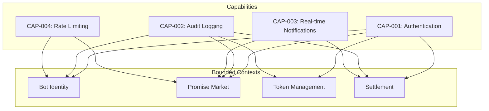
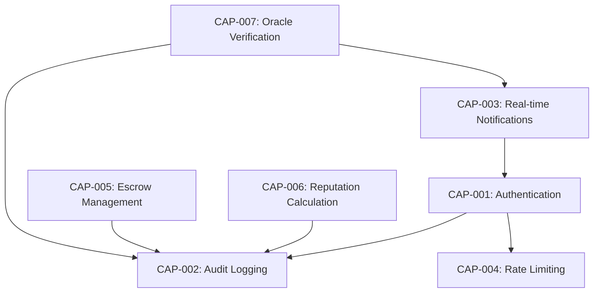

# System Capabilities

Capabilities are **cross-cutting system abilities** that span multiple bounded contexts and use cases. They represent the infrastructure and platform services that enable user stories to function.

## What is a Capability?

A capability is a **system-level function** that:
- Spans multiple bounded contexts
- Supports multiple user stories
- Has defined NFR requirements
- Can be tested independently via BDD tags



## Capability Matrix

| Capability | ID | Description | NFR Requirements | BDD Tag |
|------------|----|-------------|------------------|---------|
| **Authentication** | CAP-001 | Verify bot identity via API keys | NFR-SEC-001, NFR-SEC-002 | `@CAP-001` |
| **Audit Logging** | CAP-002 | Record all state-changing operations | NFR-SEC-003, NFR-PERF-002 | `@CAP-002` |
| **Real-time Notifications** | CAP-003 | Push updates to connected clients | NFR-PERF-001, NFR-REL-001 | `@CAP-003` |
| **Rate Limiting** | CAP-004 | Prevent abuse and ensure fairness | NFR-PERF-003, NFR-SEC-004 | `@CAP-004` |
| **Escrow Management** | CAP-005 | Lock and release funds atomically | NFR-SEC-005, NFR-REL-002 | `@CAP-005` |
| **Reputation Calculation** | CAP-006 | Compute reputation scores | NFR-PERF-002 | `@CAP-006` |
| **Oracle Verification** | CAP-007 | Validate execution proofs | NFR-SEC-006, NFR-REL-003 | `@CAP-007` |

## Capability Dependencies

Capabilities can depend on other capabilities:



## Capability to Roadmap Mapping

Roadmap items can implement:

1. **New capabilities** - Add infrastructure (e.g., "Implement CAP-003 Real-time Notifications")
2. **Capability enhancements** - Extend existing capability to new contexts
3. **NFR violations** - Fix capability performance/security issues

| Roadmap Item | Type | Capabilities Affected |
|--------------|------|----------------------|
| ROAD-005 | Enhancement | CAP-001 |
| ROAD-007 | Enhancement | CAP-006 |
| ROAD-009 | New | CAP-005 |
| ROAD-018 | New | CAP-007 |

## Capability Testing

All capabilities have BDD tests tagged with `@CAP-XXX`:

```bash
# Test a specific capability
just bdd-tag @CAP-001

# Test all authentication scenarios
just bdd-tag @CAP-001

# Test audit logging across all features
just bdd-tag @CAP-002
```

## Capability Catalog

### Security Capabilities
- [CAP-001: Authentication](./CAP-001-authentication) - API key verification
- [CAP-004: Rate Limiting](./CAP-004-rate-limiting) - Abuse prevention

### Observability Capabilities  
- [CAP-002: Audit Logging](./CAP-002-audit-logging) - Operation logging

### Communication Capabilities
- [CAP-003: Real-time Notifications](./CAP-003-real-time-notifications) - Live updates

### Business Capabilities
- [CAP-005: Escrow Management](./CAP-005-escrow-management) - Fund management
- [CAP-006: Reputation Calculation](./CAP-006-reputation-calculation) - Scoring system
- [CAP-007: Oracle Verification](./CAP-007-oracle-verification) - Proof validation

---

**Related**: [User Stories](../user-stories/index) • [BDD Capability Tags](../mapping/capability-bdd-tags) • [DDD Use Cases](../ddd/07-use-cases)
