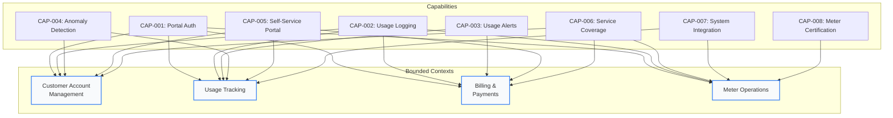
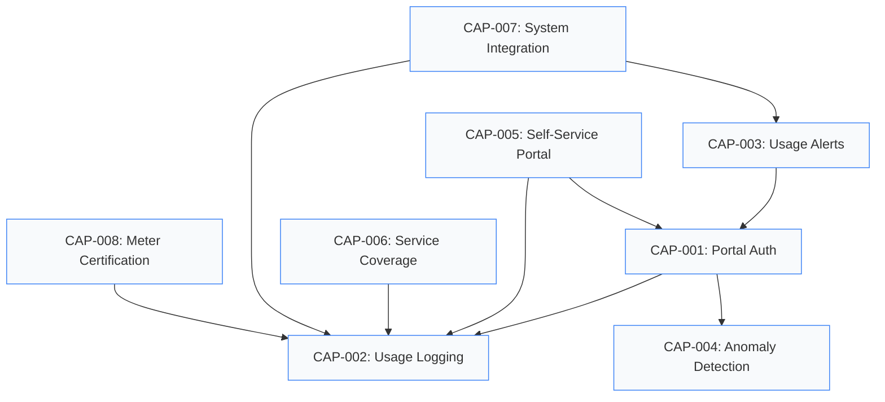

# System Capabilities

Capabilities are **cross-cutting system abilities** that span multiple bounded contexts and use cases. They represent the infrastructure and platform services that enable user stories to function. Each capability is independently testable and has defined NFR requirements.

---

## At a Glance

<div style={{
  display: 'grid',
  gridTemplateColumns: 'repeat(auto-fit, minmax(170px, 1fr))',
  gap: '16px',
  marginBottom: '32px'
}}>
  <div style={{
    padding: '20px',
    borderRadius: '8px',
    backgroundColor: '#f8fafc',
    border: '1px solid #e2e8f0',
    textAlign: 'center'
  }}>
    <div style={{ fontSize: '28px', fontWeight: 'bold', color: '#0f172a', marginBottom: '8px' }}>8</div>
    <div style={{ fontSize: '14px', color: '#64748b', fontWeight: '500' }}>Capabilities</div>
    <div style={{ fontSize: '12px', color: '#94a3b8', marginTop: '4px' }}>Cross-cutting services</div>
  </div>

  <div style={{
    padding: '20px',
    borderRadius: '8px',
    backgroundColor: '#f8fafc',
    border: '1px solid #e2e8f0',
    textAlign: 'center'
  }}>
    <div style={{ fontSize: '28px', fontWeight: 'bold', color: '#0f172a', marginBottom: '8px' }}>4</div>
    <div style={{ fontSize: '14px', color: '#64748b', fontWeight: '500' }}>Bounded Contexts</div>
    <div style={{ fontSize: '12px', color: '#94a3b8', marginTop: '4px' }}>Served by capabilities</div>
  </div>

  <div style={{
    padding: '20px',
    borderRadius: '8px',
    backgroundColor: '#f8fafc',
    border: '1px solid #e2e8f0',
    textAlign: 'center'
  }}>
    <div style={{ fontSize: '28px', fontWeight: 'bold', color: '#0f172a', marginBottom: '8px' }}>~120</div>
    <div style={{ fontSize: '14px', color: '#64748b', fontWeight: '500' }}>BDD Scenarios</div>
    <div style={{ fontSize: '12px', color: '#94a3b8', marginTop: '4px' }}>Testing capabilities</div>
  </div>

  <div style={{
    padding: '20px',
    borderRadius: '8px',
    backgroundColor: '#f8fafc',
    border: '1px solid #e2e8f0',
    textAlign: 'center'
  }}>
    <div style={{ fontSize: '28px', fontWeight: 'bold', color: '#0f172a', marginBottom: '8px' }}>12</div>
    <div style={{ fontSize: '14px', color: '#64748b', fontWeight: '500' }}>NFR Requirements</div>
    <div style={{ fontSize: '12px', color: '#94a3b8', marginTop: '4px' }}>Governing capabilities</div>
  </div>
</div>

---

## Quick Navigation

<div style={{
  display: 'grid',
  gridTemplateColumns: 'repeat(auto-fit, minmax(140px, 1fr))',
  gap: '12px',
  marginBottom: '28px'
}}>
  <a href="#capability-matrix" style={{
    padding: '12px 16px', borderRadius: '6px', backgroundColor: '#f1f5f9', border: '1px solid #cbd5e1',
    textDecoration: 'none', color: '#334155', fontWeight: '500', fontSize: '13px', textAlign: 'center'
  }}>Capability Matrix</a>
  <a href="#context-mapping" style={{
    padding: '12px 16px', borderRadius: '6px', backgroundColor: '#f1f5f9', border: '1px solid #cbd5e1',
    textDecoration: 'none', color: '#3b82f6', fontWeight: '500', fontSize: '13px', textAlign: 'center'
  }}>Context Mapping</a>
  <a href="#team-ownership" style={{
    padding: '12px 16px', borderRadius: '6px', backgroundColor: '#f8fafc', border: '1px solid #e2e8f0',
    textDecoration: 'none', color: '#475569', fontWeight: '500', fontSize: '13px', textAlign: 'center'
  }}>Team Ownership</a>
  <a href="#user-story-enablement" style={{
    padding: '12px 16px', borderRadius: '6px', backgroundColor: '#f8fafc', border: '1px solid #e2e8f0',
    textDecoration: 'none', color: '#0f172a', fontWeight: '500', fontSize: '13px', textAlign: 'center'
  }}>Story Enablement</a>
  <a href="#compliance-coverage" style={{
    padding: '12px 16px', borderRadius: '6px', backgroundColor: '#f8fafc', border: '1px solid #e2e8f0',
    textDecoration: 'none', color: '#0f172a', fontWeight: '500', fontSize: '13px', textAlign: 'center'
  }}>Compliance</a>
  <a href="#capability-catalog" style={{
    padding: '12px 16px', borderRadius: '6px', backgroundColor: '#f8fafc', border: '1px solid #e2e8f0',
    textDecoration: 'none', color: '#475569', fontWeight: '500', fontSize: '13px', textAlign: 'center'
  }}>Catalog</a>
</div>

---

## Capability Matrix {#capability-matrix}

<div style={{
  display: 'grid',
  gridTemplateColumns: 'repeat(auto-fit, minmax(280px, 1fr))',
  gap: '16px',
  marginBottom: '32px'
}}>
  <div style={{ padding: '16px 20px', borderRadius: '8px', border: '1px solid #e2e8f0', borderLeft: '4px solid #3b82f6', backgroundColor: '#f8fafc' }}>
    <div style={{ display: 'flex', justifyContent: 'space-between', alignItems: 'center', marginBottom: '8px' }}>
      <span style={{ fontSize: '14px', fontWeight: '700', color: '#0f172a' }}>CAP-001</span>
      <span style={{ fontSize: '10px', padding: '2px 8px', borderRadius: '9999px', backgroundColor: '#f1f5f9', color: '#3b82f6', fontWeight: '600' }}>Security</span>
    </div>
    <div style={{ fontSize: '14px', fontWeight: '600', color: '#334155', marginBottom: '6px' }}>Portal Authentication</div>
    <div style={{ fontSize: '12px', color: '#64748b', lineHeight: '1.5', marginBottom: '10px' }}>Access token generation, validation, and session management across all bounded contexts.</div>
    <div style={{ display: 'flex', gap: '6px', flexWrap: 'wrap', fontSize: '10px' }}>
      <span style={{ padding: '2px 6px', borderRadius: '4px', backgroundColor: '#f1f5f9', color: '#3b82f6' }}>NFR-SEC-001</span>
      <span style={{ padding: '2px 6px', borderRadius: '4px', backgroundColor: '#f1f5f9', color: '#3b82f6' }}>NFR-SEC-002</span>
      <span style={{ padding: '2px 6px', borderRadius: '4px', backgroundColor: '#f1f5f9', color: '#475569' }}>~18 scenarios</span>
    </div>
  </div>

  <div style={{ padding: '16px 20px', borderRadius: '8px', border: '2px solid #475569', backgroundColor: '#f8fafc' }}>
    <div style={{ display: 'flex', justifyContent: 'space-between', alignItems: 'center', marginBottom: '8px' }}>
      <span style={{ fontSize: '14px', fontWeight: '700', color: '#0f172a' }}>CAP-002</span>
      <span style={{ fontSize: '10px', padding: '2px 8px', borderRadius: '9999px', backgroundColor: '#f8fafc', color: '#475569', fontWeight: '600' }}>Observability</span>
    </div>
    <div style={{ fontSize: '14px', fontWeight: '600', color: '#334155', marginBottom: '6px' }}>Usage Logging</div>
    <div style={{ fontSize: '12px', color: '#64748b', lineHeight: '1.5', marginBottom: '10px' }}>Records all state-changing operations for audit trails, compliance reporting, and debugging.</div>
    <div style={{ display: 'flex', gap: '6px', flexWrap: 'wrap', fontSize: '10px' }}>
      <span style={{ padding: '2px 6px', borderRadius: '4px', backgroundColor: '#f1f5f9', color: '#3b82f6' }}>NFR-SEC-003</span>
      <span style={{ padding: '2px 6px', borderRadius: '4px', backgroundColor: '#f8fafc', color: '#475569' }}>NFR-PERF-002</span>
      <span style={{ padding: '2px 6px', borderRadius: '4px', backgroundColor: '#f1f5f9', color: '#475569' }}>~15 scenarios</span>
    </div>
  </div>

  <div style={{ padding: '16px 20px', borderRadius: '8px', border: '2px solid #0f172a', backgroundColor: '#f8fafc' }}>
    <div style={{ display: 'flex', justifyContent: 'space-between', alignItems: 'center', marginBottom: '8px' }}>
      <span style={{ fontSize: '14px', fontWeight: '700', color: '#0f172a' }}>CAP-003</span>
      <span style={{ fontSize: '10px', padding: '2px 8px', borderRadius: '9999px', backgroundColor: '#f8fafc', color: '#0f172a', fontWeight: '600' }}>Communication</span>
    </div>
    <div style={{ fontSize: '14px', fontWeight: '600', color: '#334155', marginBottom: '6px' }}>Usage Alerts</div>
    <div style={{ fontSize: '12px', color: '#64748b', lineHeight: '1.5', marginBottom: '10px' }}>Push notifications and real-time updates to customers and operators on usage thresholds and anomalies.</div>
    <div style={{ display: 'flex', gap: '6px', flexWrap: 'wrap', fontSize: '10px' }}>
      <span style={{ padding: '2px 6px', borderRadius: '4px', backgroundColor: '#f8fafc', color: '#475569' }}>NFR-PERF-001</span>
      <span style={{ padding: '2px 6px', borderRadius: '4px', backgroundColor: '#f8fafc', color: '#0f172a' }}>NFR-REL-001</span>
      <span style={{ padding: '2px 6px', borderRadius: '4px', backgroundColor: '#f1f5f9', color: '#475569' }}>~14 scenarios</span>
    </div>
  </div>

  <div style={{ padding: '16px 20px', borderRadius: '8px', border: '1px solid #e2e8f0', borderLeft: '4px solid #3b82f6', backgroundColor: '#f8fafc' }}>
    <div style={{ display: 'flex', justifyContent: 'space-between', alignItems: 'center', marginBottom: '8px' }}>
      <span style={{ fontSize: '14px', fontWeight: '700', color: '#0f172a' }}>CAP-004</span>
      <span style={{ fontSize: '10px', padding: '2px 8px', borderRadius: '9999px', backgroundColor: '#f1f5f9', color: '#3b82f6', fontWeight: '600' }}>Security</span>
    </div>
    <div style={{ fontSize: '14px', fontWeight: '600', color: '#334155', marginBottom: '6px' }}>Anomaly Detection</div>
    <div style={{ fontSize: '12px', color: '#64748b', lineHeight: '1.5', marginBottom: '10px' }}>Identifies unusual usage patterns, potential leaks, meter tampering, and billing fraud.</div>
    <div style={{ display: 'flex', gap: '6px', flexWrap: 'wrap', fontSize: '10px' }}>
      <span style={{ padding: '2px 6px', borderRadius: '4px', backgroundColor: '#f8fafc', color: '#475569' }}>NFR-PERF-003</span>
      <span style={{ padding: '2px 6px', borderRadius: '4px', backgroundColor: '#f1f5f9', color: '#3b82f6' }}>NFR-SEC-004</span>
      <span style={{ padding: '2px 6px', borderRadius: '4px', backgroundColor: '#f1f5f9', color: '#475569' }}>~16 scenarios</span>
    </div>
  </div>

  <div style={{ padding: '16px 20px', borderRadius: '8px', border: '2px solid #475569', backgroundColor: '#f8fafc' }}>
    <div style={{ display: 'flex', justifyContent: 'space-between', alignItems: 'center', marginBottom: '8px' }}>
      <span style={{ fontSize: '14px', fontWeight: '700', color: '#0f172a' }}>CAP-005</span>
      <span style={{ fontSize: '10px', padding: '2px 8px', borderRadius: '9999px', backgroundColor: '#f1f5f9', color: '#475569', fontWeight: '600' }}>Experience</span>
    </div>
    <div style={{ fontSize: '14px', fontWeight: '600', color: '#334155', marginBottom: '6px' }}>Self-Service Portal</div>
    <div style={{ fontSize: '12px', color: '#64748b', lineHeight: '1.5', marginBottom: '10px' }}>Customer-facing dashboards for account management, usage monitoring, billing history, and service requests.</div>
    <div style={{ display: 'flex', gap: '6px', flexWrap: 'wrap', fontSize: '10px' }}>
      <span style={{ padding: '2px 6px', borderRadius: '4px', backgroundColor: '#f1f5f9', color: '#3b82f6' }}>NFR-SEC-005</span>
      <span style={{ padding: '2px 6px', borderRadius: '4px', backgroundColor: '#f8fafc', color: '#0f172a' }}>NFR-REL-002</span>
      <span style={{ padding: '2px 6px', borderRadius: '4px', backgroundColor: '#f8fafc', color: '#475569' }}>NFR-A11Y-001</span>
      <span style={{ padding: '2px 6px', borderRadius: '4px', backgroundColor: '#f1f5f9', color: '#475569' }}>~15 scenarios</span>
    </div>
  </div>

  <div style={{ padding: '16px 20px', borderRadius: '8px', border: '2px solid #475569', backgroundColor: '#f8fafc' }}>
    <div style={{ display: 'flex', justifyContent: 'space-between', alignItems: 'center', marginBottom: '8px' }}>
      <span style={{ fontSize: '14px', fontWeight: '700', color: '#0f172a' }}>CAP-006</span>
      <span style={{ fontSize: '10px', padding: '2px 8px', borderRadius: '9999px', backgroundColor: '#f8fafc', color: '#475569', fontWeight: '600' }}>Business</span>
    </div>
    <div style={{ fontSize: '14px', fontWeight: '600', color: '#334155', marginBottom: '6px' }}>Service Coverage</div>
    <div style={{ fontSize: '12px', color: '#64748b', lineHeight: '1.5', marginBottom: '10px' }}>Geographic service area mapping, coverage validation, zone management, and service availability checks.</div>
    <div style={{ display: 'flex', gap: '6px', flexWrap: 'wrap', fontSize: '10px' }}>
      <span style={{ padding: '2px 6px', borderRadius: '4px', backgroundColor: '#f8fafc', color: '#475569' }}>NFR-PERF-002</span>
      <span style={{ padding: '2px 6px', borderRadius: '4px', backgroundColor: '#f1f5f9', color: '#475569' }}>~12 scenarios</span>
    </div>
  </div>

  <div style={{ padding: '16px 20px', borderRadius: '8px', border: '2px solid #0f172a', backgroundColor: '#f8fafc' }}>
    <div style={{ display: 'flex', justifyContent: 'space-between', alignItems: 'center', marginBottom: '8px' }}>
      <span style={{ fontSize: '14px', fontWeight: '700', color: '#0f172a' }}>CAP-007</span>
      <span style={{ fontSize: '10px', padding: '2px 8px', borderRadius: '9999px', backgroundColor: '#f8fafc', color: '#0f172a', fontWeight: '600' }}>Communication</span>
    </div>
    <div style={{ fontSize: '14px', fontWeight: '600', color: '#334155', marginBottom: '6px' }}>System Integration</div>
    <div style={{ fontSize: '12px', color: '#64748b', lineHeight: '1.5', marginBottom: '10px' }}>External system connectors for SCADA, GIS mapping, payment gateways, and third-party utility platforms.</div>
    <div style={{ display: 'flex', gap: '6px', flexWrap: 'wrap', fontSize: '10px' }}>
      <span style={{ padding: '2px 6px', borderRadius: '4px', backgroundColor: '#f1f5f9', color: '#3b82f6' }}>NFR-SEC-006</span>
      <span style={{ padding: '2px 6px', borderRadius: '4px', backgroundColor: '#f8fafc', color: '#0f172a' }}>NFR-REL-003</span>
      <span style={{ padding: '2px 6px', borderRadius: '4px', backgroundColor: '#f1f5f9', color: '#475569' }}>~16 scenarios</span>
    </div>
  </div>

  <div style={{ padding: '16px 20px', borderRadius: '8px', border: '1px solid #e2e8f0', borderLeft: '4px solid #3b82f6', backgroundColor: '#f8fafc' }}>
    <div style={{ display: 'flex', justifyContent: 'space-between', alignItems: 'center', marginBottom: '8px' }}>
      <span style={{ fontSize: '14px', fontWeight: '700', color: '#0f172a' }}>CAP-008</span>
      <span style={{ fontSize: '10px', padding: '2px 8px', borderRadius: '9999px', backgroundColor: '#f1f5f9', color: '#3b82f6', fontWeight: '600' }}>Security</span>
    </div>
    <div style={{ fontSize: '14px', fontWeight: '600', color: '#334155', marginBottom: '6px' }}>Meter Certification</div>
    <div style={{ fontSize: '12px', color: '#64748b', lineHeight: '1.5', marginBottom: '10px' }}>Hardware verification, calibration tracking, compliance certification, and meter lifecycle management.</div>
    <div style={{ display: 'flex', gap: '6px', flexWrap: 'wrap', fontSize: '10px' }}>
      <span style={{ padding: '2px 6px', borderRadius: '4px', backgroundColor: '#f1f5f9', color: '#3b82f6' }}>NFR-SEC-007</span>
      <span style={{ padding: '2px 6px', borderRadius: '4px', backgroundColor: '#f8fafc', color: '#0f172a' }}>NFR-REL-004</span>
      <span style={{ padding: '2px 6px', borderRadius: '4px', backgroundColor: '#f1f5f9', color: '#475569' }}>~14 scenarios</span>
    </div>
  </div>
</div>

---

## Context Mapping {#context-mapping}

Each capability spans one or more bounded contexts. The diagram shows which contexts consume each capability.



### Capability Dependencies



---

## Team Ownership {#team-ownership}

Each capability has a single owning team responsible for its development, maintenance, and NFR compliance. Other teams consume the capability as a service.

| Capability | Owner | Consumers | Primary Personas |
|:-----------|:------|:----------|:-----------------|
| [CAP-001 Portal Auth](/docs/capabilities/CAP-001) | **Customer Services** | All teams | All personas |
| [CAP-002 Usage Logging](/docs/capabilities/CAP-002) | **Operations** | All teams | PER-001 Admin, PER-002 Operator |
| [CAP-003 Usage Alerts](/docs/capabilities/CAP-003) | **Operations** | Customer Services, Finance | PER-003 Residential, PER-004 Commercial |
| [CAP-004 Anomaly Detection](/docs/capabilities/CAP-004) | **Operations** | Customer Services, Field Services | PER-002 Operator, PER-001 Admin |
| [CAP-005 Self-Service Portal](/docs/capabilities/CAP-005) | **Customer Services** | Operations, Finance | PER-003 Residential, PER-004 Commercial |
| [CAP-006 Service Coverage](/docs/capabilities/CAP-006) | **Finance** | Customer Services, Field Services | PER-001 Admin, PER-003 Residential |
| [CAP-007 System Integration](/docs/capabilities/CAP-007) | **Field Services** | Operations | PER-002 Operator, PER-005 Technician |
| [CAP-008 Meter Certification](/docs/capabilities/CAP-008) | **Field Services** | Operations | PER-005 Technician, PER-002 Operator |

---

## Persona Usage Matrix {#persona-usage}

Which personas interact with which capabilities, and through which bounded context:

| Capability | PER-001 Admin | PER-002 Operator | PER-003 Residential | PER-004 Commercial | PER-005 Technician |
|:-----------|:---:|:---:|:---:|:---:|:---:|
| CAP-001 Portal Auth | Manages | Uses | Uses | Uses | Uses |
| CAP-002 Usage Logging | Reviews | Reviews | -- | Views | -- |
| CAP-003 Usage Alerts | Configures | Monitors | Receives | Receives | -- |
| CAP-004 Anomaly Detection | Reviews | Investigates | Notified | Notified | Reports |
| CAP-005 Self-Service Portal | Administers | -- | Primary user | Primary user | -- |
| CAP-006 Service Coverage | Manages zones | -- | Checks coverage | Checks coverage | -- |
| CAP-007 System Integration | -- | Monitors feeds | -- | -- | Operates |
| CAP-008 Meter Certification | Approves | Validates | -- | -- | Performs |

---

## User Story Enablement {#user-story-enablement}

Each user story depends on one or more capabilities. This matrix shows which capabilities must be in place for each story to function.

| User Story | Description | Capabilities Required | Bounded Context |
|:-----------|:------------|:----------------------|:----------------|
| [US-001](/docs/user-stories/US-001-customer-enrollment) | Customer Enrollment | CAP-001, CAP-002, CAP-006 | Customer Account Mgmt |
| [US-002](/docs/user-stories/US-002-service-activation) | Service Activation | CAP-001, CAP-002, CAP-006 | Customer Account Mgmt |
| [US-004](/docs/user-stories/US-004-meter-reading) | Meter Reading | CAP-002, CAP-007, CAP-008 | Usage Tracking |
| [US-005](/docs/user-stories/US-005-view-usage-history) | View Usage History | CAP-001, CAP-002, CAP-005 | Usage Tracking |
| [US-006](/docs/user-stories/US-006-service-area-lookup) | Service Area Lookup | CAP-006 | Customer Account Mgmt |
| [US-007](/docs/user-stories/US-007-submit-service-request) | Submit Service Request | CAP-001, CAP-002, CAP-005 | Meter Operations |
| [US-008](/docs/user-stories/US-008-technician-dispatch) | Technician Dispatch | CAP-002, CAP-007 | Meter Operations |
| [US-009](/docs/user-stories/US-009-customer-communication) | Customer Communication | CAP-001, CAP-003, CAP-005 | Customer Account Mgmt |
| [US-010](/docs/user-stories/US-010-smart-meter-integration) | Smart Meter Integration | CAP-007, CAP-008 | Meter Operations |

---

## Compliance Coverage {#compliance-coverage}

### ADR Foundation

Architecture decisions that underpin capability design:

| Capability | Relevant ADRs | Rationale |
|:-----------|:-------------|:----------|
| CAP-001 Portal Auth | ADR-009, ADR-021 | API key auth pattern (ADR-009), Clerk integration (ADR-021) |
| CAP-002 Usage Logging | ADR-001, ADR-005 | DDD event sourcing (ADR-001), event-driven communication (ADR-005) |
| CAP-003 Usage Alerts | ADR-003, ADR-005 | Convex real-time subscriptions (ADR-003), event-driven (ADR-005) |
| CAP-004 Anomaly Detection | ADR-006, ADR-015 | Aggregate consistency (ADR-006), eventual consistency (ADR-015) |
| CAP-005 Self-Service Portal | ADR-004, ADR-019, ADR-020 | Next.js frontend (ADR-004), Tailwind (ADR-019), shadcn/ui (ADR-020) |
| CAP-006 Service Coverage | ADR-002, ADR-016 | Modular monolith (ADR-002), Convex functions (ADR-016) |
| CAP-007 System Integration | ADR-003, ADR-005, ADR-015 | Convex backend (ADR-003), events (ADR-005), eventual consistency (ADR-015) |
| CAP-008 Meter Certification | ADR-006, ADR-009 | Aggregate boundaries (ADR-006), API auth (ADR-009) |

### NFR Coverage

| NFR Category | NFR ID | Capabilities Constrained | Target |
|:-------------|:-------|:-------------------------|:-------|
| Performance | NFR-PERF-001 | CAP-003 | API response < 200ms (p95) |
| Performance | NFR-PERF-002 | CAP-002, CAP-006 | Dashboard load < 2s |
| Performance | NFR-PERF-003 | CAP-004 | Anomaly detection < 5s |
| Security | NFR-SEC-001 | CAP-001 | Token validation on every request |
| Security | NFR-SEC-002 | CAP-001 | SHA-256 key hashing |
| Security | NFR-SEC-003 | CAP-002 | Immutable audit log |
| Security | NFR-SEC-004 | CAP-004 | Rate limiting: 100 req/min |
| Security | NFR-SEC-005 | CAP-005 | Session timeout: 30 min |
| Security | NFR-SEC-006 | CAP-007 | mTLS for external connections |
| Security | NFR-SEC-007 | CAP-008 | Calibration audit chain |
| Reliability | NFR-REL-001 | CAP-003 | 99.9% delivery rate |
| Reliability | NFR-REL-002 | CAP-005 | 99.95% portal uptime |
| Reliability | NFR-REL-003 | CAP-007 | Retry with exponential backoff |
| Reliability | NFR-REL-004 | CAP-008 | Zero data loss on cert records |
| Accessibility | NFR-A11Y-001 | CAP-005 | WCAG 2.1 AA compliance |

### BDD Scenario Coverage

| Capability | Est. Scenarios | Feature Files | Coverage Status |
|:-----------|:---:|:---:|:---:|
| CAP-001 Portal Auth | ~18 | 3 | Covered |
| CAP-002 Usage Logging | ~15 | 2 | Covered |
| CAP-003 Usage Alerts | ~14 | 2 | Covered |
| CAP-004 Anomaly Detection | ~16 | 3 | Covered |
| CAP-005 Self-Service Portal | ~15 | 3 | Partial |
| CAP-006 Service Coverage | ~12 | 2 | Partial |
| CAP-007 System Integration | ~16 | 3 | Covered |
| CAP-008 Meter Certification | ~14 | 2 | Covered |
| **Total** | **~120** | **20** | |

---

## Capability Testing

All capabilities have BDD tests tagged with `@CAP-XXX`:

```bash
# Test a specific capability
just bdd-tag @CAP-001

# Test all security capabilities
just bdd-tag @CAP-001 @CAP-004 @CAP-008

# Test all observability capabilities
just bdd-tag @CAP-002
```

---

## Capability Catalog {#capability-catalog}

### Security

- [CAP-001: Portal Authentication](./CAP-001-customer-portal-auth) -- Access token verification and session management
- [CAP-004: Anomaly Detection](./CAP-004-anomaly-detection) -- Unusual pattern identification and fraud prevention
- [CAP-008: Meter Certification](./CAP-008-meter-certification) -- Hardware verification and calibration compliance

### Observability

- [CAP-002: Usage Logging](./CAP-002-usage-logging) -- Audit trail and operation recording

### Communication

- [CAP-003: Usage Alerts](./CAP-003-usage-alerts) -- Real-time push notifications
- [CAP-007: System Integration](./CAP-007-system-integration) -- External system connectors (SCADA, GIS, payments)

### Experience

- [CAP-005: Self-Service Portal](./CAP-005-self-service-portal) -- Customer-facing dashboards and account management

### Business

- [CAP-006: Service Coverage](./CAP-006-service-coverage) -- Geographic zone management and service validation

---

**Related**: [System Architecture](/docs/system-overview) | [Teams & Ownership](/docs/teams-overview) | [Users & Personas](/docs/users-overview) | [BDD Feature Index](/docs/bdd/feature-index) | [ADR Catalog](/docs/adr/README) | [NFR Index](/docs/nfr/)
