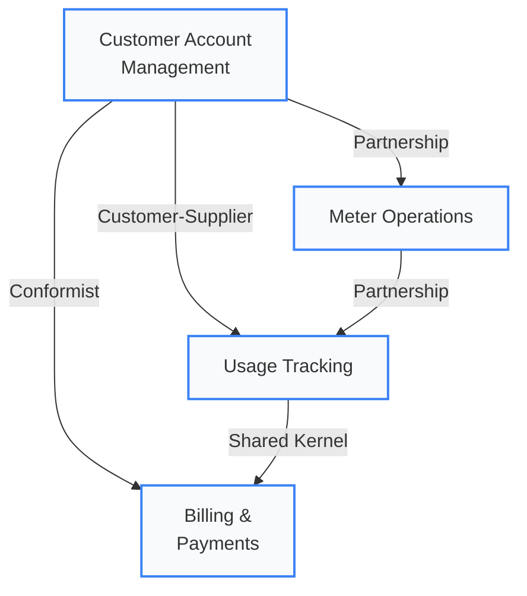

# Domain Overview: AquaTrack

AquaTrack is a **Municipal Water Tracking & Management System** where municipal utilities, water districts, and commercial water operators collaborate to efficiently manage water resources, track consumption, bill customers, and optimize distribution.

---

## At a Glance

  

    
4

    
Bounded Contexts

    
Domain decomposition

  

  

    
12

    
Aggregates

    
Consistency boundaries

  

  

    
15

    
Domain Events

    
Cross-context signals

  

  

    
10

    
Language Terms

    
Ubiquitous language

  

  

    
5

    
Personas

    
Domain actors

  

  

    
~160

    
BDD Scenarios

    
Spec coverage

  

---

## Quick Navigation

  <a href="#bounded-contexts" style={{
    padding: '12px 16px', borderRadius: '6px', backgroundColor: '#f1f5f9', border: '1px solid #cbd5e1',
    textDecoration: 'none', color: '#334155', fontWeight: '500', fontSize: '13px', textAlign: 'center'
  }}>Bounded Contexts</a>
  <a href="#domain-actors" style={{
    padding: '12px 16px', borderRadius: '6px', backgroundColor: '#f1f5f9', border: '1px solid #cbd5e1',
    textDecoration: 'none', color: '#3b82f6', fontWeight: '500', fontSize: '13px', textAlign: 'center'
  }}>Domain Actors</a>
  <a href="#user-story-mapping" style={{
    padding: '12px 16px', borderRadius: '6px', backgroundColor: '#f8fafc', border: '1px solid #e2e8f0',
    textDecoration: 'none', color: '#475569', fontWeight: '500', fontSize: '13px', textAlign: 'center'
  }}>User Stories</a>
  <a href="#strategic-classification" style={{
    padding: '12px 16px', borderRadius: '6px', backgroundColor: '#f8fafc', border: '1px solid #e2e8f0',
    textDecoration: 'none', color: '#0f172a', fontWeight: '500', fontSize: '13px', textAlign: 'center'
  }}>Classification</a>
  <a href="#compliance-traceability" style={{
    padding: '12px 16px', borderRadius: '6px', backgroundColor: '#f8fafc', border: '1px solid #e2e8f0',
    textDecoration: 'none', color: '#0f172a', fontWeight: '500', fontSize: '13px', textAlign: 'center'
  }}>Compliance</a>
  <a href="#ubiquitous-language" style={{
    padding: '12px 16px', borderRadius: '6px', backgroundColor: '#f8fafc', border: '1px solid #e2e8f0',
    textDecoration: 'none', color: '#475569', fontWeight: '500', fontSize: '13px', textAlign: 'center'
  }}>Language</a>

---

## Core Domain

**Water Utility Operations** -- A multi-sided system connecting:
- **Water Utilities**: Municipalities managing water distribution and billing
- **Customers**: Residential and commercial water consumers
- **Service Operators**: Field technicians managing meters and service calls
- **Billing System**: Automated billing and payment processing

This is a **transactional domain** with elements of an **operational domain**:
- *Transactional*: Clear billing mechanics, payment settlement, service contracts
- *Operational*: Real-time usage tracking, meter management, emergency response

### Key Problems Solved

  

    
Usage Accuracy

    
Ensure accurate meter readings and usage attribution

  

  

    
Billing Efficiency

    
Automate billing cycles and payment processing

  

  

    
Service Management

    
Track service requests, repairs, and meter maintenance

  

  

    
Conservation

    
Monitor usage patterns to promote water conservation

  

  

    
Compliance

    
Maintain regulatory compliance and audit trails

  

---

## Bounded Contexts {#bounded-contexts}

AquaTrack is decomposed into four bounded contexts, each owning its domain model, data, and team.

  

    

      
Customer Account Management

      Supporting
    

    

      Customer lifecycle -- enrollment, profiles, account standing, service deposits.
    

    
<strong>Aggregates:</strong> CustomerAccount, AccountStatus, ServiceDeposit

    
<strong>Events:</strong> AccountCreated, StatusChanged, DepositReleased

    

      Team: Customer Services
      ~35 BDD scenarios
    

  

  

    

      
Usage Tracking

      Core
    

    

      Meter readings, consumption calculation, usage history, anomaly detection.
    

    
<strong>Aggregates:</strong> MeterReading, UsagePeriod, ConsumptionRecord

    
<strong>Events:</strong> ReadingRecorded, UsageCalculated, AnomalyDetected

    

      Team: Operations
      ~45 BDD scenarios
    

  

  

    

      
Billing & Payments

      Core
    

    

      Invoice generation, billing cycles, payment processing, settlement, disputes.
    

    
<strong>Aggregates:</strong> Invoice, BillingCycle, Payment

    
<strong>Events:</strong> InvoiceGenerated, PaymentReceived, BillFinalized

    

      Team: Finance
      ~40 BDD scenarios
    

  

  

    

      
Meter Operations

      Supporting
    

    

      Meter lifecycle, installation, calibration, maintenance, technician dispatch.
    

    
<strong>Aggregates:</strong> Meter, ServiceRequest, MaintenanceSchedule

    
<strong>Events:</strong> MeterRegistered, MaintenanceScheduled, ServiceCompleted

    

      Team: Field Services
      ~40 BDD scenarios
    

  

### Context Map

---

## Domain Actors {#domain-actors}

Each bounded context is accessed by specific personas. This matrix shows the primary interactions.

| Persona | Customer Account Mgmt | Usage Tracking | Billing & Payments | Meter Operations |
|:--------|:---:|:---:|:---:|:---:|
| [PER-001 Utility Admin](/docs/personas/PER-001-utility-administrator) | Manages accounts | Reviews logs | Oversees billing | Approves work |
| [PER-002 Treatment Operator](/docs/personas/PER-002-treatment-operator) | -- | Monitors readings | -- | Coordinates maintenance |
| [PER-003 Residential Customer](/docs/personas/PER-003-residential-customer) | Enrolls, manages profile | Views usage | Pays invoices | Requests service |
| [PER-004 Commercial Customer](/docs/personas/PER-004-commercial-customer) | Manages fleet accounts | Monitors usage | Manages payments | Requests service |
| [PER-005 Meter Technician](/docs/personas/PER-005-meter-technician) | -- | Records readings | -- | Installs, calibrates |

---

## User Story Mapping {#user-story-mapping}

Each user story maps to one or more bounded contexts and is served by capabilities:

| User Story | Description | Primary Context | Capabilities | Owning Team |
|:-----------|:------------|:----------------|:-------------|:------------|
| [US-001](/docs/user-stories/US-001-customer-enrollment) | Customer Enrollment | Customer Account Mgmt | CAP-001, CAP-002, CAP-006 | Customer Services |
| [US-002](/docs/user-stories/US-002-service-activation) | Service Activation | Customer Account Mgmt | CAP-001, CAP-002, CAP-006 | Customer Services |
| [US-004](/docs/user-stories/US-004-meter-reading) | Meter Reading | Usage Tracking | CAP-002, CAP-007, CAP-008 | Operations |
| [US-005](/docs/user-stories/US-005-view-usage-history) | View Usage History | Usage Tracking | CAP-001, CAP-002, CAP-005 | Operations |
| [US-006](/docs/user-stories/US-006-service-area-lookup) | Service Area Lookup | Customer Account Mgmt | CAP-006 | Customer Services |
| [US-007](/docs/user-stories/US-007-submit-service-request) | Submit Service Request | Meter Operations | CAP-001, CAP-002, CAP-005 | Field Services |
| [US-008](/docs/user-stories/US-008-technician-dispatch) | Technician Dispatch | Meter Operations | CAP-002, CAP-007 | Field Services |
| [US-009](/docs/user-stories/US-009-customer-communication) | Customer Communication | Customer Account Mgmt | CAP-001, CAP-003, CAP-005 | Customer Services |
| [US-010](/docs/user-stories/US-010-smart-meter-integration) | Smart Meter Integration | Meter Operations | CAP-007, CAP-008 | Field Services |

---

## Strategic Classification {#strategic-classification}

  

    
Core Domain

    
Highest business value -- competitive differentiator. Custom-built, heavily tested.

    

      &#x2022; <strong>Usage Tracking</strong> -- Real-time consumption data 
      &#x2022; <strong>Billing & Payments</strong> -- Revenue engine
    

    

      Teams: Operations, Finance | ADRs: ADR-001, ADR-005, ADR-006, ADR-015 | ~85 BDD scenarios
    

  

  

    
Supporting Subdomain

    
Necessary but not differentiating. Could eventually use off-the-shelf solutions.

    

      &#x2022; <strong>Customer Account Mgmt</strong> -- Account lifecycle 
      &#x2022; <strong>Meter Operations</strong> -- Physical infrastructure
    

    

      Teams: Customer Services, Field Services | ADRs: ADR-002, ADR-016 | ~75 BDD scenarios
    

  

  

    
Generic Subdomain

    
Commodity functions. Use third-party services where possible.

    

      &#x2022; <strong>Payment Processing</strong> -- via payment gateway 
      &#x2022; <strong>Authentication</strong> -- via Clerk (ADR-021) 
      &#x2022; <strong>Email/SMS</strong> -- via notification provider
    

    

      ADRs: ADR-003, ADR-009, ADR-021 | NFRs: NFR-SEC-001, NFR-SEC-002
    

  

---

## Compliance Traceability {#compliance-traceability}

### ADRs by Bounded Context

| Bounded Context | ADRs | Category Focus |
|:----------------|:-----|:---------------|
| **Customer Account Mgmt** | ADR-001, ADR-002, ADR-009, ADR-016, ADR-021 | DDD, modular monolith, auth, Convex functions, Clerk |
| **Usage Tracking** | ADR-001, ADR-003, ADR-005, ADR-006, ADR-015 | DDD, Convex backend, events, aggregates, eventual consistency |
| **Billing & Payments** | ADR-001, ADR-005, ADR-006, ADR-015, ADR-016 | DDD, events, aggregates, eventual consistency, Convex functions |
| **Meter Operations** | ADR-001, ADR-002, ADR-005, ADR-009 | DDD, modular monolith, events, API auth |
| **Cross-cutting** | ADR-004, ADR-017, ADR-018, ADR-019, ADR-020 | Next.js, Bun, Vercel, Tailwind, shadcn/ui |

### NFRs by Bounded Context

| Bounded Context | Performance | Security | Reliability | Accessibility |
|:----------------|:---:|:---:|:---:|:---:|
| **Customer Account Mgmt** | NFR-PERF-001 | NFR-SEC-001, NFR-SEC-002, NFR-SEC-005 | NFR-REL-002 | NFR-A11Y-001 |
| **Usage Tracking** | NFR-PERF-001, NFR-PERF-002, NFR-PERF-003 | NFR-SEC-003, NFR-SEC-004 | NFR-REL-001 | -- |
| **Billing & Payments** | NFR-PERF-001, NFR-PERF-002 | NFR-SEC-001, NFR-SEC-003 | NFR-REL-001, NFR-REL-002 | NFR-A11Y-001 |
| **Meter Operations** | NFR-PERF-001 | NFR-SEC-006, NFR-SEC-007 | NFR-REL-003, NFR-REL-004 | -- |

### BDD Coverage by Context

  

    
Customer Account Mgmt

    
~35

    
scenarios across 4 feature files

    

      

    

    
85% passing

  

  

    
Usage Tracking

    
~45

    
scenarios across 5 feature files

    

      

    

    
90% passing

  

  

    
Billing & Payments

    
~40

    
scenarios across 4 feature files

    

      

    

    
75% passing

  

  

    
Meter Operations

    
~40

    
scenarios across 5 feature files

    

      

    

    
80% passing

  

---

## Ubiquitous Language {#ubiquitous-language}

Key terms used consistently across code, docs, and communication:

| Term | Definition | Context |
|:-----|:----------|:--------|
| **Customer Account** | Service agreement for water delivery to a property | Customer Account Mgmt |
| **Meter** | Device measuring water consumption (cubic meters) | Meter Operations |
| **Reading** | Recorded meter value at specific date/time | Usage Tracking |
| **Usage** | Calculated consumption based on meter readings | Usage Tracking |
| **Service Deposit** | Upfront payment required for account activation | Customer Account Mgmt |
| **Billing Cycle** | Regular interval (monthly/quarterly) for billing | Billing & Payments |
| **Invoice** | Bill for water consumption and services | Billing & Payments |
| **Payment** | Customer's settlement of invoice | Billing & Payments |
| **Service Request** | Request for meter reading, repair, or maintenance | Meter Operations |
| **Account Standing** | Customer's payment and contract status | Customer Account Mgmt |

See [full Ubiquitous Language glossary](./ubiquitous-language) for the complete reference.

---

## Business Model

| Revenue Stream | Description | Related Context |
|:---------------|:------------|:----------------|
| **Usage Billing** | Recurring monthly/quarterly billings based on consumption | Billing & Payments |
| **Service Fees** | Charges for service calls, meter inspections, and maintenance | Meter Operations |
| **Late Payments** | Interest/penalties on overdue accounts | Billing & Payments |
| **Conservation Rebates** | Incentives for low usage or efficient practices | Usage Tracking |

### Success Metrics

| Metric | Target | Measured By |
|:-------|:-------|:------------|
| Billing Accuracy | > 99.5% | Correctly billed customers / total | 
| Payment Collection Rate | > 95% | Invoices paid on time / total invoices |
| Meter Reading Accuracy | < 2% variance | Estimated vs actual readings |
| Service Response Time | < 4 hours | Average time to resolve service requests |
| Customer Satisfaction | > 4.2/5.0 | Satisfaction surveys and complaint rates |

---

## Domain Boundaries

### In Scope
- Customer account management and lifecycle
- Water meter operations and reading collection
- Usage tracking and billing calculation
- Payment processing and settlement
- Service request management
- Account standing and status

### Out of Scope (Initially)
- Water treatment plants (managed separately)
- Infrastructure maintenance (separate operations)
- Advanced conservation modeling (v2 feature)
- Multi-currency support (single currency MVP)
- Predictive analytics (v2 feature)

---

## Next Steps

- [Bounded Contexts](./bounded-contexts) -- Detailed context boundaries and integration patterns
- [Ubiquitous Language](./ubiquitous-language) -- Complete domain terminology
- [Aggregates & Entities](./aggregates-entities) -- Consistency boundaries and object model
- [Domain Events](./domain-events) -- Cross-context event catalog
- [Use Cases](./use-cases) -- System interaction patterns

---

**Related**: [System Architecture](/docs/system-overview) | [Users & Personas](/docs/users-overview) | [Teams & Ownership](/docs/teams-overview) | [Capabilities](/docs/capabilities/) | [BDD Feature Index](/docs/bdd/feature-index)
