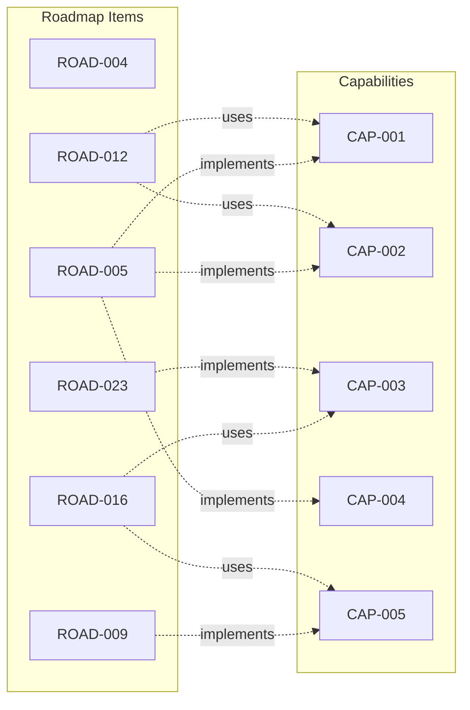

# Capability-Roadmap Matrix

This matrix shows which roadmap items implement, enhance, or fix each system capability.

## Matrix Overview



## Detailed Matrix

| Capability | Type | Implemented By | Enhanced By | NFR Fixes |
|------------|------|----------------|-------------|-----------|
| **CAP-001** Authentication | Foundation | ROAD-005 | ROAD-028 | ROAD-028 (SEC) |
| **CAP-002** Audit Logging | Foundation | ROAD-005 | ROAD-020 | - |
| **CAP-003** Real-time Notifications | Feature | ROAD-023 | ROAD-021 | ROAD-023 (PERF) |
| **CAP-004** Rate Limiting | Foundation | ROAD-005 | ROAD-028 | ROAD-028 (PERF) |
| **CAP-005** Escrow Management | Feature | ROAD-009 | ROAD-019 | - |
| **CAP-006** Reputation Calculation | Feature | ROAD-007 | - | - |
| **CAP-007** Oracle Verification | Feature | ROAD-018 | - | - |

## Roadmap Items by Type

### Foundation Capabilities
Roadmap items that build core infrastructure:

| Roadmap | Item | Capabilities | Status |
|---------|------|--------------|--------|
| ROAD-005 | Bot Authentication | CAP-001, CAP-002, CAP-004 | ✅ Complete |

### Feature Capabilities
Roadmap items that add business capabilities:

| Roadmap | Item | Capabilities | Status |
|---------|------|--------------|--------|
| ROAD-007 | Reputation System | CAP-006 | ✅ Complete |
| ROAD-009 | Escrow System | CAP-005 | ✅ Complete |
| ROAD-023 | Real-time Updates | CAP-003 | 🎯 Planned |

### Capability Enhancements
Roadmap items that extend capabilities to new contexts:

| Roadmap | Item | Extends Capability | To Context |
|---------|------|-------------------|------------|
| ROAD-012 | Promise Creation | CAP-001, CAP-002, CAP-005 | Promise Market |
| ROAD-016 | Promise Acceptance | CAP-003, CAP-005 | Promise Market |
| ROAD-020 | Dispute Resolution | CAP-005 | Settlement |

### NFR Violation Fixes
Roadmap items that fix capability performance/security issues:

| Roadmap | Item | Fixes | Violation |
|---------|------|-------|-----------|
| ROAD-028 | Security Hardening | CAP-001, CAP-004 | NFR-SEC-001 |

## Implementation Patterns

### Pattern 1: New Capability
When adding infrastructure that doesn't exist:

```
Roadmap Item: "Implement CAP-003 Real-time Notifications"
├── New infrastructure (WebSocket server)
├── CAP-003 documentation
├── @CAP-003 BDD tests
└── Updates to dependent stories
```

Example: **ROAD-023** implements **CAP-003**

### Pattern 2: Capability Enhancement
When extending existing capability to new bounded context:

```
Roadmap Item: "Enable CAP-005 for Promise Acceptance"
├── Escrow integration in Promise Market context
├── @CAP-005 BDD scenarios for acceptance flow
└── Updates to US-004 documentation
```

Example: **ROAD-016** uses **CAP-005** for promise acceptance

### Pattern 3: NFR Violation Fix
When fixing performance/security issues:

```
Roadmap Item: "Fix CAP-001 rate limiting vulnerability"
├── Fix vulnerability in auth layer
├── Add regression tests
├── Update security documentation
└── Mark NFR-SEC-001 as resolved
```

Example: **ROAD-028** fixes **CAP-001** issues

## Coverage Tracking

Track which capabilities are covered by roadmap items:

| Phase | Capabilities Implemented | Capabilities Enhanced | Coverage % |
|-------|-------------------------|----------------------|------------|
| Phase 0 | 0 | 0 | 0% |
| Phase 1 | 3 (CAP-001,002,004) | 1 (CAP-006) | 43% |
| Phase 2 | 1 (CAP-005) | 0 | 57% |
| Phase 3 | 0 | 3 (CAP-001,002,005) | 57% |
| Phase 4 | 0 | 1 (CAP-005) | 57% |
| Phase 5 | 1 (CAP-003) | 0 | 71% |
| Phase 6 | 0 | 0 | 71% |
| Phase 7 | 0 | 2 (CAP-001,004) | 71% |

## Verification Commands

```bash
# Check which roadmap items affect a capability
just roadmap-filter --capability CAP-001

# List capabilities without roadmap coverage
just capabilities-orphaned

# Generate implementation timeline
just roadmap-timeline --group-by-capability
```

## Updating This Matrix

When adding roadmap items:

1. Identify which capabilities are affected
2. Determine if it's "implements", "enhances", or "fixes"
3. Update the matrix above
4. Update capability documentation with roadmap references
5. Tag BDD tests appropriately

---

**Related**: [Capabilities](../capabilities/index) • [Roadmap](../ROADMAP) • [User Stories](../user-stories/index)
