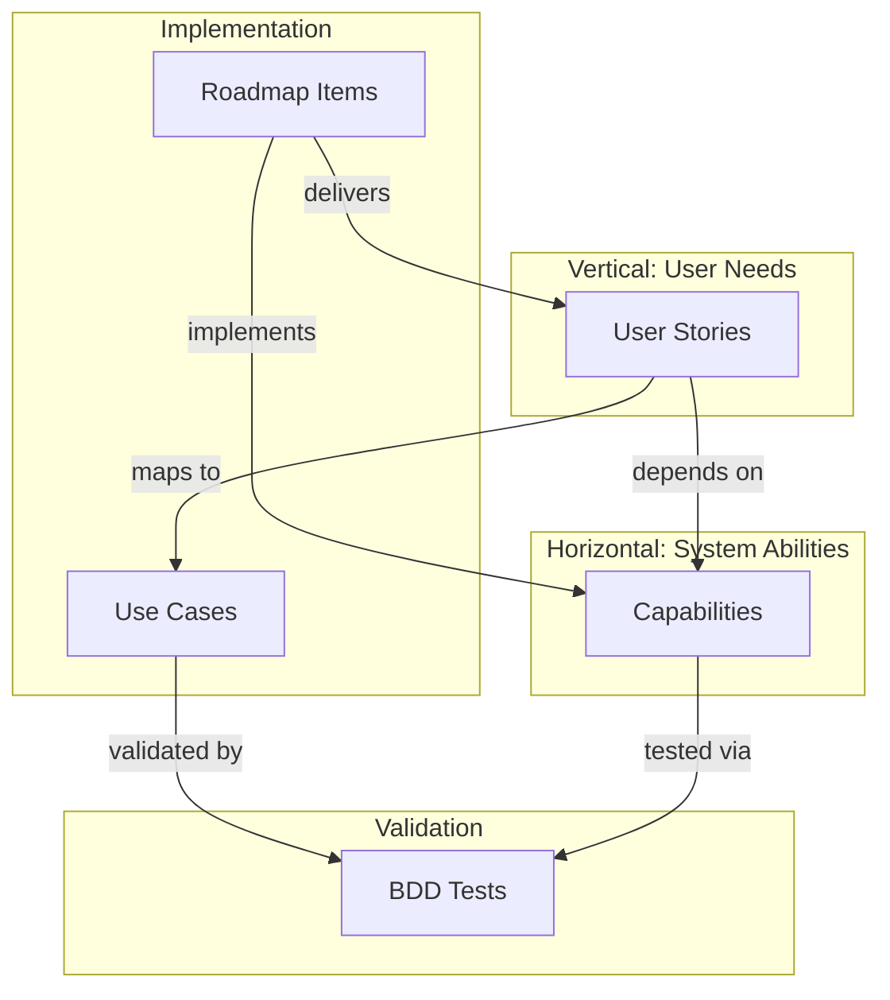

# Documentation Mapping

This section provides mapping documents that show relationships between capabilities, user stories, roadmap items, and BDD tests.

## Relationship Overview



## Mapping Documents

### [Capability-Roadmap Matrix](./capability-roadmap-matrix)
Shows which roadmap items implement, enhance, or fix each capability.

**Key Questions Answered:**
- Which roadmap item implements CAP-003?
- What capabilities does ROAD-016 affect?
- Are there capabilities without roadmap coverage?

### [Story-Capability Dependencies](./story-capability-dependencies)
Shows which capabilities each user story depends on.

**Key Questions Answered:**
- What capabilities does US-004 require?
- Which stories are blocked waiting for CAP-003?
- What's the critical path for implementation?

### [Capability-BDD Tags](../bdd/capability-tags)
Documents how BDD tests are tagged with capability identifiers.

**Key Questions Answered:**
- How do I tag tests for CAP-001?
- Which scenarios test authentication?
- What's the capability coverage?

## Relationship Types

### User Story → Capability
**"Depends on"** - A story cannot be implemented without the capability.

```
US-001: Register Bot
  → depends on CAP-001 (Authentication)
  → depends on CAP-002 (Audit Logging)
```

### Roadmap Item → Capability
**"Implements"** - Creates a new capability from scratch.
**"Enhances"** - Extends capability to new bounded context.
**"Fixes"** - Resolves NFR violation in capability.

```
ROAD-005: Bot Authentication
  → implements CAP-001
  → implements CAP-002
  → implements CAP-004

ROAD-016: Promise Acceptance  
  → enhances CAP-005 (to Promise Market context)
  → uses CAP-003 (for notifications)
```

### Capability → BDD Tests
**"Tested via"** - Tests tagged with capability identifier.

```
CAP-001: Authentication
  → tested via @CAP-001 tagged scenarios
  → all protected endpoint tests
```

## Quick Reference

| If you want to know... | Look at... |
|------------------------|------------|
| What capabilities exist? | [Capabilities Index](../capabilities/index) |
| What stories are planned? | [User Stories Index](../user-stories/index) |
| Which capability implements auth? | [CAP-001](../capabilities/CAP-001-authentication) |
| What does US-004 depend on? | [US-004 doc](../user-stories/US-004-promise-acceptance) |
| Which roadmap covers escrow? | [Capability-Roadmap Matrix](./capability-roadmap-matrix) |
| Are stories blocked? | [Story-Capability Dependencies](./story-capability-dependencies) |
| How to tag BDD tests? | [Capability Tags](../bdd/capability-tags) |

## Usage Workflows

### Planning a Feature
1. Start with [User Stories](../user-stories/index)
2. Check [Story-Capability Dependencies](./story-capability-dependencies) for blockers
3. Review [Capability-Roadmap Matrix](./capability-roadmap-matrix) for timeline
4. Create roadmap item referencing capabilities

### Writing BDD Tests
1. Identify which capabilities the scenario tests
2. Add capability tags (e.g., `@CAP-001`)
3. Reference [Capability Tags](../bdd/capability-tags) for examples

### Tracking Progress
1. Check capability readiness in [Capability-Roadmap Matrix](./capability-roadmap-matrix)
2. Identify unblocked stories in [Story-Capability Dependencies](./story-capability-dependencies)
3. Run capability-tagged BDD tests to verify coverage

## Matrix Summary

### Capability Status
| Capability | Status | Stories Blocked | Roadmap Items |
|------------|--------|-----------------|---------------|
| CAP-001 | ✅ Ready | 0 | ROAD-005, 028 |
| CAP-002 | ✅ Ready | 0 | ROAD-005, 020 |
| CAP-003 | 🎯 Planned | 2 | ROAD-023 |
| CAP-004 | ✅ Ready | 0 | ROAD-005, 028 |
| CAP-005 | ✅ Ready | 0 | ROAD-009, 012, 016 |
| CAP-006 | ✅ Ready | 0 | ROAD-007 |
| CAP-007 | 🎯 Planned | 0 | ROAD-018 |

### Story Readiness
| Phase | Stories Ready | Stories Blocked | Blocker |
|-------|---------------|-----------------|---------|
| Phase 1 | 6 | 0 | - |
| Phase 2 | 1 | 0 | - |
| Phase 3 | 0 | 2 | CAP-003 |

---

**Related**: [Capabilities](../capabilities/index) • [User Stories](../user-stories/index) • [Roadmap](../ROADMAP) • [BDD Overview](../bdd/bdd-overview)
