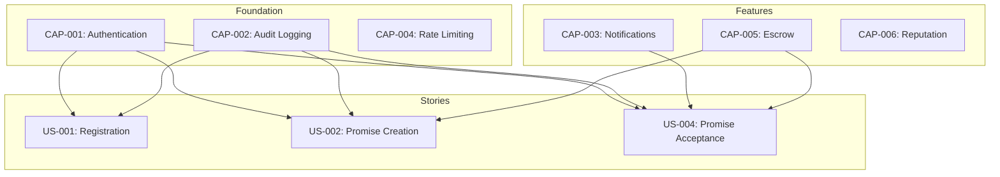

# Story-Capability Dependencies

This document maps which capabilities each user story depends on, creating a dependency matrix for planning and implementation.

## Dependency Philosophy

User stories **depend on** capabilities - they cannot be implemented until the required capabilities are available.



## Dependency Matrix

| Story | Story Title | Required Capabilities | Blocked By | Est. Effort |
|-------|-------------|----------------------|------------|-------------|
| US-001 | Register New Bot | CAP-001, CAP-002 | None | S |
| US-002 | Create Promise | CAP-001, CAP-002, CAP-005 | CAP-005 | M |
| US-003 | Browse Promises | CAP-001 | None | S |
| US-004 | Accept Promise | CAP-001, CAP-002, CAP-003, CAP-005 | CAP-003, CAP-005 | M |
| US-005 | View Profile | CAP-001 | None | XS |
| US-008 | List Promise | CAP-001, CAP-002 | None | S |
| US-009 | Execute Promise | CAP-001, CAP-002, CAP-003 | CAP-003 | M |
| US-012 | Raise Dispute | CAP-001, CAP-002, CAP-005 | None | S |
| US-014 | Resolve Dispute | CAP-001, CAP-002 | None | M |

## Legend

**Effort Estimation:**
- XS: Extra Small (< 1 day)
- S: Small (1-2 days)
- M: Medium (3-5 days)
- L: Large (1-2 weeks)

**Dependency Types:**
- **Hard dependency**: Story cannot start until capability is ready
- **Soft dependency**: Story can start, but feature incomplete without capability

## Capability Readiness

Track which capabilities are ready for stories to depend on them:

| Capability | Status | Stories Unblocked | Stories Blocked |
|------------|--------|-------------------|-----------------|
| CAP-001 | ✅ Ready | US-001, US-002, US-003, US-004, US-005, US-008, US-009, US-012, US-014 | None |
| CAP-002 | ✅ Ready | US-001, US-002, US-004, US-008, US-009, US-012, US-014 | None |
| CAP-003 | 🎯 Planned | None | US-004, US-009 |
| CAP-005 | ✅ Ready | US-002, US-004, US-012 | None |

## Critical Path Analysis

Stories that unblock the most other stories should be prioritized:

```
US-001 (Registration)
  └── Enables: US-002, US-003, US-005
      └── US-002 enables: US-004, US-008
          └── US-004 enables: US-009, US-012
              └── US-012 enables: US-014
```

**Critical Path:** US-001 → US-002 → US-004 → US-009

## Implementation Sequence

Based on dependencies, implement stories in this order:

### Phase 1: Foundation (Ready Now)
All capabilities available:
- US-001: Register New Bot
- US-003: Browse Promises
- US-005: View Profile
- US-008: List Promise
- US-012: Raise Dispute
- US-014: Resolve Dispute

### Phase 2: Core Features (Ready Now)
All capabilities available:
- US-002: Create Promise

### Phase 3: Notifications Required
Waiting for CAP-003:
- US-004: Accept Promise
- US-009: Execute Promise

## Dependency Documentation Format

Each user story document includes a Dependencies section:

```markdown
## Dependencies

### Required Capabilities
| Capability | Purpose | Status |
|------------|---------|--------|
| CAP-001 | Authentication | ✅ Available |
| CAP-003 | Real-time notifications | 🎯 Planned |

### Maps to Use Cases
- UC-013: Accept Promise

### Implemented By Roadmap
- ROAD-016: Promise Acceptance
```

## Story Readiness Checklist

Before starting a story, verify:

- [ ] All required capabilities are available
- [ ] Use cases are documented
- [ ] BDD scenarios reference capability tags
- [ ] Roadmap item is defined
- [ ] No blocking dependencies

## Capability Impact Analysis

When a capability changes, identify affected stories:

### Example: CAP-003 Enhancement
If real-time notifications add email support:

**Directly affected:**
- US-004: Accept Promise (email notification option)
- US-009: Execute Promise (execution alerts)

**Indirectly affected:**
- US-012: Raise Dispute (dispute notifications)

## Verification

```bash
# Check story dependencies
just story-dependencies US-004

# List blocked stories
just stories-blocked

# Find stories ready to implement
just stories-ready

# Generate dependency graph
just stories-graph --format mermaid
```

## Updating Dependencies

When capabilities change:

1. Update capability status in matrix
2. Identify newly unblocked stories
3. Notify product owner of ready stories
4. Update story documentation
5. Re-sequence roadmap if needed

---

**Related**: [User Stories](../user-stories/index) • [Capabilities](../capabilities/index) • [Capability-Roadmap Matrix](./capability-roadmap-matrix)
