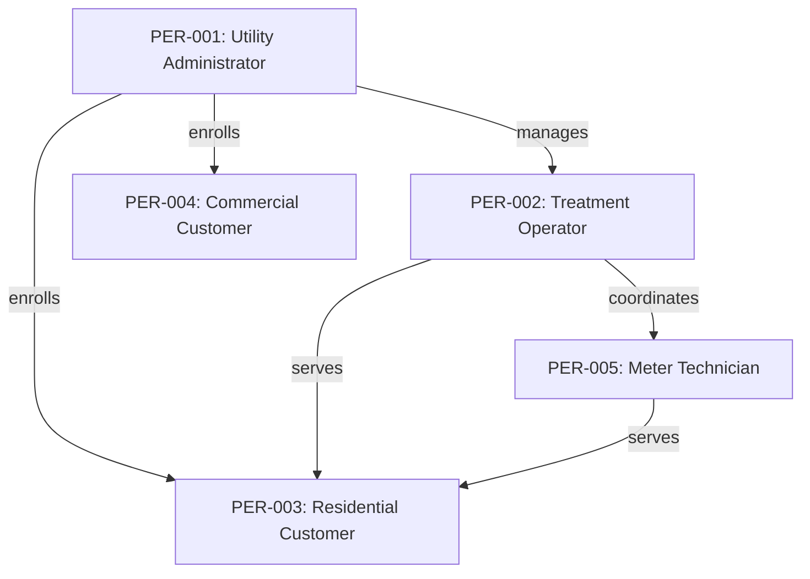

# Personas

Personas represent the different user types who interact with the AquaTrack water utility platform. Each persona has distinct goals, pain points, and behaviors that inform user story development.

## Persona Matrix

### By Type

| Persona | Name | Type | Archetype | Status | Stories |
|---------|------|------|-----------|--------|---------|
| PER-001 | [Utility Administrator](./PER-001-utility-administrator) | human | creator | approved | 3 |
| PER-002 | [Treatment Operator](./PER-002-treatment-operator) | human | operator | approved | 5 |
| PER-003 | [Residential Customer](./PER-003-residential-customer) | human | consumer | approved | 3 |
| PER-004 | [Commercial Customer](./PER-004-commercial-customer) | human | administrator | approved | 2 |
| PER-005 | [Meter Technician](./PER-005-meter-technician) | human | integrator | draft | 3 |

### By Archetype

**Creator** (1)
- [PER-001: Utility Administrator](./PER-001-utility-administrator)

**Operator** (1)
- [PER-002: Treatment Operator](./PER-002-treatment-operator)

**Consumer** (1)
- [PER-003: Residential Customer](./PER-003-residential-customer)

**Administrator** (1)
- [PER-004: Commercial Customer](./PER-004-commercial-customer)

**Integrator** (1)
- [PER-005: Meter Technician](./PER-005-meter-technician)

## Summary Statistics

- **Total Personas**: 5
- **Approved**: 4
- **Draft**: 1
- **Deprecated**: 0
- **Total Story References**: 16

## Persona Relationships



## Story Coverage by Persona

### PER-001: Utility Administrator
- US-001: Enroll New Customer
- US-002: Activate Water Service
- US-006: Service Area Lookup

### PER-002: Treatment Operator
- US-002: Activate Water Service
- US-005: View Usage History
- US-006: Service Area Lookup
- US-009: Customer Communication
- US-010: Smart Meter Integration

### PER-003: Residential Customer
- US-001: Enroll New Customer
- US-004: Record Meter Reading
- US-007: Submit Service Request

### PER-004: Commercial Customer
- US-005: View Usage History
- US-006: Service Area Lookup

### PER-005: Meter Technician
- US-002: Activate Water Service
- US-008: Technician Dispatch
- US-010: Smart Meter Integration

## Capability Usage by Persona

| Persona | Primary Capabilities |
|---------|---------------------|
| PER-001 | CAP-001, CAP-002, CAP-006 |
| PER-002 | CAP-001, CAP-002, CAP-003, CAP-005, CAP-007 |
| PER-003 | CAP-001, CAP-002, CAP-003, CAP-004 |
| PER-004 | CAP-001, CAP-002, CAP-003, CAP-005, CAP-006 |
| PER-005 | CAP-001, CAP-004, CAP-007 |

## BDD Tags

Use persona tags in BDD scenarios:

```gherkin
@PER-001 @US-001 @CAP-001
Feature: Customer Enrollment
  As a utility administrator
  I want to enroll a new customer
  So that they can receive water service
```

**Available Tags:**
- `@PER-001` - Utility Administrator
- `@PER-002` - Treatment Operator
- `@PER-003` - Residential Customer
- `@PER-004` - Commercial Customer
- `@PER-005` - Meter Technician

## Creating New Personas

To create a new persona:

1. Create file: `docs/personas/PER-XXX-name.md`
2. Use the persona front matter schema
3. Set status to `draft` initially
4. Define related stories and personas
5. Run governance linter to validate
6. Update status to `approved` when ready

### Front Matter Schema

```yaml
---
id: PER-XXX
name: "Persona Name"
tag: "@PER-XXX"
type: human|bot|system|external_api
status: draft|approved|deprecated
archetype: creator|operator|administrator|consumer|integrator
description: "Brief description"
goals:
  - Goal 1
pain_points:
  - Pain point 1
behaviors:
  - Behavior 1
typical_capabilities:
  - CAP-XXX
technical_profile:
  skill_level: beginner|intermediate|advanced
  integration_type: web_ui|api|sdk|webhook|mobile_app
  frequency: daily|weekly|occasional
related_stories:
  - US-XXX
related_personas:
  - PER-XXX
created: "YYYY-MM-DD"
updated: "YYYY-MM-DD"
validated_by: "@agent-name"
---
```

## Verification

```bash
# Lint all personas
./scripts/governance-linter.js --personas

# Lint specific persona
./scripts/governance-linter.js PER-001

# Generate coverage report
./scripts/persona-coverage-report.js

# Run BDD tests for persona
just bdd-tag @PER-001
```

---

**Auto-generated**: This index is automatically maintained by the governance linter. Last updated: 2026-02-01

**Related**: [User Stories](../user-stories/index) • [Capabilities](../capabilities/index) • [Governance Linter](../../scripts/governance-linter.js)
