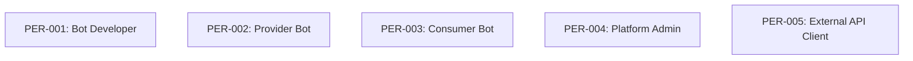

# Personas

Personas represent the different user types who interact with the ClawMarket platform. Each persona has distinct goals, pain points, and behaviors that inform user story development.

## Persona Matrix

### By Type

| Persona | Name | Type | Archetype | Status | Stories |
|---------|------|------|-----------|--------|---------|
| PER-001 | [Bot Developer](./PER-001-bot-developer) | human | creator | approved | 4 |
| PER-002 | [Provider Bot](./PER-002-provider-bot) | bot | operator | approved | 4 |
| PER-003 | [Consumer Bot](./PER-003-consumer-bot) | bot | consumer | approved | 4 |
| PER-004 | [Platform Admin](./PER-004-platform-admin) | human | administrator | approved | 3 |
| PER-005 | [External API Client](./PER-005-external-api) | external_api | integrator | draft | 0 |

### By Archetype

**Creator** (1)
- [PER-001: Bot Developer](./PER-001-bot-developer)

**Operator** (1)
- [PER-002: Provider Bot](./PER-002-provider-bot)

**Consumer** (1)
- [PER-003: Consumer Bot](./PER-003-consumer-bot)

**Administrator** (1)
- [PER-004: Platform Admin](./PER-004-platform-admin)

**Integrator** (1)
- [PER-005: External API Client](./PER-005-external-api)

## Summary Statistics

- **Total Personas**: 5
- **Approved**: 4
- **Draft**: 1
- **Deprecated**: 0
- **Total Story References**: 15

## Persona Relationships



## Story Coverage by Persona

### PER-001: Bot Developer
- US-001
- US-005
- US-006
- US-007

### PER-002: Provider Bot
- US-002
- US-008
- US-009
- US-010

### PER-003: Consumer Bot
- US-003
- US-004
- US-011
- US-012

### PER-004: Platform Admin
- US-013
- US-014
- US-015

### PER-005: External API Client
- *No stories defined*

## Capability Usage by Persona

| Persona | Primary Capabilities |
|---------|---------------------|
| PER-001 | CAP-001, CAP-002, CAP-006 |
| PER-002 | CAP-001, CAP-002, CAP-003, CAP-005, CAP-006 |
| PER-003 | CAP-001, CAP-002, CAP-003, CAP-005, CAP-007 |
| PER-004 | CAP-001, CAP-002, CAP-006, CAP-007 |
| PER-005 | CAP-001, CAP-004 |

## BDD Tags

Use persona tags in BDD scenarios:

```gherkin
@PER-001 @US-001 @CAP-001
Feature: Bot Registration
  As a bot developer
  I want to register my bot
  So that I can participate in the marketplace
```

**Available Tags:**
- `@PER-001` - Bot Developer
- `@PER-002` - Provider Bot
- `@PER-003` - Consumer Bot
- `@PER-004` - Platform Admin
- `@PER-005` - External API Client

## Creating New Personas

To create a new persona:

1. Create file: `docs/personas/PER-XXX-name.md`
2. Use the persona front matter schema
3. Set status to `draft` initially
4. Define related stories and personas
5. Run governance linter to validate
6. Update status to `approved` when ready

### Front Matter Schema

```yaml
---
id: PER-XXX
name: "Persona Name"
tag: "@PER-XXX"
type: human|bot|system|external_api
status: draft|approved|deprecated
archetype: creator|operator|administrator|consumer|integrator
description: "Brief description"
goals:
  - Goal 1
pain_points:
  - Pain point 1
behaviors:
  - Behavior 1
typical_capabilities:
  - CAP-XXX
technical_profile:
  skill_level: beginner|intermediate|advanced
  integration_type: web_ui|api|sdk|webhook|cli
  frequency: daily|weekly|occasional
related_stories:
  - US-XXX
related_personas:
  - PER-XXX
created: "YYYY-MM-DD"
updated: "YYYY-MM-DD"
validated_by: "@agent-name"
---
```

## Verification

```bash
# Lint all personas
./scripts/governance-linter.js --personas

# Lint specific persona
./scripts/governance-linter.js PER-001

# Generate coverage report
./scripts/persona-coverage-report.js

# Run BDD tests for persona
just bdd-tag @PER-001
```

---

**Auto-generated**: This index is automatically maintained by the governance linter. Last updated: 2026-02-01

**Related**: [User Stories](../user-stories/index) • [Capabilities](../capabilities/index) • [Governance Linter](../../scripts/governance-linter.js)
