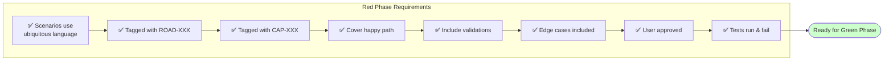
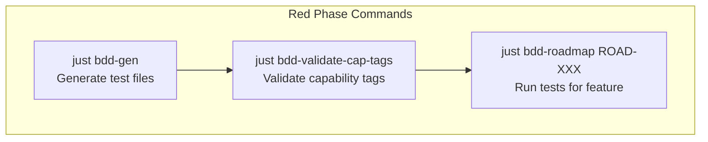

# Governance Linter & Documentation Integration Plan

> **For Claude:** REQUIRED SUB-SKILL: Use superpowers:executing-plans to implement this plan task-by-task.

**Goal:** Update the governance linter and agent documentation to validate and enforce the new capability/user story structure with proper cross-references.

**Architecture:** Extend the existing governance linter to validate CAP-XXX and US-XXX documents, add capability tag validation to BDD tests, and update agent documentation with new commands.

**Tech Stack:** Node.js, JavaScript, Docusaurus, BDD/Cucumber, Just task runner

---

## Context

The project has introduced:
- **Capabilities** (`docs/capabilities/CAP-XXX.md`) - Cross-cutting system abilities
- **User Stories** (`docs/user-stories/US-XXX.md`) - User needs depending on capabilities
- **Capability Tags** (`@CAP-XXX`) - BDD test tags linking tests to capabilities

These need integration with:
1. Governance linter validation
2. Agent documentation
3. Docusaurus navigation
4. BDD test runner

---

## Task 1: Add Capability Validation to Governance Linter

**Files:**
- Modify: `scripts/governance-linter.js:1-50`
- Modify: `scripts/governance-linter.js:76-146`
- Add: Validation functions around line 260

**Step 1: Add capability constants and validators**

Add to top of file after NFR_TYPES:
```javascript
const VALID_CAPABILITY_IDS = [
  'CAP-001', 'CAP-002', 'CAP-003', 'CAP-004', 
  'CAP-005', 'CAP-006', 'CAP-007'
];

const VALID_USER_STORY_IDS = [
  'US-001', 'US-002', 'US-004'
];

const VALID_USE_CASE_IDS = [
  'UC-001', 'UC-002', 'UC-003', 'UC-010', 'UC-011', 
  'UC-012', 'UC-013', 'UC-014', 'UC-020', 'UC-021'
];
```

**Step 2: Create validateCapabilityFrontMatter function**

Add after validateNfrFrontMatter (around line 285):
```javascript
/**
 * Validate CAP-XXX capability file front matter
 */
function validateCapabilityFrontMatter(filePath, frontMatter) {
  const errors = [];
  const warnings = [];
  
  // Required fields
  if (!frontMatter.id) errors.push('Missing required field: id');
  if (!frontMatter.title) errors.push('Missing required field: title');
  if (!frontMatter.category) errors.push('Missing required field: category');
  if (!frontMatter.tag) errors.push('Missing required field: tag');
  
  // Validate ID format
  if (frontMatter.id && !frontMatter.id.match(/^CAP-\d+$/)) {
    errors.push(`Invalid id format: ${frontMatter.id} (expected CAP-XXX)`);
  }
  
  // Validate tag format
  if (frontMatter.tag && !frontMatter.tag.match(/^@CAP-\d+$/)) {
    errors.push(`Invalid tag format: ${frontMatter.tag} (expected @CAP-XXX)`);
  }
  
  // Validate category
  const validCategories = ['Security', 'Observability', 'Communication', 'Business'];
  if (frontMatter.category && !validCategories.includes(frontMatter.category)) {
    warnings.push(`Unusual category: ${frontMatter.category}`);
  }
  
  return { errors, warnings };
}

/**
 * Validate US-XXX user story file front matter
 */
function validateUserStoryFrontMatter(filePath, frontMatter) {
  const errors = [];
  const warnings = [];
  
  // Required fields
  if (!frontMatter.id) errors.push('Missing required field: id');
  if (!frontMatter.title) errors.push('Missing required field: title');
  if (!frontMatter.actor) errors.push('Missing required field: actor');
  if (!frontMatter.status) errors.push('Missing required field: status');
  if (!frontMatter.capabilities) errors.push('Missing required field: capabilities');
  
  // Validate ID format
  if (frontMatter.id && !frontMatter.id.match(/^US-\d+$/)) {
    errors.push(`Invalid id format: ${frontMatter.id} (expected US-XXX)`);
  }
  
  // Validate capabilities array
  if (frontMatter.capabilities) {
    if (!Array.isArray(frontMatter.capabilities)) {
      errors.push('capabilities must be an array');
    } else {
      for (const cap of frontMatter.capabilities) {
        if (!cap.match(/^CAP-\d+$/)) {
          errors.push(`Invalid capability reference: ${cap}`);
        } else if (!VALID_CAPABILITY_IDS.includes(cap)) {
          errors.push(`Unknown capability: ${cap}`);
        }
      }
    }
  }
  
  // Validate use_cases if present
  if (frontMatter.use_cases) {
    if (!Array.isArray(frontMatter.use_cases)) {
      errors.push('use_cases must be an array');
    } else {
      for (const uc of frontMatter.use_cases) {
        if (!uc.match(/^UC-\d+$/)) {
          errors.push(`Invalid use case reference: ${uc}`);
        }
      }
    }
  }
  
  return { errors, warnings };
}
```

**Step 3: Update validateRoadFrontMatter to require capabilities or NFRs**

Modify the governance validation in validateRoadFrontMatter (around line 99):
```javascript
    // NEW: Validate capabilities or NFRs present
    if (frontMatter.governance) {
      const hasCapabilities = frontMatter.governance.capabilities && 
        Array.isArray(frontMatter.governance.capabilities) && 
        frontMatter.governance.capabilities.length > 0;
      
      const hasApplicableNFRs = frontMatter.governance.nfrs && 
        Array.isArray(frontMatter.governance.nfrs.applicable) && 
        frontMatter.governance.nfrs.applicable.length > 0;
      
      const hasFailingNFRs = frontMatter.governance.nfrs && 
        frontMatter.governance.nfrs.status === 'fail';
      
      if (!hasCapabilities && !hasApplicableNFRs && !hasFailingNFRs) {
        errors.push('ROAD item must have at least one capability OR non-compliant NFR');
      }
      
      // Validate capability references
      if (hasCapabilities) {
        for (const cap of frontMatter.governance.capabilities) {
          if (!cap.match(/^CAP-\d+$/)) {
            errors.push(`Invalid capability reference: ${cap}`);
          }
          // Check capability file exists
          const capFile = findCapabilityFile(cap);
          if (!capFile) {
            errors.push(`Referenced capability file not found: ${cap}`);
          }
        }
      }
    }
```

**Step 4: Add findCapabilityFile helper**

Add after findRoadFile (around line 324):
```javascript
/**
 * Find CAP-XXX capability file
 */
function findCapabilityFile(capId) {
  const files = glob.sync(path.join(DOCS_DIR, 'capabilities/*.md'));
  for (const file of files) {
    const content = fs.readFileSync(file, 'utf8');
    const fm = extractFrontMatter(content);
    if (fm && fm.id === capId) {
      return file;
    }
  }
  return null;
}

/**
 * Find US-XXX user story file
 */
function findUserStoryFile(usId) {
  const files = glob.sync(path.join(DOCS_DIR, 'user-stories/*.md'));
  for (const file of files) {
    const content = fs.readFileSync(file, 'utf8');
    const fm = extractFrontMatter(content);
    if (fm && fm.id === usId) {
      return file;
    }
  }
  return null;
}
```

**Step 5: Add CLI flags and lint functions**

Add to argument parsing (around line 54):
```javascript
const checkCapabilities = args.includes('--capabilities');
const checkUserStories = args.includes('--user-stories');
const targetCapability = args.find(arg => arg.startsWith('CAP-'));
const targetUserStory = args.find(arg => arg.startsWith('US-'));
```

Add lint functions before main() (around line 460):
```javascript
/**
 * Lint all capability files
 */
function lintCapabilities() {
  const capFiles = glob.sync(path.join(DOCS_DIR, 'capabilities/CAP-*.md'));
  
  for (const file of capFiles) {
    if (path.basename(file) === 'index.md') continue;
    
    const content = fs.readFileSync(file, 'utf8');
    const frontMatter = extractFrontMatter(content);
    
    if (!frontMatter) {
      results.errors.push({
        file,
        message: 'No front matter found'
      });
      continue;
    }
    
    if (frontMatter.error) {
      results.errors.push({
        file,
        message: `Invalid YAML: ${frontMatter.error}`
      });
      continue;
    }
    
    results.total++;
    
    const validation = validateCapabilityFrontMatter(file, frontMatter);
    
    for (const error of validation.errors) {
      results.errors.push({
        file,
        capId: frontMatter.id,
        message: error,
        severity: 'error'
      });
    }
    
    for (const warning of validation.warnings) {
      results.warnings.push({
        file,
        capId: frontMatter.id,
        message: warning,
        severity: 'warning'
      });
    }
    
    if (validation.errors.length === 0) {
      results.passed.push({
        file,
        capId: frontMatter.id,
        message: 'All validations passed'
      });
    }
  }
}

/**
 * Lint all user story files
 */
function lintUserStories() {
  const usFiles = glob.sync(path.join(DOCS_DIR, 'user-stories/US-*.md'));
  
  for (const file of usFiles) {
    if (path.basename(file) === 'index.md') continue;
    
    const content = fs.readFileSync(file, 'utf8');
    const frontMatter = extractFrontMatter(content);
    
    if (!frontMatter) {
      results.errors.push({
        file,
        message: 'No front matter found'
      });
      continue;
    }
    
    if (frontMatter.error) {
      results.errors.push({
        file,
        message: `Invalid YAML: ${frontMatter.error}`
      });
      continue;
    }
    
    results.total++;
    
    const validation = validateUserStoryFrontMatter(file, frontMatter);
    
    for (const error of validation.errors) {
      results.errors.push({
        file,
        usId: frontMatter.id,
        message: error,
        severity: 'error'
      });
    }
    
    for (const warning of validation.warnings) {
      results.warnings.push({
        file,
        usId: frontMatter.id,
        message: warning,
        severity: 'warning'
      });
    }
    
    if (validation.errors.length === 0) {
      results.passed.push({
        file,
        usId: frontMatter.id,
        message: 'All validations passed'
      });
    }
  }
}
```

**Step 6: Update main() to handle new flags**

Modify main() (around line 584):
```javascript
function main() {
  try {
    if (targetRoad) {
      lintRoadItem(targetRoad);
    } else if (targetCapability) {
      // TODO: Add lintCapabilityItem
      console.log(`Linting ${targetCapability}...`);
      lintCapabilities();
    } else if (targetUserStory) {
      // TODO: Add lintUserStoryItem  
      console.log(`Linting ${targetUserStory}...`);
      lintUserStories();
    } else if (allRoads) {
      lintAllRoads();
    } else if (checkCapabilities) {
      lintCapabilities();
    } else if (checkUserStories) {
      lintUserStories();
    } else if (checkChangelog) {
      lintChangelog();
    } else if (checkAdrs) {
      lintAdrs();
    } else if (ci) {
      // CI mode: check everything
      lintAllRoads();
      lintCapabilities();
      lintUserStories();
      lintChangelog();
      lintAdrs();
    } else {
      console.log('Usage:');
      console.log('  ./scripts/governance-linter.js ROAD-005');
      console.log('  ./scripts/governance-linter.js CAP-001');
      console.log('  ./scripts/governance-linter.js US-001');
      console.log('  ./scripts/governance-linter.js --all-roads');
      console.log('  ./scripts/governance-linter.js --capabilities');
      console.log('  ./scripts/governance-linter.js --user-stories');
      console.log('  ./scripts/governance-linter.js --changelog');
      console.log('  ./scripts/governance-linter.js --adrs');
      console.log('  ./scripts/governance-linter.js --ci');
      console.log('  ./scripts/governance-linter.js --format=json ROAD-005');
      process.exit(1);
    }
```

**Step 7: Test the linter**

Run: `./scripts/governance-linter.js --capabilities`
Expected: Validations pass for all capability files

Run: `./scripts/governance-linter.js --user-stories`
Expected: Validations pass for all user story files

Run: `./scripts/governance-linter.js ROAD-004`
Expected: Should check for capabilities in governance section

**Step 8: Commit**
```bash
git add scripts/governance-linter.js
git commit -m "feat: add capability and user story validation to governance linter

- Add validateCapabilityFrontMatter() for CAP-XXX files
- Add validateUserStoryFrontMatter() for US-XXX files
- Enforce ROAD items must have capabilities OR non-compliant NFRs
- Add CLI flags: --capabilities, --user-stories
- Update CI mode to validate all document types"
```

---

## Task 2: Add Capability Tag Validation to BDD Tests

**Files:**
- Create: `scripts/validate-bdd-tags.js`
- Modify: `justfile` (add bdd-validate-cap-tags command)

**Step 1: Create BDD tag validator script**

Create `scripts/validate-bdd-tags.js`:
```javascript
#!/usr/bin/env node
/**
 * BDD Tag Validator
 * Validates that all @CAP-XXX tags reference existing capabilities
 * 
 * Usage:
 *   ./scripts/validate-bdd-tags.js
 *   ./scripts/validate-bdd-tags.js --strict
 */

const fs = require('fs');
const path = require('path');
const glob = require('glob');

const FEATURES_DIR = path.join(process.cwd(), 'stack-tests/features');
const DOCS_DIR = path.join(process.cwd(), 'docs');

// Known valid capability IDs
const VALID_CAPABILITIES = [
  'CAP-001', 'CAP-002', 'CAP-003', 'CAP-004',
  'CAP-005', 'CAP-006', 'CAP-007'
];

// Parse arguments
const args = process.argv.slice(2);
const strict = args.includes('--strict');

const results = {
  errors: [],
  warnings: [],
  passed: [],
  total: 0
};

/**
 * Extract tags from feature/scenario content
 */
function extractTags(content) {
  const tags = [];
  const lines = content.split('\n');
  
  for (const line of lines) {
    const trimmed = line.trim();
    if (trimmed.startsWith('@')) {
      const lineTags = trimmed.split(/\s+/);
      for (const tag of lineTags) {
        if (tag.startsWith('@')) {
          tags.push(tag);
        }
      }
    }
  }
  
  return tags;
}

/**
 * Validate capability tags in a feature file
 */
function validateFeatureFile(filePath) {
  const content = fs.readFileSync(filePath, 'utf8');
  const tags = extractTags(content);
  
  const capTags = tags.filter(tag => tag.match(/^@CAP-\d+$/));
  
  for (const tag of capTags) {
    results.total++;
    const capId = tag.substring(1); // Remove @
    
    if (!VALID_CAPABILITIES.includes(capId)) {
      results.errors.push({
        file: filePath,
        tag: tag,
        message: `Unknown capability tag: ${tag}`
      });
    } else {
      results.passed.push({
        file: filePath,
        tag: tag,
        message: `Valid capability tag`
      });
    }
  }
  
  // In strict mode, warn if no capability tags
  if (strict && capTags.length === 0) {
    results.warnings.push({
      file: filePath,
      message: 'No capability tags found (@CAP-XXX)'
    });
  }
}

/**
 * Main validation
 */
function main() {
  const featureFiles = glob.sync(path.join(FEATURES_DIR, '**/*.feature'));
  
  for (const file of featureFiles) {
    validateFeatureFile(file);
  }
  
  // Output results
  console.log('🔍 BDD Tag Validator');
  console.log('═══════════════════════════════════════════\n');
  
  if (results.errors.length > 0) {
    console.log(`❌ ERRORS (${results.errors.length})`);
    console.log('───────────────────────────────────────────');
    for (const error of results.errors) {
      const file = path.relative(process.cwd(), error.file);
      console.log(`\n${error.tag} in ${file}`);
      console.log(`  ${error.message}`);
    }
    console.log('');
  }
  
  if (results.warnings.length > 0) {
    console.log(`⚠️  WARNINGS (${results.warnings.length})`);
    console.log('───────────────────────────────────────────');
    for (const warning of results.warnings) {
      const file = path.relative(process.cwd(), warning.file);
      console.log(`\n${file}`);
      console.log(`  ${warning.message}`);
    }
    console.log('');
  }
  
  console.log('───────────────────────────────────────────');
  console.log(`Summary: ${results.errors.length} errors, ${results.warnings.length} warnings`);
  console.log(`Capability tags checked: ${results.total}\n`);
  
  if (results.errors.length > 0) {
    process.exit(1);
  }
  
  process.exit(0);
}

main();
```

**Step 2: Add justfile command**

Add to `justfile`:
```makefile
# Validate BDD capability tags
bdd-validate-cap-tags:
    node scripts/validate-bdd-tags.js

# Validate BDD capability tags (strict mode - requires all features to have capability tags)
bdd-validate-cap-tags-strict:
    node scripts/validate-bdd-tags.js --strict
```

**Step 3: Test validation**

Run: `just bdd-validate-cap-tags`
Expected: Pass if all existing @CAP-XXX tags are valid

**Step 4: Commit**
```bash
git add scripts/validate-bdd-tags.js justfile
git commit -m "feat: add BDD capability tag validator

- Create validate-bdd-tags.js script
- Validates @CAP-XXX tags reference existing capabilities
- Supports --strict mode for requiring capability tags
- Add just commands: bdd-validate-cap-tags, bdd-validate-cap-tags-strict"
```

---

## Task 3: Generate Capability Coverage Report

**Files:**
- Create: `scripts/capability-coverage-report.js`

**Step 1: Create coverage report script**

Create `scripts/capability-coverage-report.js`:
```javascript
#!/usr/bin/env node
/**
 * Capability Coverage Report
 * Generates report showing test coverage by capability
 * 
 * Usage:
 *   ./scripts/capability-coverage-report.js
 *   ./scripts/capability-coverage-report.js --format=json
 */

const fs = require('fs');
const path = require('path');
const glob = require('glob');

const FEATURES_DIR = path.join(process.cwd(), 'stack-tests/features');
const CAPABILITIES_DIR = path.join(process.cwd(), 'docs/capabilities');

// Parse arguments
const args = process.argv.slice(2);
const format = args.includes('--format=json') ? 'json' : 'human';

// All known capabilities
const ALL_CAPABILITIES = [
  { id: 'CAP-001', name: 'Authentication', status: 'stable' },
  { id: 'CAP-002', name: 'Audit Logging', status: 'stable' },
  { id: 'CAP-003', name: 'Real-time Notifications', status: 'planned' },
  { id: 'CAP-004', name: 'Rate Limiting', status: 'stable' },
  { id: 'CAP-005', name: 'Escrow Management', status: 'stable' },
  { id: 'CAP-006', name: 'Reputation Calculation', status: 'stable' },
  { id: 'CAP-007', name: 'Oracle Verification', status: 'planned' }
];

/**
 * Extract tags from feature file
 */
function extractTags(content) {
  const tags = [];
  const lines = content.split('\n');
  
  for (const line of lines) {
    const trimmed = line.trim();
    if (trimmed.startsWith('@')) {
      const lineTags = trimmed.split(/\s+/);
      for (const tag of lineTags) {
        if (tag.startsWith('@')) {
          tags.push(tag);
        }
      }
    }
  }
  
  return tags;
}

/**
 * Count scenarios in feature file
 */
function countScenarios(content) {
  const matches = content.match(/Scenario:/g);
  return matches ? matches.length : 0;
}

/**
 * Generate coverage report
 */
function generateReport() {
  const report = {
    generatedAt: new Date().toISOString(),
    summary: {
      totalCapabilities: ALL_CAPABILITIES.length,
      coveredCapabilities: 0,
      coveragePercent: 0
    },
    capabilities: {}
  };
  
  // Initialize capability tracking
  for (const cap of ALL_CAPABILITIES) {
    report.capabilities[cap.id] = {
      name: cap.name,
      status: cap.status,
      scenarioCount: 0,
      featureFiles: [],
      covered: false
    };
  }
  
  // Scan feature files
  const featureFiles = glob.sync(path.join(FEATURES_DIR, '**/*.feature'));
  
  for (const file of featureFiles) {
    const content = fs.readFileSync(file, 'utf8');
    const tags = extractTags(content);
    const scenarioCount = countScenarios(content);
    const relativePath = path.relative(FEATURES_DIR, file);
    
    const capTags = tags.filter(tag => tag.match(/^@CAP-\d+$/));
    
    for (const tag of capTags) {
      const capId = tag.substring(1);
      if (report.capabilities[capId]) {
        report.capabilities[capId].scenarioCount += scenarioCount;
        report.capabilities[capId].featureFiles.push(relativePath);
        report.capabilities[capId].covered = true;
      }
    }
  }
  
  // Calculate summary
  const coveredCount = Object.values(report.capabilities)
    .filter(cap => cap.covered).length;
  report.summary.coveredCapabilities = coveredCount;
  report.summary.coveragePercent = Math.round(
    (coveredCount / report.summary.totalCapabilities) * 100
  );
  
  return report;
}

/**
 * Output in human-readable format
 */
function outputHuman(report) {
  console.log('📊 Capability Coverage Report');
  console.log('═══════════════════════════════════════════\n');
  
  console.log(`Generated: ${report.generatedAt}`);
  console.log(`Coverage: ${report.summary.coveredCapabilities}/${report.summary.totalCapabilities} capabilities (${report.summary.coveragePercent}%)\n`);
  
  console.log('Capability Coverage:');
  console.log('───────────────────────────────────────────\n');
  
  for (const [capId, capData] of Object.entries(report.capabilities)) {
    const status = capData.covered ? '✅' : '❌';
    const scenarios = capData.scenarioCount > 0 
      ? `${capData.scenarioCount} scenarios` 
      : 'No test coverage';
    
    console.log(`${status} ${capId}: ${capData.name}`);
    console.log(`   Status: ${capData.status}`);
    console.log(`   Tests: ${scenarios}`);
    
    if (capData.featureFiles.length > 0) {
      console.log(`   Features: ${capData.featureFiles.length} files`);
    }
    console.log('');
  }
  
  // Uncovered capabilities
  const uncovered = Object.entries(report.capabilities)
    .filter(([_, cap]) => !cap.covered)
    .map(([id, _]) => id);
  
  if (uncovered.length > 0) {
    console.log('❌ Uncovered Capabilities:');
    console.log('───────────────────────────────────────────');
    for (const capId of uncovered) {
      const cap = report.capabilities[capId];
      console.log(`  ${capId}: ${cap.name} (${cap.status})`);
    }
    console.log('');
  }
}

/**
 * Main
 */
function main() {
  const report = generateReport();
  
  if (format === 'json') {
    console.log(JSON.stringify(report, null, 2));
  } else {
    outputHuman(report);
  }
  
  // Exit with error if coverage < 100%
  if (report.summary.coveragePercent < 100) {
    process.exit(1);
  }
  
  process.exit(0);
}

main();
```

**Step 2: Add justfile command**

Add to `justfile`:
```makefile
# Generate capability coverage report
capability-coverage:
    node scripts/capability-coverage-report.js

# Generate capability coverage report (JSON format)
capability-coverage-json:
    node scripts/capability-coverage-report.js --format=json
```

**Step 3: Test report generation**

Run: `just capability-coverage`
Expected: Shows coverage percentage and which capabilities have tests

**Step 4: Commit**
```bash
git add scripts/capability-coverage-report.js justfile
git commit -m "feat: add capability coverage reporting

- Generate report showing test coverage by @CAP-XXX tags
- Shows scenarios per capability and uncovered capabilities
- Add just commands: capability-coverage, capability-coverage-json
- CI can fail if coverage < 100%"
```

---

## Task 4: Update Agent Quick Reference

**Files:**
- Modify: `docs/agents/quick-reference.md`

**Step 1: Add capability commands section**

Add after BDD Writer Commands (around line 48):
```markdown
### Capability & User Story Commands
```bash
just bdd-validate-cap-tags          # Validate @CAP-XXX tags exist
just bdd-validate-cap-tags-strict   # Validate all features have capability tags
just capability-coverage            # Show capability test coverage
just capability-coverage-json       # Coverage report in JSON
```
```

**Step 2: Add governance linter commands**

Add after capability commands:
```markdown
### Governance Linter Commands
```bash
./scripts/governance-linter.js ROAD-005           # Lint specific ROAD
./scripts/governance-linter.js CAP-001            # Lint specific capability
./scripts/governance-linter.js US-001             # Lint specific user story
./scripts/governance-linter.js --all-roads        # Lint all ROADs
./scripts/governance-linter.js --capabilities     # Lint all capabilities
./scripts/governance-linter.js --user-stories     # Lint all user stories
./scripts/governance-linter.js --ci               # CI mode (lints everything)
```
```

**Step 3: Update Workflow 3 to include validation**

Modify Workflow 3 (Implement New Feature) around line 76:
```markdown
### Workflow 3: Implement New Feature
```bash
# 1. Review BDD scenarios (already exist or create with BDD Writer)

# 2. Validate capability tags
just bdd-validate-cap-tags

# 3. Run tests (Red phase - will fail)
just bdd-roadmap ROAD-XXX

# 4. Implement feature (Code Writer)
# ... write code ...

# 5. Run tests again (Green phase - should pass)
just bdd-roadmap ROAD-XXX

# 6. Validate governance
./scripts/governance-linter.js ROAD-XXX

# 7. Run full checks
just check

# 8. Check capability coverage
just capability-coverage

# 9. View test report
just bdd-report
```
```

**Step 4: Add validation section to decision tree**

Add before troubleshooting (around line 132):
```markdown
### "Does this feature have proper documentation?"

```
Has capability tags? ──No──> Add @CAP-XXX tags to BDD tests
    │                           just bdd-validate-cap-tags
    Yes
    │
Linked to capability? ──No──> Add to ROAD front matter
    │                           governance.capabilities
    Yes
    │
Linked to use case? ──No──> Add to US front matter
    │                           use_cases
    Yes
    │
Lint passes? ──No──> Fix validation errors
    │                 ./scripts/governance-linter.js --ci
    Yes
    │
Coverage OK? ──No──> Add missing tests
                      just capability-coverage
```
```

**Step 5: Commit**
```bash
git add docs/agents/quick-reference.md
git commit -m "docs: update agent quick reference with capability commands

- Add capability and user story commands
- Add governance linter commands
- Update implementation workflow with validation steps
- Add documentation validation decision tree"
```

---

## Task 5: Update Agent BDD Loop Documentation

**Files:**
- Modify: `docs/agents/bdd-loop.md`

**Step 1: Update Red Phase to include capability tagging**

Modify Red Phase section (around line 86):
```markdown
### Red Phase Checklist


```

**Step 2: Update tagging examples**

Find the tagging example (around line 35) and update:
```markdown
Create --> TagRoadmap[Tag Scenarios with @ROAD-XXX and @CAP-XXX]
```

**Step 3: Add capability validation to Green Phase**

Add after architecture review (around line 175):
```markdown
    CW->>AI: "Review architecture"
    activate AI
    AI->>AI: Check ports & adapters
    AI->>AI: Verify dependency direction
    alt Architecture Issues
        AI->>CW: "❌ Violations found"
        CW->>CW: Fix issues
        CW->>AI: "Review again"
    else Architecture Good
        AI->>CW: "✅ Hexagonal compliant"
    end
    deactivate AI

    CW->>TAG: "Validate capability tags"
    activate TAG
    TAG->>TAG: Check @CAP-XXX tags exist
    TAG->>TAG: Validate tag references
    alt Missing Tags
        TAG->>CW: "❌ Missing capability tags"
        CW->>CW: Add @CAP-XXX tags
        CW->>TAG: "Validate again"
    else Tags Valid
        TAG->>CW: "✅ Capability tags valid"
    end
    deactivate TAG
```

**Step 4: Update Commands by Phase section**

Modify the Red Phase commands (around line 510):
```markdown

```

**Step 5: Commit**
```bash
git add docs/agents/bdd-loop.md
git commit -m "docs: update BDD loop with capability validation

- Add @CAP-XXX tagging to Red Phase checklist
- Include capability tag validation in workflow
- Update command sequences with validation steps"
```

---

## Task 6: Update Docusaurus Sidebars

**Files:**
- Modify: `docs/sidebars.ts`

**Step 1: Add capabilities sidebar**

Add after bddSidebar (around line 95):
```typescript
  capabilitiesSidebar: [
    {
      type: 'doc',
      id: 'capabilities/index',
      label: 'Capabilities Overview',
    },
    {
      type: 'category',
      label: 'Security',
      items: [
        'capabilities/CAP-001-authentication',
        'capabilities/CAP-004-rate-limiting',
      ],
    },
    {
      type: 'category',
      label: 'Observability',
      items: [
        'capabilities/CAP-002-audit-logging',
      ],
    },
    {
      type: 'category',
      label: 'Communication',
      items: [
        'capabilities/CAP-003-real-time-notifications',
      ],
    },
  ],
```

**Step 2: Add user stories sidebar**

Add after capabilitiesSidebar:
```typescript
  userStoriesSidebar: [
    {
      type: 'doc',
      id: 'user-stories/index',
      label: 'User Stories Catalog',
    },
    {
      type: 'category',
      label: 'Bot Developer',
      items: [
        'user-stories/US-001-bot-registration',
      ],
    },
    {
      type: 'category',
      label: 'Provider Bot',
      items: [
        'user-stories/US-002-promise-creation',
      ],
    },
    {
      type: 'category',
      label: 'Consumer Bot',
      items: [
        'user-stories/US-004-promise-acceptance',
      ],
    },
  ],
```

**Step 3: Update export**

Ensure the sidebars object exports all sidebars:
```typescript
export default sidebars;
```

**Step 4: Commit**
```bash
git add docs/sidebars.ts
git commit -m "docs: update sidebars with capabilities and user stories

- Add capabilitiesSidebar with categorized capabilities
- Add userStoriesSidebar with stories by actor
- Group capabilities by Security/Observability/Communication"
```

---

## Task 7: Update Docusaurus Config

**Files:**
- Modify: `docs/docusaurus.config.ts`

**Step 1: Add navigation items for capabilities and user stories**

Find the navbar items (around line 90) and add:
```typescript
          {
            to: '/docs/capabilities',
            label: 'Capabilities',
            position: 'left',
          },
          {
            to: '/docs/user-stories',
            label: 'User Stories',
            position: 'left',
          },
```

**Step 2: Update footer if needed**

Check footer links (around line 140) and add capabilities/user stories links.

**Step 3: Commit**
```bash
git add docs/docusaurus.config.ts
git commit -m "docs: update docusaurus config with capability navigation

- Add Capabilities link to navbar
- Add User Stories link to navbar"
```

---

## Task 8: Update Agent Overview

**Files:**
- Modify: `docs/agents/overview.md`

**Step 1: Add BDD validation to agent responsibilities**

Update BDD Writer description (around line 75):
```markdown
#### 5. BDD Writer ✍️
**Role**: BDD Scenario Creation
**Autonomy**: Low 🔒 (Always asks permission)

- Write Gherkin feature files
- Tag scenarios with roadmap IDs (@ROAD-XXX)
- Tag scenarios with capability IDs (@CAP-XXX)
- Use ubiquitous language
- Validate capability tags exist
```

**Step 2: Update CI Runner to include validation**

Update CI Runner description (around line 55):
```markdown
#### 3. CI Runner ⚙️
**Role**: Continuous Integration
**Autonomy**: High ⚡

- Run linting, type checking, tests
- Auto-fix formatting and minor issues
- Validate capability tags in BDD tests
- Generate coverage reports
- Generate capability coverage reports
```

**Step 3: Commit**
```bash
git add docs/agents/overview.md
git commit -m "docs: update agent overview with capability responsibilities

- BDD Writer tags scenarios with @CAP-XXX
- CI Runner validates capability tags
- CI Runner generates capability coverage reports"
```

---

## Task 9: Update Roadmap Items with Capabilities

**Files:**
- Modify: `docs/roads/ROAD-004.md` through `docs/roads/ROAD-009.md`

**Step 1: Update ROAD-004 (Bot Registration)**

Add to governance front matter:
```yaml
governance:
  capabilities:
    - CAP-001
    - CAP-002
```

**Step 2: Update ROAD-005 (Bot Authentication)**

Add to governance:
```yaml
governance:
  capabilities:
    - CAP-001
    - CAP-002
    - CAP-004
```

**Step 3: Update ROAD-006, 007, 009 similarly**

Match capabilities to what each roadmap implements:
- ROAD-006: CAP-001, CAP-002
- ROAD-007: CAP-006
- ROAD-009: CAP-005

**Step 4: Commit**
```bash
git add docs/roads/ROAD-*.md
git commit -m "docs: add capability references to roadmap items

- ROAD-004: CAP-001, CAP-002
- ROAD-005: CAP-001, CAP-002, CAP-004
- ROAD-006: CAP-001, CAP-002
- ROAD-007: CAP-006
- ROAD-009: CAP-005"
```

---

## Task 10: Integration Testing

**Step 1: Test governance linter with all flags**

Run each command:
```bash
./scripts/governance-linter.js --capabilities
./scripts/governance-linter.js --user-stories
./scripts/governance-linter.js --all-roads
./scripts/governance-linter.js --ci
```

All should pass with the current documents.

**Step 2: Test BDD tag validation**

```bash
just bdd-validate-cap-tags
```

Should validate existing capability tags.

**Step 3: Test coverage report**

```bash
just capability-coverage
```

Should show coverage percentage.

**Step 4: Test documentation site**

```bash
cd docs
npm run build
```

Should build without errors.

**Step 5: Final validation**

Run full CI check:
```bash
just check
./scripts/governance-linter.js --ci
```

**Step 6: Final commit**
```bash
git commit --allow-empty -m "test: validate all integrations

- Governance linter passes for all document types
- BDD capability tag validation passes
- Capability coverage report generates
- Documentation site builds successfully
- Full CI validation complete"
```

---

## Summary

This plan implements comprehensive integration of capabilities and user stories into the governance and documentation system:

### Changes Made:
1. **Governance Linter** - Validates CAP-XXX, US-XXX, and enforces capability requirements on ROAD items
2. **BDD Tag Validator** - Ensures @CAP-XXX tags reference existing capabilities
3. **Capability Coverage Report** - Shows test coverage by capability
4. **Agent Documentation** - Updated with new commands and workflows
5. **Docusaurus Config** - Added navigation for capabilities and user stories
6. **Roadmap Updates** - Linked existing roadmap items to capabilities

### New Commands:
- `just bdd-validate-cap-tags` - Validate BDD capability tags
- `just capability-coverage` - Generate coverage report
- `./scripts/governance-linter.js --capabilities` - Lint capabilities
- `./scripts/governance-linter.js --user-stories` - Lint user stories

### Validation:
- Every ROAD item must have capabilities OR non-compliant NFRs
- Every US-XXX must reference valid UC-XXX use cases
- Every @CAP-XXX BDD tag must reference existing capability
- CI generates capability coverage reports
