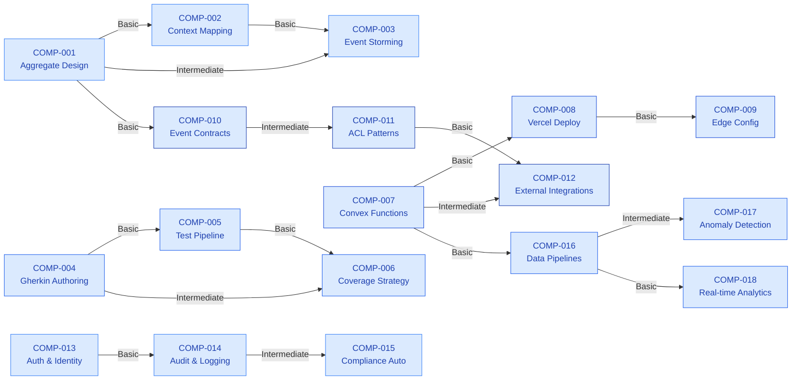

# Practice Areas

AquaTrack follows the Katalyst Practice Area model -- each engineering discipline is a formally defined practice area with structured competencies, team adoption tracking, and individual proficiency assessments.

### At a Glance {#at-a-glance}

  

    
6

    
Practice Areas

  

  

    
18

    
Competencies

  

  

    
24

    
Team Adoptions

  

  

    
64

    
Individual Assessments

  

### Practice Area Summary {#practice-area-summary}

  

    

      PA-001 Domain-Driven Design
      Understanding
    

    
Aggregate boundaries, bounded contexts, ubiquitous language, context mapping, and event storming.

    

      COMP-001 Aggregate Design
      COMP-002 Context Mapping
      COMP-003 Event Storming
    

    

      

        

      

      82%
    

    <a href="/docs/practice-areas/PA-001-ddd" style={{ fontSize: '13px', color: '#3b82f6', fontWeight: '500', textDecoration: 'none' }}>View details &rarr;</a>
  

  

    

      PA-002 Test Automation & BDD
      Feedback
    

    
Gherkin scenario authoring, Cucumber/Vitest integration, test pyramid strategy, CI/CD test gates.

    

      COMP-004 Gherkin Authoring
      COMP-005 Test Pipeline
      COMP-006 Coverage Strategy
    

    

      

        

      

      76%
    

    <a href="/docs/practice-areas/PA-002-bdd" style={{ fontSize: '13px', color: '#3b82f6', fontWeight: '500', textDecoration: 'none' }}>View details &rarr;</a>
  

  

    

      PA-003 Cloud Infrastructure
      Confidence
    

    
Convex backend functions, Vercel deployment, edge configuration, environment management.

    

      COMP-007 Convex Functions
      COMP-008 Vercel Deploy
      COMP-009 Edge Config
    

    

      

        

      

      71%
    

    <a href="/docs/practice-areas/PA-003-cloud" style={{ fontSize: '13px', color: '#3b82f6', fontWeight: '500', textDecoration: 'none' }}>View details &rarr;</a>
  

  

    

      PA-004 API Design & Integration
      Confidence
    

    
RESTful conventions, domain event contracts, anti-corruption layers, shared kernel protocols.

    

      COMP-010 Event Contracts
      COMP-011 ACL Patterns
      COMP-012 External Integrations
    

    

      

        

      

      68%
    

    <a href="/docs/practice-areas/PA-004-api" style={{ fontSize: '13px', color: '#3b82f6', fontWeight: '500', textDecoration: 'none' }}>View details &rarr;</a>
  

  

    

      PA-005 Security & Compliance
      Confidence
    

    
Authentication (Clerk), authorization policies, audit trails, PCI compliance, OWASP practices.

    

      COMP-013 Auth & Identity
      COMP-014 Audit & Logging
      COMP-015 Compliance Automation
    

    

      

        

      

      74%
    

    <a href="/docs/practice-areas/PA-005-security" style={{ fontSize: '13px', color: '#3b82f6', fontWeight: '500', textDecoration: 'none' }}>View details &rarr;</a>
  

  

    

      PA-006 Data Engineering
      Understanding
    

    
Time-series data pipelines, ETL workflows, anomaly detection, usage analytics, real-time streaming.

    

      COMP-016 Data Pipelines
      COMP-017 Anomaly Detection
      COMP-018 Real-time Analytics
    

    

      

        

      

      65%
    

    <a href="/docs/practice-areas/PA-006-data" style={{ fontSize: '13px', color: '#3b82f6', fontWeight: '500', textDecoration: 'none' }}>View details &rarr;</a>
  

### Team Adoption Heatmap {#team-adoption-heatmap}

<table style={{ width: '100%', borderCollapse: 'collapse', fontSize: '13px' }}>
  <thead>
    <tr style={{ background: '#f8fafc' }}>
      <th style={{ padding: '10px 12px', textAlign: 'left', borderBottom: '2px solid #e2e8f0', color: '#0f172a', fontWeight: '600' }}>Team</th>
      <th style={{ padding: '10px 12px', textAlign: 'center', borderBottom: '2px solid #e2e8f0', color: '#0f172a', fontWeight: '600' }}>PA-001 DDD</th>
      <th style={{ padding: '10px 12px', textAlign: 'center', borderBottom: '2px solid #e2e8f0', color: '#0f172a', fontWeight: '600' }}>PA-002 BDD</th>
      <th style={{ padding: '10px 12px', textAlign: 'center', borderBottom: '2px solid #e2e8f0', color: '#0f172a', fontWeight: '600' }}>PA-003 Cloud</th>
      <th style={{ padding: '10px 12px', textAlign: 'center', borderBottom: '2px solid #e2e8f0', color: '#0f172a', fontWeight: '600' }}>PA-004 API</th>
      <th style={{ padding: '10px 12px', textAlign: 'center', borderBottom: '2px solid #e2e8f0', color: '#0f172a', fontWeight: '600' }}>PA-005 Security</th>
      <th style={{ padding: '10px 12px', textAlign: 'center', borderBottom: '2px solid #e2e8f0', color: '#0f172a', fontWeight: '600' }}>PA-006 Data</th>
    </tr>
  </thead>
  <tbody>
    <tr>
      <td style={{ padding: '10px 12px', borderBottom: '1px solid #e2e8f0', fontWeight: '600', color: '#0f172a' }}>Customer Services</td>
      <td style={{ padding: '10px 12px', borderBottom: '1px solid #e2e8f0', textAlign: 'center' }}>
        Proficient
        
85

      </td>
      <td style={{ padding: '10px 12px', borderBottom: '1px solid #e2e8f0', textAlign: 'center' }}>
        Proficient
        
80

      </td>
      <td style={{ padding: '10px 12px', borderBottom: '1px solid #e2e8f0', textAlign: 'center' }}>
        Adopting
        
62

      </td>
      <td style={{ padding: '10px 12px', borderBottom: '1px solid #e2e8f0', textAlign: 'center' }}>
        Adopting
        
58

      </td>
      <td style={{ padding: '10px 12px', borderBottom: '1px solid #e2e8f0', textAlign: 'center' }}>
        Leading
        
92

      </td>
      <td style={{ padding: '10px 12px', borderBottom: '1px solid #e2e8f0', textAlign: 'center' }}>
        Exploring
        
35

      </td>
    </tr>
    <tr>
      <td style={{ padding: '10px 12px', borderBottom: '1px solid #e2e8f0', fontWeight: '600', color: '#0f172a' }}>Operations</td>
      <td style={{ padding: '10px 12px', borderBottom: '1px solid #e2e8f0', textAlign: 'center' }}>
        Proficient
        
88

      </td>
      <td style={{ padding: '10px 12px', borderBottom: '1px solid #e2e8f0', textAlign: 'center' }}>
        Leading
        
91

      </td>
      <td style={{ padding: '10px 12px', borderBottom: '1px solid #e2e8f0', textAlign: 'center' }}>
        Proficient
        
78

      </td>
      <td style={{ padding: '10px 12px', borderBottom: '1px solid #e2e8f0', textAlign: 'center' }}>
        Proficient
        
75

      </td>
      <td style={{ padding: '10px 12px', borderBottom: '1px solid #e2e8f0', textAlign: 'center' }}>
        Adopting
        
60

      </td>
      <td style={{ padding: '10px 12px', borderBottom: '1px solid #e2e8f0', textAlign: 'center' }}>
        Leading
        
94

      </td>
    </tr>
    <tr>
      <td style={{ padding: '10px 12px', borderBottom: '1px solid #e2e8f0', fontWeight: '600', color: '#0f172a' }}>Finance</td>
      <td style={{ padding: '10px 12px', borderBottom: '1px solid #e2e8f0', textAlign: 'center' }}>
        Adopting
        
70

      </td>
      <td style={{ padding: '10px 12px', borderBottom: '1px solid #e2e8f0', textAlign: 'center' }}>
        Adopting
        
65

      </td>
      <td style={{ padding: '10px 12px', borderBottom: '1px solid #e2e8f0', textAlign: 'center' }}>
        Adopting
        
60

      </td>
      <td style={{ padding: '10px 12px', borderBottom: '1px solid #e2e8f0', textAlign: 'center' }}>
        Adopting
        
64

      </td>
      <td style={{ padding: '10px 12px', borderBottom: '1px solid #e2e8f0', textAlign: 'center' }}>
        Proficient
        
82

      </td>
      <td style={{ padding: '10px 12px', borderBottom: '1px solid #e2e8f0', textAlign: 'center' }}>
        Adopting
        
55

      </td>
    </tr>
    <tr>
      <td style={{ padding: '10px 12px', borderBottom: '1px solid #e2e8f0', fontWeight: '600', color: '#0f172a' }}>Field Services</td>
      <td style={{ padding: '10px 12px', borderBottom: '1px solid #e2e8f0', textAlign: 'center' }}>
        Adopting
        
72

      </td>
      <td style={{ padding: '10px 12px', borderBottom: '1px solid #e2e8f0', textAlign: 'center' }}>
        Adopting
        
68

      </td>
      <td style={{ padding: '10px 12px', borderBottom: '1px solid #e2e8f0', textAlign: 'center' }}>
        Proficient
        
84

      </td>
      <td style={{ padding: '10px 12px', borderBottom: '1px solid #e2e8f0', textAlign: 'center' }}>
        Proficient
        
76

      </td>
      <td style={{ padding: '10px 12px', borderBottom: '1px solid #e2e8f0', textAlign: 'center' }}>
        Adopting
        
58

      </td>
      <td style={{ padding: '10px 12px', borderBottom: '1px solid #e2e8f0', textAlign: 'center' }}>
        Adopting
        
52

      </td>
    </tr>
  </tbody>
</table>

### Adoption Level Legend {#adoption-level-legend}

  

    Exploring
    Learning fundamentals, no formal adoption
  

  

    Adopting
    Actively integrating into workflow
  

  

    Proficient
    Consistently applied with quality
  

  

    Leading
    Driving innovation and mentoring others
  

### Practice Advocates {#practice-advocates}

<table style={{ width: '100%', borderCollapse: 'collapse', fontSize: '13px' }}>
  <thead>
    <tr style={{ background: '#f8fafc' }}>
      <th style={{ padding: '10px 12px', textAlign: 'left', borderBottom: '2px solid #e2e8f0', color: '#0f172a', fontWeight: '600' }}>Practice Area</th>
      <th style={{ padding: '10px 12px', textAlign: 'left', borderBottom: '2px solid #e2e8f0', color: '#0f172a', fontWeight: '600' }}>Customer Services</th>
      <th style={{ padding: '10px 12px', textAlign: 'left', borderBottom: '2px solid #e2e8f0', color: '#0f172a', fontWeight: '600' }}>Operations</th>
      <th style={{ padding: '10px 12px', textAlign: 'left', borderBottom: '2px solid #e2e8f0', color: '#0f172a', fontWeight: '600' }}>Finance</th>
      <th style={{ padding: '10px 12px', textAlign: 'left', borderBottom: '2px solid #e2e8f0', color: '#0f172a', fontWeight: '600' }}>Field Services</th>
    </tr>
  </thead>
  <tbody>
    <tr>
      <td style={{ padding: '10px 12px', borderBottom: '1px solid #e2e8f0', fontWeight: '600', color: '#0f172a' }}>PA-001 DDD</td>
      <td style={{ padding: '10px 12px', borderBottom: '1px solid #e2e8f0', color: '#475569' }}>Sarah Chen</td>
      <td style={{ padding: '10px 12px', borderBottom: '1px solid #e2e8f0', color: '#475569' }}>David Okonkwo</td>
      <td style={{ padding: '10px 12px', borderBottom: '1px solid #e2e8f0', color: '#475569' }}>Priya Sharma</td>
      <td style={{ padding: '10px 12px', borderBottom: '1px solid #e2e8f0', color: '#475569' }}>Olga Petrov</td>
    </tr>
    <tr>
      <td style={{ padding: '10px 12px', borderBottom: '1px solid #e2e8f0', fontWeight: '600', color: '#0f172a' }}>PA-002 BDD</td>
      <td style={{ padding: '10px 12px', borderBottom: '1px solid #e2e8f0', color: '#475569' }}>James Kowalski</td>
      <td style={{ padding: '10px 12px', borderBottom: '1px solid #e2e8f0', color: '#475569' }}>Raj Gupta</td>
      <td style={{ padding: '10px 12px', borderBottom: '1px solid #e2e8f0', color: '#475569' }}>Anna Bergstrom</td>
      <td style={{ padding: '10px 12px', borderBottom: '1px solid #e2e8f0', color: '#475569' }}>Maria Gonzalez</td>
    </tr>
    <tr>
      <td style={{ padding: '10px 12px', borderBottom: '1px solid #e2e8f0', fontWeight: '600', color: '#0f172a' }}>PA-003 Cloud</td>
      <td style={{ padding: '10px 12px', borderBottom: '1px solid #e2e8f0', color: '#475569' }}>Marcus Rivera</td>
      <td style={{ padding: '10px 12px', borderBottom: '1px solid #e2e8f0', color: '#475569' }}>David Okonkwo</td>
      <td style={{ padding: '10px 12px', borderBottom: '1px solid #e2e8f0', color: '#475569' }}>Carlos Mendez</td>
      <td style={{ padding: '10px 12px', borderBottom: '1px solid #e2e8f0', color: '#475569' }}>Kevin Brooks</td>
    </tr>
    <tr>
      <td style={{ padding: '10px 12px', borderBottom: '1px solid #e2e8f0', fontWeight: '600', color: '#0f172a' }}>PA-004 API</td>
      <td style={{ padding: '10px 12px', borderBottom: '1px solid #e2e8f0', color: '#475569' }}>Sarah Chen</td>
      <td style={{ padding: '10px 12px', borderBottom: '1px solid #e2e8f0', color: '#475569' }}>David Okonkwo</td>
      <td style={{ padding: '10px 12px', borderBottom: '1px solid #e2e8f0', color: '#475569' }}>Priya Sharma</td>
      <td style={{ padding: '10px 12px', borderBottom: '1px solid #e2e8f0', color: '#475569' }}>Yusuf Ali</td>
    </tr>
    <tr>
      <td style={{ padding: '10px 12px', borderBottom: '1px solid #e2e8f0', fontWeight: '600', color: '#0f172a' }}>PA-005 Security</td>
      <td style={{ padding: '10px 12px', borderBottom: '1px solid #e2e8f0', color: '#475569' }}>Aisha Patel</td>
      <td style={{ padding: '10px 12px', borderBottom: '1px solid #e2e8f0', color: '#475569' }}>Emily Zhang</td>
      <td style={{ padding: '10px 12px', borderBottom: '1px solid #e2e8f0', color: '#475569' }}>Tom Ikeda</td>
      <td style={{ padding: '10px 12px', borderBottom: '1px solid #e2e8f0', color: '#475569' }}>Olga Petrov</td>
    </tr>
    <tr>
      <td style={{ padding: '10px 12px', borderBottom: '1px solid #e2e8f0', fontWeight: '600', color: '#0f172a' }}>PA-006 Data</td>
      <td style={{ padding: '10px 12px', borderBottom: '1px solid #e2e8f0', color: '#475569' }}>Marcus Rivera</td>
      <td style={{ padding: '10px 12px', borderBottom: '1px solid #e2e8f0', color: '#475569' }}>Lisa Nakamura</td>
      <td style={{ padding: '10px 12px', borderBottom: '1px solid #e2e8f0', color: '#475569' }}>Anna Bergstrom</td>
      <td style={{ padding: '10px 12px', borderBottom: '1px solid #e2e8f0', color: '#475569' }}>Yusuf Ali</td>
    </tr>
  </tbody>
</table>

### Competency Dependency Graph {#competency-dependency-graph}

### Cross-References {#cross-references}

  <a href="/docs/teams-overview" style={{ background: '#f8fafc', border: '1px solid #e2e8f0', borderRadius: '8px', padding: '10px 16px', fontSize: '13px', color: '#3b82f6', textDecoration: 'none', fontWeight: '500' }}>Teams Overview</a>
  <a href="/docs/system-overview" style={{ background: '#f8fafc', border: '1px solid #e2e8f0', borderRadius: '8px', padding: '10px 16px', fontSize: '13px', color: '#3b82f6', textDecoration: 'none', fontWeight: '500' }}>System Architecture</a>
  <a href="/docs/tools/" style={{ background: '#f8fafc', border: '1px solid #e2e8f0', borderRadius: '8px', padding: '10px 16px', fontSize: '13px', color: '#3b82f6', textDecoration: 'none', fontWeight: '500' }}>Tools</a>

