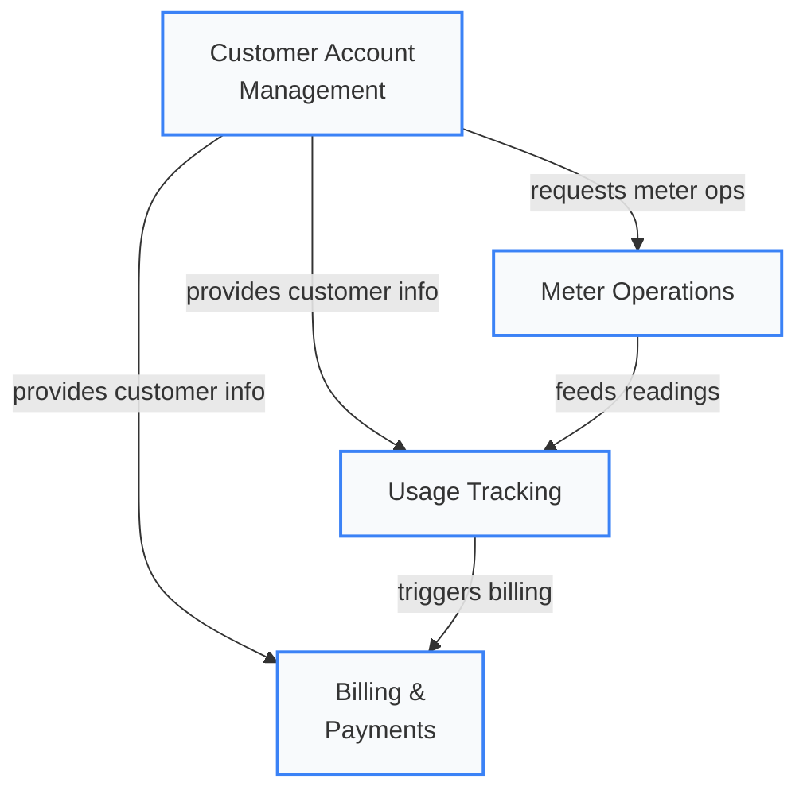
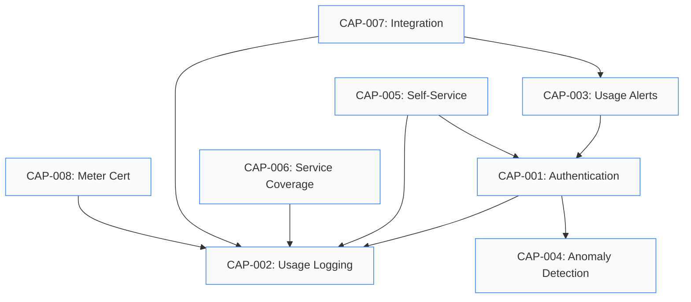
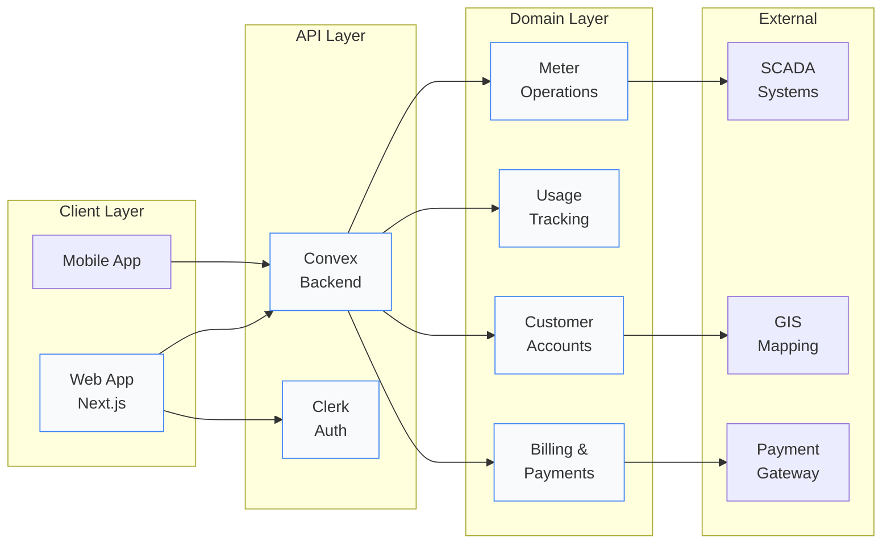

# System Architecture

AquaTrack is a **Municipal Water Tracking & Management System** built on Domain-Driven Design principles with a modern cloud-native stack. This section maps the full system -- from high-level subsystems down to individual capabilities and technology choices.

---

## At a Glance

  

    
4

    
Bounded Contexts

    
Core subsystems

  

  

    
8

    
Capabilities

    
Cross-cutting services

  

  

    
24

    
ADRs

    
Architecture decisions

  

  

    
6

    
Stack Layers

    
Frontend to infra

  

---

## Quick Navigation

  <a href="#subsystems" style={{
    padding: '12px 16px',
    borderRadius: '6px',
    backgroundColor: '#f1f5f9',
    border: '1px solid #cbd5e1',
    textDecoration: 'none',
    color: '#334155',
    fontWeight: '500',
    fontSize: '13px',
    textAlign: 'center'
  }}>Subsystems</a>

  <a href="#capabilities" style={{
    padding: '12px 16px',
    borderRadius: '6px',
    backgroundColor: '#f1f5f9',
    border: '1px solid #cbd5e1',
    textDecoration: 'none',
    color: '#3b82f6',
    fontWeight: '500',
    fontSize: '13px',
    textAlign: 'center'
  }}>Capabilities</a>

  <a href="#technology-stack" style={{
    padding: '12px 16px',
    borderRadius: '6px',
    backgroundColor: '#f8fafc',
    border: '1px solid #e2e8f0',
    textDecoration: 'none',
    color: '#475569',
    fontWeight: '500',
    fontSize: '13px',
    textAlign: 'center'
  }}>Tech Stack</a>

  <a href="#architecture-decisions" style={{
    padding: '12px 16px',
    borderRadius: '6px',
    backgroundColor: '#f8fafc',
    border: '1px solid #e2e8f0',
    textDecoration: 'none',
    color: '#0f172a',
    fontWeight: '500',
    fontSize: '13px',
    textAlign: 'center'
  }}>ADRs</a>

  <a href="#system-integration" style={{
    padding: '12px 16px',
    borderRadius: '6px',
    backgroundColor: '#f8fafc',
    border: '1px solid #e2e8f0',
    textDecoration: 'none',
    color: '#0f172a',
    fontWeight: '500',
    fontSize: '13px',
    textAlign: 'center'
  }}>Integration</a>

  <a href="#nfrs" style={{
    padding: '12px 16px',
    borderRadius: '6px',
    backgroundColor: '#f8fafc',
    border: '1px solid #e2e8f0',
    textDecoration: 'none',
    color: '#475569',
    fontWeight: '500',
    fontSize: '13px',
    textAlign: 'center'
  }}>NFRs</a>

---

## Subsystems {#subsystems}

AquaTrack is decomposed into four bounded contexts, each owning its own domain model and data.

  

    
Customer Account Management

    

      Manages the full lifecycle of customer water service accounts -- enrollment, profiles, account standing, and service deposits.
    

    
<strong>Key Aggregates</strong>

    

      
&#x2022; CustomerAccount

      
&#x2022; AccountStatus

      
&#x2022; ServiceDeposit

    

    

      <strong>Events:</strong> AccountCreated, StatusChanged, DepositReleased
    

    

      Team: Customer Services
      PER-001, PER-003, PER-004
      ~35 BDD scenarios
    

  

  

    
Usage Tracking

    

      Collects and validates meter readings, calculates consumption, and provides real-time usage data to customers and operators.
    

    
<strong>Key Aggregates</strong>

    

      
&#x2022; MeterReading

      
&#x2022; UsagePeriod

      
&#x2022; ConsumptionRecord

    

    

      <strong>Events:</strong> ReadingRecorded, UsageCalculated, AnomalyDetected
    

    

      Team: Operations
      PER-002, PER-003, PER-004
      ~45 BDD scenarios
    

  

  

    
Billing & Payments

    

      Generates invoices from usage data, manages billing cycles, processes payments, and handles settlement and disputes.
    

    
<strong>Key Aggregates</strong>

    

      
&#x2022; Invoice

      
&#x2022; BillingCycle

      
&#x2022; Payment

    

    

      <strong>Events:</strong> InvoiceGenerated, PaymentReceived, BillFinalized
    

    

      Team: Finance
      PER-001, PER-003, PER-004
      ~40 BDD scenarios
    

  

  

    
Meter Operations

    

      Manages the physical meter lifecycle -- installation, calibration, maintenance scheduling, service requests, and hardware integration.
    

    
<strong>Key Aggregates</strong>

    

      
&#x2022; Meter

      
&#x2022; ServiceRequest

      
&#x2022; MaintenanceSchedule

    

    

      <strong>Events:</strong> MeterRegistered, MaintenanceScheduled, ServiceCompleted
    

    

      Team: Field Services
      PER-002, PER-005
      ~40 BDD scenarios
    

  

### Context Relationships

---

## Capabilities {#capabilities}

Capabilities are **cross-cutting system services** that span multiple subsystems. Each capability is independently testable and has defined NFR requirements.

  

    

      CAP-001
      Security
    

    
Portal Authentication

    
Access token generation, validation, and session management across all contexts.

  

  

    

      CAP-002
      Observability
    

    
Usage Logging

    
Records all state-changing operations for audit trails, compliance, and debugging.

  

  

    

      CAP-003
      Communication
    

    
Usage Alerts

    
Push notifications and real-time updates to customers and operators.

  

  

    

      CAP-004
      Security
    

    
Anomaly Detection

    
Identifies unusual usage patterns, potential leaks, and meter tampering.

  

  

    

      CAP-005
      Experience
    

    
Self-Service Portal

    
Customer-facing dashboards for account management, usage monitoring, and billing.

  

  

    

      CAP-006
      Business
    

    
Service Coverage

    
Geographic service area mapping, coverage validation, and zone management.

  

  

    

      CAP-007
      Communication
    

    
System Integration

    
External system connectors for SCADA, GIS, and third-party utility platforms.

  

  

    

      CAP-008
      Security
    

    
Meter Certification

    
Hardware verification, calibration tracking, and compliance certification for meters.

  

### Capability Dependencies

---

## Technology Stack {#technology-stack}

  

    

      
Frontend

      
Client-side application layer

    

    

      <strong>Next.js</strong> &middot; React &middot; TypeScript &middot; Tailwind CSS &middot; shadcn/ui
    

  

  

    

      
Backend

      
Server-side logic and API

    

    

      <strong>Convex</strong> &middot; Server Functions &middot; Real-time Subscriptions
    

  

  

    

      
Database

      
Persistent storage layer

    

    

      <strong>Convex DB</strong> &middot; Document Model &middot; ACID Transactions
    

  

  

    

      
Authentication

      
Identity and access control

    

    

      <strong>Clerk</strong> &middot; API Key Auth &middot; Session Management
    

  

  

    

      
Deployment

      
Hosting and CI/CD

    

    

      <strong>Vercel</strong> &middot; Edge Functions &middot; Preview Deployments
    

  

  

    

      
Runtime & Tooling

      
Developer experience

    

    

      <strong>Bun</strong> &middot; TypeScript &middot; ESLint &middot; Prettier
    

  

---

## Architecture Decisions {#architecture-decisions}

Key ADRs that define the system's shape:

| ADR | Decision | Category | Status |
|:----|:---------|:---------|:-------|
| ADR-001 | Domain-Driven Design | Architecture | Accepted |
| ADR-002 | Modular Monolith | Architecture | Accepted |
| ADR-003 | Convex for Backend & Database | Infrastructure | Accepted |
| ADR-004 | Next.js for Frontend | Infrastructure | Accepted |
| ADR-005 | Event-Driven Communication | Architecture | Accepted |
| ADR-006 | Aggregates as Consistency Boundaries | Architecture | Accepted |
| ADR-009 | API Key Authentication | Security | Accepted |
| ADR-015 | Eventual Consistency Between Contexts | Architecture | Accepted |
| ADR-016 | Convex Functions as Application Services | Architecture | Accepted |
| ADR-017 | Bun as Runtime | Infrastructure | Accepted |
| ADR-018 | Vercel for Deployment | Infrastructure | Accepted |
| ADR-019 | Tailwind CSS for Styling | Infrastructure | Accepted |
| ADR-020 | shadcn/ui for Components | Infrastructure | Accepted |
| ADR-021 | Clerk for Authentication | Security | Accepted |

---

## System Integration {#system-integration}

---

## Non-Functional Requirements {#nfrs}

  

    
Performance

    

      
&#x2022; API response &lt; 200ms (p95)

      
&#x2022; Dashboard load &lt; 2s

      
&#x2022; Real-time updates &lt; 500ms

    

  

  

    
Security

    

      
&#x2022; API key auth on all endpoints

      
&#x2022; SHA-256 key hashing

      
&#x2022; Audit logging on mutations

    

  

  

    
Reliability

    

      
&#x2022; 99.9% uptime target

      
&#x2022; Automatic failover

      
&#x2022; Data backup &lt; 1hr RPO

    

  

  

    
Accessibility

    

      
&#x2022; WCAG 2.1 AA compliance

      
&#x2022; Screen reader support

      
&#x2022; Keyboard navigation

    

  

---

## User Story Mapping {#user-story-mapping}

How user stories flow through the system architecture:

| User Story | Primary Subsystem | Capabilities Used | Personas | Team |
|:-----------|:-----------------|:------------------|:---------|:-----|
| [US-001](/docs/user-stories/US-001-customer-enrollment) Customer Enrollment | Customer Account Mgmt | CAP-001, CAP-002, CAP-006 | PER-003, PER-004 | Customer Services |
| [US-002](/docs/user-stories/US-002-service-activation) Service Activation | Customer Account Mgmt | CAP-001, CAP-002, CAP-006 | PER-001, PER-003 | Customer Services |
| [US-004](/docs/user-stories/US-004-meter-reading) Meter Reading | Usage Tracking | CAP-002, CAP-007, CAP-008 | PER-002, PER-005 | Operations |
| [US-005](/docs/user-stories/US-005-view-usage-history) View Usage History | Usage Tracking | CAP-001, CAP-002, CAP-005 | PER-003, PER-004 | Operations |
| [US-006](/docs/user-stories/US-006-service-area-lookup) Service Area Lookup | Customer Account Mgmt | CAP-006 | PER-003, PER-004 | Customer Services |
| [US-007](/docs/user-stories/US-007-submit-service-request) Service Request | Meter Operations | CAP-001, CAP-002, CAP-005 | PER-003, PER-004 | Field Services |
| [US-008](/docs/user-stories/US-008-technician-dispatch) Technician Dispatch | Meter Operations | CAP-002, CAP-007 | PER-002, PER-005 | Field Services |
| [US-009](/docs/user-stories/US-009-customer-communication) Customer Comms | Customer Account Mgmt | CAP-001, CAP-003, CAP-005 | PER-001, PER-003 | Customer Services |
| [US-010](/docs/user-stories/US-010-smart-meter-integration) Smart Meter | Meter Operations | CAP-007, CAP-008 | PER-005, PER-002 | Field Services |

---

## Compliance Coverage {#compliance-coverage}

### ADR-to-Subsystem Matrix

| ADR | Decision | Customer Acct | Usage Tracking | Billing | Meter Ops |
|:----|:---------|:---:|:---:|:---:|:---:|
| ADR-001 | Domain-Driven Design | Applies | Applies | Applies | Applies |
| ADR-002 | Modular Monolith | Applies | Applies | Applies | Applies |
| ADR-003 | Convex Backend | Applies | Applies | Applies | Applies |
| ADR-005 | Event-Driven Comms | Publishes | Publishes | Subscribes | Publishes |
| ADR-006 | Aggregate Boundaries | 3 aggregates | 3 aggregates | 3 aggregates | 3 aggregates |
| ADR-009 | API Key Auth | Auth gate | Auth gate | Auth gate | Auth gate |
| ADR-015 | Eventual Consistency | -- | Consumer | Consumer | Producer |
| ADR-016 | Convex Functions | App services | App services | App services | App services |
| ADR-021 | Clerk Auth | User sessions | -- | -- | -- |

### NFR-to-Capability Matrix

| NFR | Target | Capabilities Constrained |
|:----|:-------|:------------------------|
| NFR-PERF-001 | API response < 200ms (p95) | CAP-001, CAP-003 |
| NFR-PERF-002 | Dashboard load < 2s | CAP-002, CAP-005, CAP-006 |
| NFR-SEC-001 | Token validation on every request | CAP-001 |
| NFR-SEC-003 | Immutable audit log | CAP-002 |
| NFR-REL-001 | 99.9% alert delivery | CAP-003 |
| NFR-REL-003 | Retry with exponential backoff | CAP-007 |
| NFR-A11Y-001 | WCAG 2.1 AA | CAP-005 |

### BDD Spec Coverage

| Subsystem | Est. Scenarios | Feature Files | Owning Team | Pass Rate |
|:----------|:---:|:---:|:------------|:---:|
| Customer Account Mgmt | ~35 | 4 | Customer Services | ~85% |
| Usage Tracking | ~45 | 5 | Operations | ~90% |
| Billing & Payments | ~40 | 4 | Finance | ~75% |
| Meter Operations | ~40 | 5 | Field Services | ~80% |
| **Total** | **~160** | **18** | | **~83%** |

---

## Next Steps

- [Domain Overview](./ddd/domain-overview) -- Full DDD domain model
- [Bounded Contexts](./ddd/bounded-contexts) -- Detailed context boundaries
- [Architecture Decisions](./adr/README) -- Complete ADR catalog
- [System Specs](./bdd/feature-index) -- BDD test coverage

---

**Related**: [Users & Personas](./users-overview) | [Teams & Ownership](./teams-overview) | [Capabilities](./capabilities/) | [Domain Events](./ddd/domain-events) | [BDD Feature Index](./bdd/feature-index) | [ADR Catalog](./adr/README) | [NFR Index](./nfr/)
