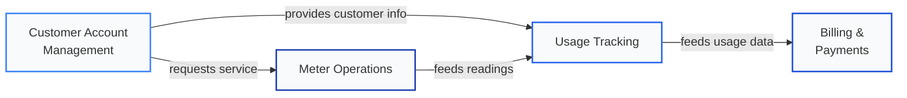

  AquaTrack's domain is divided into <strong style={{ color: '#0f172a' }}>4 bounded contexts</strong>, each owned end-to-end by a dedicated product team.

### At a Glance {#at-a-glance}

  
4

  
Bounded Contexts

  
2

  
Core Domains

  
2

  
Supporting Subdomains

  
8

  
Capabilities

### Context Summary {#context-summary}

  

    <h4 style={{ margin: '0', fontSize: '16px', color: '#0f172a' }}>Customer Account Management</h4>
    Supporting Subdomain
  

  

    <strong style={{ color: '#64748b' }}>Owner:</strong>{' '}
    <a href="/docs/teams/customer-services">Customer Services Team</a>
  

  

    <strong style={{ color: '#64748b' }}>Key Aggregates:</strong>{' '}
    CustomerAccount{' '}
    AccountStatus{' '}
    ServiceDeposit
  

  

    <strong style={{ color: '#64748b' }}>Capabilities:</strong>{' '}
    CAP-001{' '}
    CAP-005
  

  <a href="/docs/systems/customer-account-mgmt" style={{ fontSize: '13px', fontWeight: '600', color: '#3b82f6', textDecoration: 'none' }}>View Details &#8594;</a>

  

    <h4 style={{ margin: '0', fontSize: '16px', color: '#0f172a' }}>Usage Tracking</h4>
    Core Domain
  

  

    <strong style={{ color: '#64748b' }}>Owner:</strong>{' '}
    <a href="/docs/teams/operations">Operations Team</a>
  

  

    <strong style={{ color: '#64748b' }}>Key Aggregates:</strong>{' '}
    MeterReading{' '}
    UsagePeriod{' '}
    ConsumptionRecord
  

  

    <strong style={{ color: '#64748b' }}>Capabilities:</strong>{' '}
    CAP-002{' '}
    CAP-003{' '}
    CAP-004
  

  <a href="/docs/systems/usage-tracking" style={{ fontSize: '13px', fontWeight: '600', color: '#3b82f6', textDecoration: 'none' }}>View Details &#8594;</a>

  

    <h4 style={{ margin: '0', fontSize: '16px', color: '#0f172a' }}>Billing & Payments</h4>
    Core Domain
  

  

    <strong style={{ color: '#64748b' }}>Owner:</strong>{' '}
    <a href="/docs/teams/finance">Finance Team</a>
  

  

    <strong style={{ color: '#64748b' }}>Key Aggregates:</strong>{' '}
    Invoice{' '}
    BillingCycle{' '}
    Payment
  

  

    <strong style={{ color: '#64748b' }}>Capabilities:</strong>{' '}
    CAP-006
  

  <a href="/docs/systems/billing-payments" style={{ fontSize: '13px', fontWeight: '600', color: '#3b82f6', textDecoration: 'none' }}>View Details &#8594;</a>

  

    <h4 style={{ margin: '0', fontSize: '16px', color: '#0f172a' }}>Meter Operations</h4>
    Supporting Subdomain
  

  

    <strong style={{ color: '#64748b' }}>Owner:</strong>{' '}
    <a href="/docs/teams/field-services">Field Services Team</a>
  

  

    <strong style={{ color: '#64748b' }}>Key Aggregates:</strong>{' '}
    Meter{' '}
    ServiceRequest{' '}
    MaintenanceSchedule
  

  

    <strong style={{ color: '#64748b' }}>Capabilities:</strong>{' '}
    CAP-007{' '}
    CAP-008
  

  <a href="/docs/systems/meter-operations" style={{ fontSize: '13px', fontWeight: '600', color: '#3b82f6', textDecoration: 'none' }}>View Details &#8594;</a>

### Context Relationships {#context-relationships}

### Integration Patterns {#integration-patterns}

  
Customer-Supplier

  

    Customer Account Management acts as the upstream supplier, providing customer identity and account data to Usage Tracking and Billing. The downstream contexts consume the data model as published.
  

  
Shared Kernel

  

    Usage Tracking and Billing & Payments share a small kernel of usage-related value objects (consumption units, reading types). Changes require agreement from both teams.
  

  
Conformist

  

    Billing & Payments conforms to the account model defined by Customer Account Management. It adopts the upstream model without translation, reducing integration complexity.
  

  
Partnership

  

    Meter Operations and Usage Tracking operate as partners, jointly coordinating reading schedules and data collection. Neither dominates; changes are negotiated between the Operations and Field Services teams.
  

### Cross-References {#cross-references}

  <a href="/docs/system-overview" style={{ background: '#f1f5f9', border: '1px solid #cbd5e1', borderRadius: '6px', padding: '6px 14px', fontSize: '13px', color: '#0f172a', textDecoration: 'none', fontWeight: '500' }}>System Architecture</a>
  <a href="/docs/teams-overview" style={{ background: '#f1f5f9', border: '1px solid #cbd5e1', borderRadius: '6px', padding: '6px 14px', fontSize: '13px', color: '#0f172a', textDecoration: 'none', fontWeight: '500' }}>Teams</a>
  <a href="/docs/ddd/domain-overview" style={{ background: '#f1f5f9', border: '1px solid #cbd5e1', borderRadius: '6px', padding: '6px 14px', fontSize: '13px', color: '#0f172a', textDecoration: 'none', fontWeight: '500' }}>Domain Overview</a>

