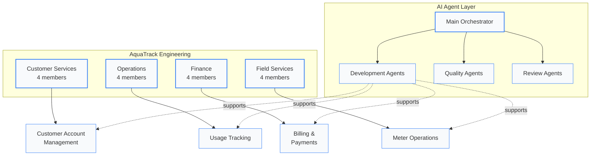
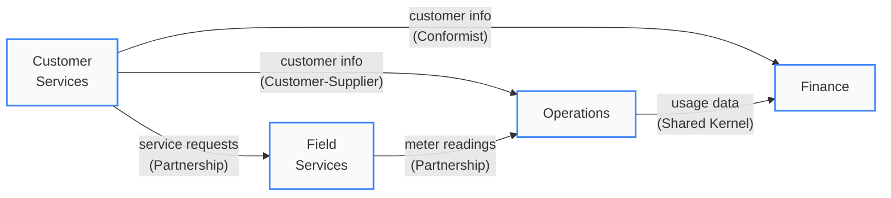

# Teams & Ownership

AquaTrack is organized around **four product teams**, each owning a bounded context end-to-end -- from domain model through deployment. Teams are cross-functional, self-organizing, and aligned to business outcomes rather than technology layers.

---

## At a Glance

  

    
4

    
Product Teams

    
Context-aligned squads

  

  

    
16

    
Team Members

    
Across all squads

  

  

    
8

    
Capabilities

    
Owned across teams

  

  

    
8

    
AI Agents

    
Automated workforce

  

---

## Quick Navigation

  <a href="#customer-services" style={{
    padding: '12px 16px',
    borderRadius: '6px',
    backgroundColor: '#f1f5f9',
    border: '1px solid #cbd5e1',
    textDecoration: 'none',
    color: '#334155',
    fontWeight: '500',
    fontSize: '13px',
    textAlign: 'center'
  }}>Customer Services</a>

  <a href="#operations" style={{
    padding: '12px 16px',
    borderRadius: '6px',
    backgroundColor: '#f1f5f9',
    border: '1px solid #cbd5e1',
    textDecoration: 'none',
    color: '#3b82f6',
    fontWeight: '500',
    fontSize: '13px',
    textAlign: 'center'
  }}>Operations</a>

  <a href="#finance" style={{
    padding: '12px 16px',
    borderRadius: '6px',
    backgroundColor: '#f8fafc',
    border: '1px solid #e2e8f0',
    textDecoration: 'none',
    color: '#475569',
    fontWeight: '500',
    fontSize: '13px',
    textAlign: 'center'
  }}>Finance</a>

  <a href="#field-services" style={{
    padding: '12px 16px',
    borderRadius: '6px',
    backgroundColor: '#f8fafc',
    border: '1px solid #e2e8f0',
    textDecoration: 'none',
    color: '#0f172a',
    fontWeight: '500',
    fontSize: '13px',
    textAlign: 'center'
  }}>Field Services</a>

  <a href="#practice-areas" style={{
    padding: '12px 16px',
    borderRadius: '6px',
    backgroundColor: '#f1f5f9',
    border: '1px solid #cbd5e1',
    textDecoration: 'none',
    color: '#3b82f6',
    fontWeight: '500',
    fontSize: '13px',
    textAlign: 'center'
  }}>Practice Areas</a>

  <a href="#ai-agents" style={{
    padding: '12px 16px',
    borderRadius: '6px',
    backgroundColor: '#f8fafc',
    border: '1px solid #e2e8f0',
    textDecoration: 'none',
    color: '#0f172a',
    fontWeight: '500',
    fontSize: '13px',
    textAlign: 'center'
  }}>AI Agents</a>

  <a href="#ownership-matrix" style={{
    padding: '12px 16px',
    borderRadius: '6px',
    backgroundColor: '#f8fafc',
    border: '1px solid #e2e8f0',
    textDecoration: 'none',
    color: '#475569',
    fontWeight: '500',
    fontSize: '13px',
    textAlign: 'center'
  }}>Ownership Matrix</a>

---

## Team Structure

---

## Customer Services {#customer-services}

  

    

      
Customer Services Team

      
Owns the <strong>Customer Account Management</strong> bounded context

    

    Supporting Subdomain
  

  
Responsible for the complete customer lifecycle -- enrollment, profile management, account standing, service deposits, and customer communications.

  

    

      
      
      
      
    

    4 members
    |
    2 capabilities
    |
    ~35 BDD scenarios
  

  <a href="/docs/teams/customer-services" style={{ fontSize: '13px', fontWeight: '600', color: '#3b82f6', textDecoration: 'none' }}>View team detail →</a>

---

## Operations {#operations}

  

    

      
Operations Team

      
Owns the <strong>Usage Tracking</strong> bounded context

    

    Core Domain
  

  
Responsible for the heartbeat of the system -- collecting meter readings, calculating consumption, validating data quality, detecting anomalies, and providing real-time usage data.

  

    

      
      
      
      
    

    4 members
    |
    3 capabilities
    |
    ~45 BDD scenarios
  

  <a href="/docs/teams/operations" style={{ fontSize: '13px', fontWeight: '600', color: '#3b82f6', textDecoration: 'none' }}>View team detail →</a>

---

## Finance {#finance}

  

    

      
Finance Team

      
Owns the <strong>Billing & Payments</strong> bounded context

    

    Core Domain
  

  
Owns the revenue engine -- generating invoices from usage data, managing billing cycles, processing payments, handling disputes, and ensuring financial compliance.

  

    

      
      
      
      
    

    4 members
    |
    1 capability
    |
    ~40 BDD scenarios
  

  <a href="/docs/teams/finance" style={{ fontSize: '13px', fontWeight: '600', color: '#3b82f6', textDecoration: 'none' }}>View team detail →</a>

---

## Field Services {#field-services}

  

    

      
Field Services Team

      
Owns the <strong>Meter Operations</strong> bounded context

    

    Supporting Subdomain
  

  
Manages the physical infrastructure -- meter installation, calibration, maintenance scheduling, service requests, technician dispatch, and SCADA/hardware integration.

  

    

      
      
      
      
    

    4 members
    |
    2 capabilities
    |
    ~40 BDD scenarios
  

  <a href="/docs/teams/field-services" style={{ fontSize: '13px', fontWeight: '600', color: '#3b82f6', textDecoration: 'none' }}>View team detail →</a>

---

## Practice Areas {#practice-areas}

  
Practice Areas & Competency Dashboard

  
6 practice areas, 18 competencies, team adoption tracking, and individual proficiency assessments following the Katalyst model.

  

    DDD
    BDD & Test
    Cloud Infra
    API Design
    Security
    Data Eng
  

  <a href="/docs/practice-areas/" style={{ fontSize: '13px', fontWeight: '600', color: '#3b82f6', textDecoration: 'none' }}>View practice areas dashboard →</a>

---

## AI Agents {#ai-agents}

The engineering teams are augmented by a fleet of **8 AI agents** organized in three layers. These agents operate across all bounded contexts, providing automated development, quality assurance, and architectural review.

  

    
Main Orchestrator

    
Top-level coordinator -- delegates to specialist agents, synthesizes results, makes final decisions

    
Coordination Layer

  

  

    
Development Layer

    

      &#x2022; <strong>Site Keeper</strong> -- Server management, builds, infrastructure 
      &#x2022; <strong>Code Writer</strong> -- Feature implementation, refactoring
    

  

  

    
Quality Layer

    

      &#x2022; <strong>CI Runner</strong> -- Lint, format, type-check, test 
      &#x2022; <strong>BDD Runner</strong> -- Execute behavioral tests 
      &#x2022; <strong>BDD Writer</strong> -- Author Gherkin scenarios
    

  

  

    
Review Layer

    

      &#x2022; <strong>Architecture Inspector</strong> -- Hexagonal audit 
      &#x2022; <strong>DDD Aligner</strong> -- Domain compliance 
      &#x2022; <strong>UX/UI Inspector</strong> -- Experience review
    

  

  <a href="/docs/agents/overview">Agent Architecture Overview</a> &middot; <a href="/docs/agents/coordination">Agent Coordination Protocol</a> &middot; <a href="/docs/agents/bdd-loop">BDD Loop Workflow</a>

---

## Ownership Matrix {#ownership-matrix}

A complete map of which team owns which bounded context, capabilities, aggregates, and personas.

### Context Ownership

| Team | Bounded Context | Classification | Capabilities | Aggregates |
|:-----|:----------------|:---------------|:-------------|:-----------|
| **Customer Services** | Customer Account Management | Supporting | CAP-001, CAP-005 | CustomerAccount, AccountStatus, ServiceDeposit |
| **Operations** | Usage Tracking | Core | CAP-002, CAP-003, CAP-004 | MeterReading, UsagePeriod, ConsumptionRecord |
| **Finance** | Billing & Payments | Core | CAP-006 | Invoice, BillingCycle, Payment |
| **Field Services** | Meter Operations | Supporting | CAP-007, CAP-008 | Meter, ServiceRequest, MaintenanceSchedule |

### Capability Ownership

| Capability | Owner | Category | Consumers |
|:-----------|:------|:---------|:----------|
| CAP-001 Portal Authentication | Customer Services | Security | All teams |
| CAP-002 Usage Logging | Operations | Observability | All teams |
| CAP-003 Usage Alerts | Operations | Communication | Customer Services, Finance |
| CAP-004 Anomaly Detection | Operations | Security | Customer Services, Field Services |
| CAP-005 Self-Service Portal | Customer Services | Experience | Operations, Finance |
| CAP-006 Service Coverage | Finance | Business | Customer Services, Field Services |
| CAP-007 System Integration | Field Services | Communication | Operations |
| CAP-008 Meter Certification | Field Services | Security | Operations |

### Persona Coverage

| Persona | Primary Team | Secondary Teams |
|:--------|:-------------|:----------------|
| PER-001 Utility Administrator | Customer Services | Finance |
| PER-002 Treatment Operator | Operations | Field Services |
| PER-003 Residential Customer | Customer Services | Operations, Finance |
| PER-004 Commercial Customer | Customer Services | Operations, Finance |
| PER-005 Meter Technician | Field Services | Operations |

---

## Cross-Team Dependencies

### Integration Patterns

  

    
Customer Services &#8594; Operations

    
Customer-Supplier pattern. Customer Services publishes account data; Operations consumes it for usage attribution.

  

  

    
Customer Services &#8594; Finance

    
Conformist pattern. Finance conforms to Customer Services' account model for billing association.

  

  

    
Operations &#8596; Finance

    
Shared Kernel. Tightly coupled for the billing flow -- usage data drives invoice generation.

  

  

    
Customer Services &#8596; Field Services

    
Partnership pattern. Joint ownership of service request flow -- customers request, technicians execute.

  

  

    
Field Services &#8596; Operations

    
Partnership pattern. Meter readings from Field Services feed into Operations' usage tracking pipeline.

  

---

## Coordination Ceremonies

| Ceremony | Frequency | Participants | Purpose |
|:---------|:----------|:-------------|:--------|
| Cross-team standup | Weekly | All team leads | Dependency sync, blockers, shared schema changes |
| Event schema review | Bi-weekly | All engineers | Review and version domain event contracts |
| Architecture review | Monthly | All teams + AI agents | ADR proposals, capability assessments, NFR tracking |
| Sprint demo | Bi-weekly | All teams + stakeholders | Feature demos, feedback, priority alignment |

---

## Compliance {#compliance}

  
Compliance Dashboard

  
BDD coverage, ADR responsibility, and NFR ownership are tracked per team. Visit each team's detail page for their compliance status.

  

    <a href="/docs/teams/customer-services#compliance" style={{ fontSize: '12px', fontWeight: '600', color: '#3b82f6', textDecoration: 'none' }}>Customer Services →</a>
    <a href="/docs/teams/operations#compliance" style={{ fontSize: '12px', fontWeight: '600', color: '#3b82f6', textDecoration: 'none' }}>Operations →</a>
    <a href="/docs/teams/finance#compliance" style={{ fontSize: '12px', fontWeight: '600', color: '#3b82f6', textDecoration: 'none' }}>Finance →</a>
    <a href="/docs/teams/field-services#compliance" style={{ fontSize: '12px', fontWeight: '600', color: '#3b82f6', textDecoration: 'none' }}>Field Services →</a>
  

---

## Next Steps

- [System Architecture](./system-overview) -- Full system overview with subsystems and capabilities
- [Users & Personas](./users-overview) -- Persona details and user story catalog
- [Domain Model](./ddd/domain-overview) -- DDD bounded contexts and aggregates
- [Agent Coordination](./agents/coordination) -- How AI agents collaborate across teams
- [Practice Areas](/docs/practice-areas/) -- Competency dashboard and team adoption tracking
- [Tools & Technology](/docs/tools/) -- Technology stack and tooling decisions
- [Bounded Contexts](/docs/systems/) -- System architecture and bounded context details

---

**Related**: [Context Map](./ddd/context-map) | [Bounded Contexts](./ddd/bounded-contexts) | [Capabilities](./capabilities/)
