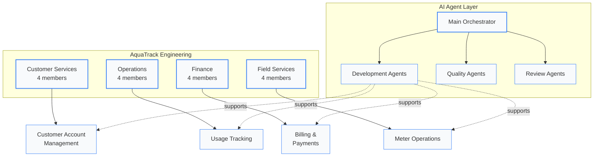
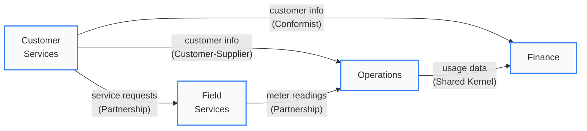

# Teams & Ownership

AquaTrack is organized around **four product teams**, each owning a bounded context end-to-end -- from domain model through deployment. Teams are cross-functional, self-organizing, and aligned to business outcomes rather than technology layers.

---

## At a Glance

  

    
4

    
Product Teams

    
Context-aligned squads

  

  

    
16

    
Team Members

    
Across all squads

  

  

    
8

    
Capabilities

    
Owned across teams

  

  

    
8

    
AI Agents

    
Automated workforce

  

---

## Quick Navigation

  <a href="#customer-services" style={{
    padding: '12px 16px',
    borderRadius: '6px',
    backgroundColor: '#f1f5f9',
    border: '1px solid #cbd5e1',
    textDecoration: 'none',
    color: '#334155',
    fontWeight: '500',
    fontSize: '13px',
    textAlign: 'center'
  }}>Customer Services</a>

  <a href="#operations" style={{
    padding: '12px 16px',
    borderRadius: '6px',
    backgroundColor: '#f1f5f9',
    border: '1px solid #cbd5e1',
    textDecoration: 'none',
    color: '#3b82f6',
    fontWeight: '500',
    fontSize: '13px',
    textAlign: 'center'
  }}>Operations</a>

  <a href="#finance" style={{
    padding: '12px 16px',
    borderRadius: '6px',
    backgroundColor: '#f8fafc',
    border: '1px solid #e2e8f0',
    textDecoration: 'none',
    color: '#475569',
    fontWeight: '500',
    fontSize: '13px',
    textAlign: 'center'
  }}>Finance</a>

  <a href="#field-services" style={{
    padding: '12px 16px',
    borderRadius: '6px',
    backgroundColor: '#f8fafc',
    border: '1px solid #e2e8f0',
    textDecoration: 'none',
    color: '#0f172a',
    fontWeight: '500',
    fontSize: '13px',
    textAlign: 'center'
  }}>Field Services</a>

  <a href="#ai-agents" style={{
    padding: '12px 16px',
    borderRadius: '6px',
    backgroundColor: '#f8fafc',
    border: '1px solid #e2e8f0',
    textDecoration: 'none',
    color: '#0f172a',
    fontWeight: '500',
    fontSize: '13px',
    textAlign: 'center'
  }}>AI Agents</a>

  <a href="#ownership-matrix" style={{
    padding: '12px 16px',
    borderRadius: '6px',
    backgroundColor: '#f8fafc',
    border: '1px solid #e2e8f0',
    textDecoration: 'none',
    color: '#475569',
    fontWeight: '500',
    fontSize: '13px',
    textAlign: 'center'
  }}>Ownership Matrix</a>

---

## Team Structure

---

## Customer Services {#customer-services}

  

    

      
Customer Services Team

      
Owns the <strong>Customer Account Management</strong> bounded context

    

    
Supporting Subdomain

  

  

    Responsible for the complete customer lifecycle -- enrollment, profile management, account standing, service deposits, and customer communications. This team is the front door for every water service customer.
  

  
Team Members

  

    

      
      

        
Sarah Chen

        
Team Lead / Senior Engineer

        
8 years in customer platforms. Previously led account systems at Pacific Gas. Drives the enrollment and account management domain.

      

    

    

      
      

        
Marcus Rivera

        
Full-Stack Engineer

        
Convex + Next.js specialist. Owns the self-service portal frontend and real-time account status sync.

      

    

    

      
      

        
Aisha Patel

        
Frontend Engineer

        
Accessibility advocate. Built the customer dashboard and notification center. WCAG 2.1 AA compliance lead.

      

    

    

      
      

        
James Kowalski

        
QA / BDD Specialist

        
Authors Gherkin scenarios for enrollment, activation, and account management. Maintains the customer services test suite.

      

    

  

  

    

      
Key Aggregates

      

        &#x2022; CustomerAccount 
        &#x2022; AccountStatus 
        &#x2022; ServiceDeposit
      

    

    

      
Domain Events Owned

      

        &#x2022; AccountCreated 
        &#x2022; StatusChanged 
        &#x2022; DepositReleased
      

    

  

  

    
Capabilities Owned

    

      <a href="/docs/capabilities/CAP-001" style={{ fontSize: '11px', padding: '3px 10px', borderRadius: '9999px', backgroundColor: '#f1f5f9', color: '#3b82f6', fontWeight: '600', textDecoration: 'none' }}>CAP-001 Portal Auth</a>
      <a href="/docs/capabilities/CAP-005" style={{ fontSize: '11px', padding: '3px 10px', borderRadius: '9999px', backgroundColor: '#f1f5f9', color: '#475569', fontWeight: '600', textDecoration: 'none' }}>CAP-005 Self-Service Portal</a>
    

  

  

    
Serves Personas

    

      <a href="/docs/personas/PER-001-utility-administrator" style={{ fontSize: '11px', padding: '3px 10px', borderRadius: '9999px', backgroundColor: '#f1f5f9', color: '#334155', fontWeight: '500', textDecoration: 'none' }}>PER-001 Utility Admin</a>
      <a href="/docs/personas/PER-003-residential-customer" style={{ fontSize: '11px', padding: '3px 10px', borderRadius: '9999px', backgroundColor: '#f1f5f9', color: '#334155', fontWeight: '500', textDecoration: 'none' }}>PER-003 Residential</a>
      <a href="/docs/personas/PER-004-commercial-customer" style={{ fontSize: '11px', padding: '3px 10px', borderRadius: '9999px', backgroundColor: '#f1f5f9', color: '#334155', fontWeight: '500', textDecoration: 'none' }}>PER-004 Commercial</a>
    

  

---

## Operations {#operations}

  

    

      
Operations Team

      
Owns the <strong>Usage Tracking</strong> bounded context

    

    
Core Domain

  

  

    Responsible for the heartbeat of the system -- collecting meter readings, calculating consumption, validating data quality, detecting anomalies, and providing real-time usage data to customers and operators. This is the most data-intensive context.
  

  
Team Members

  

    

      
      

        
David Okonkwo

        
Team Lead / Backend Engineer

        
12 years in data systems. Ex-AWS. Designed the meter reading pipeline and real-time consumption engine.

      

    

    

      
      

        
Emily Zhang

        
Data Engineer

        
Owns the usage data pipeline, ETL workflows, and data quality validation. Background in IoT telemetry at Siemens.

      

    

    

      
      

        
Raj Gupta

        
Full-Stack Engineer

        
Builds the operator dashboards and usage history views. Handles the Convex real-time subscriptions for live usage feeds.

      

    

    

      
      

        
Lisa Nakamura

        
ML / Analytics Engineer

        
Built the anomaly detection system (CAP-004). Maintains usage alert thresholds and predictive consumption models.

      

    

  

  

    

      
Key Aggregates

      

        &#x2022; MeterReading 
        &#x2022; UsagePeriod 
        &#x2022; ConsumptionRecord
      

    

    

      
Domain Events Owned

      

        &#x2022; ReadingRecorded 
        &#x2022; UsageCalculated 
        &#x2022; AnomalyDetected
      

    

  

  

    
Capabilities Owned

    

      <a href="/docs/capabilities/CAP-002" style={{ fontSize: '11px', padding: '3px 10px', borderRadius: '9999px', backgroundColor: '#f8fafc', color: '#475569', fontWeight: '600', textDecoration: 'none' }}>CAP-002 Usage Logging</a>
      <a href="/docs/capabilities/CAP-003" style={{ fontSize: '11px', padding: '3px 10px', borderRadius: '9999px', backgroundColor: '#f8fafc', color: '#0f172a', fontWeight: '600', textDecoration: 'none' }}>CAP-003 Usage Alerts</a>
      <a href="/docs/capabilities/CAP-004" style={{ fontSize: '11px', padding: '3px 10px', borderRadius: '9999px', backgroundColor: '#f1f5f9', color: '#3b82f6', fontWeight: '600', textDecoration: 'none' }}>CAP-004 Anomaly Detection</a>
    

  

  

    
Serves Personas

    

      <a href="/docs/personas/PER-002-treatment-operator" style={{ fontSize: '11px', padding: '3px 10px', borderRadius: '9999px', backgroundColor: '#f1f5f9', color: '#334155', fontWeight: '500', textDecoration: 'none' }}>PER-002 Treatment Operator</a>
      <a href="/docs/personas/PER-003-residential-customer" style={{ fontSize: '11px', padding: '3px 10px', borderRadius: '9999px', backgroundColor: '#f1f5f9', color: '#334155', fontWeight: '500', textDecoration: 'none' }}>PER-003 Residential</a>
      <a href="/docs/personas/PER-004-commercial-customer" style={{ fontSize: '11px', padding: '3px 10px', borderRadius: '9999px', backgroundColor: '#f1f5f9', color: '#334155', fontWeight: '500', textDecoration: 'none' }}>PER-004 Commercial</a>
    

  

---

## Finance {#finance}

  

    

      
Finance Team

      
Owns the <strong>Billing & Payments</strong> bounded context

    

    
Core Domain

  

  

    Owns the revenue engine -- generating invoices from usage data, managing billing cycles, processing payments, handling disputes, and ensuring financial compliance. Tightly coupled with Usage Tracking via a shared kernel for the billing flow.
  

  
Team Members

  

    

      
      

        
Priya Sharma

        
Team Lead / Backend Engineer

        
10 years in fintech. Previously built payment systems at Stripe. Architects the billing cycle engine and invoice pipeline.

      

    

    

      
      

        
Carlos Mendez

        
Payment Systems Engineer

        
Payment gateway integrations, PCI compliance, and dispute resolution workflows. Previously at Square.

      

    

    

      
      

        
Anna Bergstrom

        
Full-Stack Engineer

        
Builds billing dashboards and payment history views. Owns the shared kernel integration with Operations for usage-to-invoice flow.

      

    

    

      
      

        
Tom Ikeda

        
Compliance / Security Engineer

        
Financial audit trails, regulatory compliance, and SOC 2 readiness. Ensures all billing data meets utility commission standards.

      

    

  

  

    

      
Key Aggregates

      

        &#x2022; Invoice 
        &#x2022; BillingCycle 
        &#x2022; Payment
      

    

    

      
Domain Events Owned

      

        &#x2022; InvoiceGenerated 
        &#x2022; PaymentReceived 
        &#x2022; BillFinalized
      

    

  

  

    
Capabilities Owned

    

      <a href="/docs/capabilities/CAP-006" style={{ fontSize: '11px', padding: '3px 10px', borderRadius: '9999px', backgroundColor: '#f8fafc', color: '#475569', fontWeight: '600', textDecoration: 'none' }}>CAP-006 Service Coverage</a>
    

  

  

    
Serves Personas

    

      <a href="/docs/personas/PER-001-utility-administrator" style={{ fontSize: '11px', padding: '3px 10px', borderRadius: '9999px', backgroundColor: '#f1f5f9', color: '#334155', fontWeight: '500', textDecoration: 'none' }}>PER-001 Utility Admin</a>
      <a href="/docs/personas/PER-003-residential-customer" style={{ fontSize: '11px', padding: '3px 10px', borderRadius: '9999px', backgroundColor: '#f1f5f9', color: '#334155', fontWeight: '500', textDecoration: 'none' }}>PER-003 Residential</a>
      <a href="/docs/personas/PER-004-commercial-customer" style={{ fontSize: '11px', padding: '3px 10px', borderRadius: '9999px', backgroundColor: '#f1f5f9', color: '#334155', fontWeight: '500', textDecoration: 'none' }}>PER-004 Commercial</a>
    

  

---

## Field Services {#field-services}

  

    

      
Field Services Team

      
Owns the <strong>Meter Operations</strong> bounded context

    

    
Supporting Subdomain

  

  

    Manages the physical infrastructure -- meter installation, calibration, maintenance scheduling, service requests, technician dispatch, and SCADA/hardware integration. This is the most independent context and the first candidate for microservice extraction.
  

  
Team Members

  

    

      
      

        
Olga Petrov

        
Team Lead / IoT Engineer

        
Former SCADA systems architect at Honeywell. Designed the smart meter protocol layer and hardware integration framework.

      

    

    

      
      

        
Kevin Brooks

        
Embedded Systems Engineer

        
Firmware and device communication protocols. Maintains meter certification workflows (CAP-008) and calibration scheduling.

      

    

    

      
      

        
Maria Gonzalez

        
Full-Stack Engineer

        
Builds the technician dispatch UI and service request management portal. Owns the mobile-first field worker experience.

      

    

    

      
      

        
Yusuf Ali

        
GIS / Integration Engineer

        
Geospatial data, service area mapping, and third-party system integrations (CAP-007). Built the asset location tracking system.

      

    

  

  

    

      
Key Aggregates

      

        &#x2022; Meter 
        &#x2022; ServiceRequest 
        &#x2022; MaintenanceSchedule
      

    

    

      
Domain Events Owned

      

        &#x2022; MeterRegistered 
        &#x2022; MaintenanceScheduled 
        &#x2022; ServiceCompleted
      

    

  

  

    
Capabilities Owned

    

      <a href="/docs/capabilities/CAP-007" style={{ fontSize: '11px', padding: '3px 10px', borderRadius: '9999px', backgroundColor: '#f8fafc', color: '#0f172a', fontWeight: '600', textDecoration: 'none' }}>CAP-007 System Integration</a>
      <a href="/docs/capabilities/CAP-008" style={{ fontSize: '11px', padding: '3px 10px', borderRadius: '9999px', backgroundColor: '#f1f5f9', color: '#3b82f6', fontWeight: '600', textDecoration: 'none' }}>CAP-008 Meter Certification</a>
    

  

  

    
Serves Personas

    

      <a href="/docs/personas/PER-002-treatment-operator" style={{ fontSize: '11px', padding: '3px 10px', borderRadius: '9999px', backgroundColor: '#f1f5f9', color: '#334155', fontWeight: '500', textDecoration: 'none' }}>PER-002 Treatment Operator</a>
      <a href="/docs/personas/PER-005-meter-technician" style={{ fontSize: '11px', padding: '3px 10px', borderRadius: '9999px', backgroundColor: '#f1f5f9', color: '#334155', fontWeight: '500', textDecoration: 'none' }}>PER-005 Meter Technician</a>
    

  

---

## AI Agents {#ai-agents}

The engineering teams are augmented by a fleet of **8 AI agents** organized in three layers. These agents operate across all bounded contexts, providing automated development, quality assurance, and architectural review.

  

    
Main Orchestrator

    
Top-level coordinator -- delegates to specialist agents, synthesizes results, makes final decisions

    
Coordination Layer

  

  

    
Development Layer

    

      &#x2022; <strong>Site Keeper</strong> -- Server management, builds, infrastructure 
      &#x2022; <strong>Code Writer</strong> -- Feature implementation, refactoring
    

  

  

    
Quality Layer

    

      &#x2022; <strong>CI Runner</strong> -- Lint, format, type-check, test 
      &#x2022; <strong>BDD Runner</strong> -- Execute behavioral tests 
      &#x2022; <strong>BDD Writer</strong> -- Author Gherkin scenarios
    

  

  

    
Review Layer

    

      &#x2022; <strong>Architecture Inspector</strong> -- Hexagonal audit 
      &#x2022; <strong>DDD Aligner</strong> -- Domain compliance 
      &#x2022; <strong>UX/UI Inspector</strong> -- Experience review
    

  

  <a href="/docs/agents/overview">Agent Architecture Overview</a> &middot; <a href="/docs/agents/coordination">Agent Coordination Protocol</a> &middot; <a href="/docs/agents/bdd-loop">BDD Loop Workflow</a>

---

## Ownership Matrix {#ownership-matrix}

A complete map of which team owns which bounded context, capabilities, aggregates, and personas.

### Context Ownership

| Team | Bounded Context | Classification | Capabilities | Aggregates |
|:-----|:----------------|:---------------|:-------------|:-----------|
| **Customer Services** | Customer Account Management | Supporting | CAP-001, CAP-005 | CustomerAccount, AccountStatus, ServiceDeposit |
| **Operations** | Usage Tracking | Core | CAP-002, CAP-003, CAP-004 | MeterReading, UsagePeriod, ConsumptionRecord |
| **Finance** | Billing & Payments | Core | CAP-006 | Invoice, BillingCycle, Payment |
| **Field Services** | Meter Operations | Supporting | CAP-007, CAP-008 | Meter, ServiceRequest, MaintenanceSchedule |

### Capability Ownership

| Capability | Owner | Category | Consumers |
|:-----------|:------|:---------|:----------|
| CAP-001 Portal Authentication | Customer Services | Security | All teams |
| CAP-002 Usage Logging | Operations | Observability | All teams |
| CAP-003 Usage Alerts | Operations | Communication | Customer Services, Finance |
| CAP-004 Anomaly Detection | Operations | Security | Customer Services, Field Services |
| CAP-005 Self-Service Portal | Customer Services | Experience | Operations, Finance |
| CAP-006 Service Coverage | Finance | Business | Customer Services, Field Services |
| CAP-007 System Integration | Field Services | Communication | Operations |
| CAP-008 Meter Certification | Field Services | Security | Operations |

### Persona Coverage

| Persona | Primary Team | Secondary Teams |
|:--------|:-------------|:----------------|
| PER-001 Utility Administrator | Customer Services | Finance |
| PER-002 Treatment Operator | Operations | Field Services |
| PER-003 Residential Customer | Customer Services | Operations, Finance |
| PER-004 Commercial Customer | Customer Services | Operations, Finance |
| PER-005 Meter Technician | Field Services | Operations |

---

## Cross-Team Dependencies

### Integration Patterns

  

    
Customer Services &#8594; Operations

    
Customer-Supplier pattern. Customer Services publishes account data; Operations consumes it for usage attribution.

  

  

    
Customer Services &#8594; Finance

    
Conformist pattern. Finance conforms to Customer Services' account model for billing association.

  

  

    
Operations &#8596; Finance

    
Shared Kernel. Tightly coupled for the billing flow -- usage data drives invoice generation.

  

  

    
Customer Services &#8596; Field Services

    
Partnership pattern. Joint ownership of service request flow -- customers request, technicians execute.

  

  

    
Field Services &#8596; Operations

    
Partnership pattern. Meter readings from Field Services feed into Operations' usage tracking pipeline.

  

---

## Coordination Ceremonies

| Ceremony | Frequency | Participants | Purpose |
|:---------|:----------|:-------------|:--------|
| Cross-team standup | Weekly | All team leads | Dependency sync, blockers, shared schema changes |
| Event schema review | Bi-weekly | All engineers | Review and version domain event contracts |
| Architecture review | Monthly | All teams + AI agents | ADR proposals, capability assessments, NFR tracking |
| Sprint demo | Bi-weekly | All teams + stakeholders | Feature demos, feedback, priority alignment |

---

## User Story Ownership {#user-story-ownership}

Each user story is owned by the team that owns the primary bounded context it operates in.

| Team | User Stories | Count |
|:-----|:------------|:---:|
| **Customer Services** | [US-001](/docs/user-stories/US-001-customer-enrollment) Enrollment, [US-002](/docs/user-stories/US-002-service-activation) Activation, [US-006](/docs/user-stories/US-006-service-area-lookup) Area Lookup, [US-009](/docs/user-stories/US-009-customer-communication) Communications | 4 |
| **Operations** | [US-004](/docs/user-stories/US-004-meter-reading) Meter Reading, [US-005](/docs/user-stories/US-005-view-usage-history) Usage History | 2 |
| **Finance** | *(Billing stories pending -- invoicing, payments, disputes)* | 0 |
| **Field Services** | [US-007](/docs/user-stories/US-007-submit-service-request) Service Request, [US-008](/docs/user-stories/US-008-technician-dispatch) Dispatch, [US-010](/docs/user-stories/US-010-smart-meter-integration) Smart Meter | 3 |

---

## Compliance Dashboard {#compliance-dashboard}

### BDD Coverage by Team

  

    
Customer Services

    
~35

    
BDD scenarios across 4 feature files

    

      

    

    
~85% passing

  

  

    
Operations

    
~45

    
BDD scenarios across 5 feature files

    

      

    

    
~90% passing

  

  

    
Finance

    
~40

    
BDD scenarios across 4 feature files

    

      

    

    
~75% passing

  

  

    
Field Services

    
~40

    
BDD scenarios across 5 feature files

    

      

    

    
~80% passing

  

### ADR Responsibility

Which teams authored or are most affected by each architecture decision:

| ADR | Decision | Primary Team | Affected Teams |
|:----|:---------|:-------------|:--------------|
| ADR-001 | Domain-Driven Design | All teams | All teams |
| ADR-002 | Modular Monolith | All teams | All teams |
| ADR-003 | Convex Backend | Operations | All teams |
| ADR-004 | Next.js Frontend | Customer Services | All teams |
| ADR-005 | Event-Driven Comms | Operations | All teams |
| ADR-006 | Aggregate Boundaries | Operations | Finance, Field Services |
| ADR-009 | API Key Auth | Customer Services | All teams |
| ADR-015 | Eventual Consistency | Operations | Finance |
| ADR-016 | Convex Functions | Operations | All teams |
| ADR-017 | Bun Runtime | Field Services | All teams |
| ADR-018 | Vercel Deployment | Customer Services | All teams |
| ADR-019 | Tailwind CSS | Customer Services | All teams |
| ADR-020 | shadcn/ui | Customer Services | All teams |
| ADR-021 | Clerk Auth | Customer Services | All teams |

### NFR Ownership

Which team is the primary owner for each NFR category:

| NFR Category | Primary Owner | Responsible For | Key NFRs |
|:-------------|:-------------|:---------------|:---------|
| **Performance** | Operations | API response times, real-time feeds, dashboard speed | NFR-PERF-001, NFR-PERF-002, NFR-PERF-003 |
| **Security** | Customer Services | Auth, session management, API keys, audit trails | NFR-SEC-001 through NFR-SEC-007 |
| **Reliability** | Field Services | System integration uptime, data durability, retry logic | NFR-REL-001 through NFR-REL-004 |
| **Accessibility** | Customer Services | WCAG compliance, screen reader support, keyboard nav | NFR-A11Y-001 |

---

## Next Steps

- [System Architecture](./system-overview) -- Full system overview with subsystems and capabilities
- [Users & Personas](./users-overview) -- Persona details and user story catalog
- [Domain Model](./ddd/domain-overview) -- DDD bounded contexts and aggregates
- [Agent Coordination](./agents/coordination) -- How AI agents collaborate across teams

---

**Related**: [Context Map](./ddd/context-map) | [Bounded Contexts](./ddd/bounded-contexts) | [Capabilities](./capabilities/)
