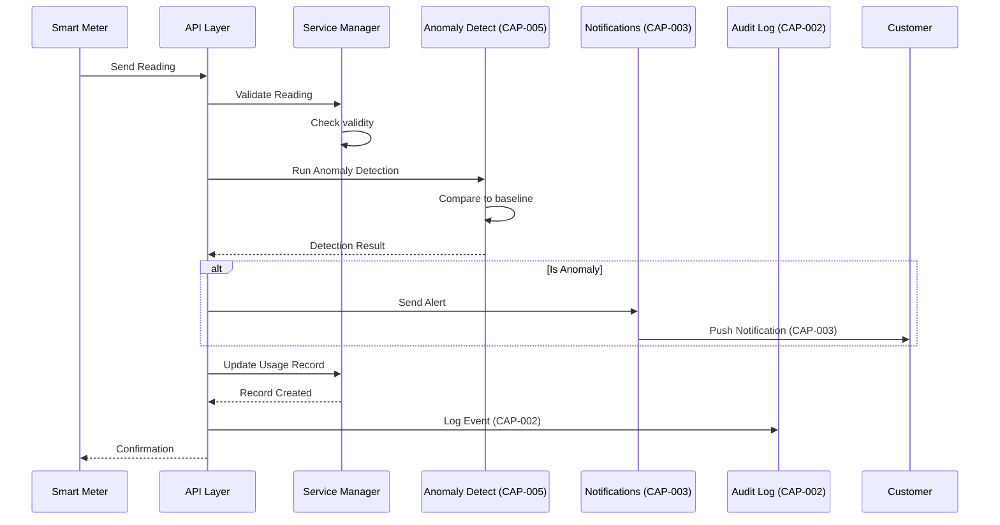

# US-004: Record Meter Reading

## Story

**As a** residential customer  
**I want** to view and understand my water meter readings  
**So that** I can monitor my consumption and identify usage patterns

## Acceptance Criteria

- [ ] Customer can view current meter reading
- [ ] Customer can see historical readings with timestamps
- [ ] System calculates daily/weekly/monthly consumption
- [ ] System detects unusual usage spikes (CAP-005)
- [ ] System notifies customer of anomalies (CAP-003)
- [ ] Smart meter readings are updated automatically every hour
- [ ] Customer can export consumption reports
- [ ] System emits MeterReadingRecorded domain event
- [ ] System creates audit log entry (CAP-002)
- [ ] Bill calculations are based on verified readings

## Dependencies

### Required Capabilities
| Capability | Purpose | Status |
|------------|---------|--------|
| CAP-001: Authentication | Verify customer identity | ✅ Available |
| CAP-002: Audit Logging | Log reading event | ✅ Available |
| CAP-003: Real-time Notifications | Notify of anomalies | 🎯 Planned |
| CAP-005: Anomaly Detection | Detect unusual usage | ✅ Available |

### Maps to Use Cases
- **UC-013: Record Meter Reading** - Primary use case
  - Validates meter reading is legitimate
  - Calculates consumption
  - Detects anomalies
  - Transitions usage record

### Implemented By Roadmap
- **ROAD-016: Meter Reading** - Planned implementation

## BDD Scenarios

Feature file: `stack-tests/features/api/water-service/04_meter_reading.feature`

```gherkin
@US-004 @CAP-001 @CAP-002 @CAP-003 @CAP-005 @ROAD-016
Feature: Record Meter Reading
  As a residential customer
  I want to view my meter readings
  So that I can understand my water consumption

  Background:
    Given a registered customer "John Smith"
    And "John Smith" is authenticated (CAP-001)
    And "John Smith" has an active smart meter
    And a meter reading service exists

  Scenario: Successfully record smart meter reading
    When the smart meter transmits reading "12450" gallons
    Then the reading should be recorded
    And a MeterReading record should be created with timestamp
    And consumption should be calculated from previous reading
    And anomaly detection should run (CAP-005)
    And a MeterReadingRecorded Domain Event should be published
    And an audit log entry should be created (CAP-002)
    And the customer dashboard should update

  Scenario: Detect and alert on anomalous usage
    Given the customer's normal daily usage is "50" gallons
    When the smart meter reports "200" gallons in one day
    Then the anomaly detection should trigger (CAP-005)
    And the customer should receive notification (CAP-003)
    And the notification should explain the spike
    And the reading should be flagged for review

  Scenario: Reject implausible meter reading
    Given the last reading was "10000" gallons
    When a reading of "5000" gallons is submitted
    Then the reading should fail validation
    And the error should reference business rule "METER-001"
    And no consumption record should be created
```

## Flow Diagram



## Technical Notes

### API Endpoint
```http
POST /api/meters/{meterId}/readings
Authorization: Bearer {apiKey}
Content-Type: application/json

{
  "reading": "12450",
  "unit": "gallons",
  "timestamp": "2026-01-31T10:00:00Z"
}
```

### Response
```json
{
  "readingId": "read_abc123",
  "meterId": "meter_def456",
  "reading": "12450",
  "consumption": "100",
  "isAnomaly": false,
  "recordedAt": "2026-01-31T10:00:00Z"
}
```

### State Transitions
```
RECORDED ──process()──▶ ANALYZED
   │
   └── anomaly ──▶ FLAGGED
```

## Verification

```bash
# Run BDD tests for this story (once implemented)
just bdd-tag @US-004

# Run meter reading tests
just bdd-roadmap ROAD-016

# Test all anomaly detection scenarios
just bdd-tag @CAP-005
```

## Related Documentation

- [UC-013: Record Meter Reading](../ddd/07-use-cases#uc-013-record-meter-reading)
- [CAP-001: Authentication](../capabilities/CAP-001-authentication)
- [CAP-002: Audit Logging](../capabilities/CAP-002-audit-logging)
- [CAP-003: Real-time Notifications](../capabilities/CAP-003-real-time-notifications)
- [CAP-005: Anomaly Detection](../capabilities/CAP-005-anomaly-detection)
- [ROAD-016: Meter Reading](../roads/ROAD-016)

---

**ID**: US-004 | **Actor**: Customer | **Status**: Planned 🎯
