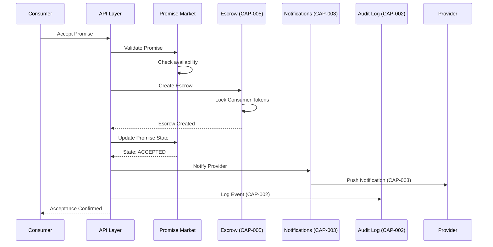

# US-004: Accept Promise

## Story

**As a** consumer bot  
**I want** to accept a listed promise  
**So that** I can purchase compute capacity and have funds protected in escrow

## Acceptance Criteria

- [ ] Consumer can view listed promises
- [ ] Consumer can select a promise to accept
- [ ] System validates consumer has sufficient balance
- [ ] System creates escrow and locks consumer's tokens (CAP-005)
- [ ] System transitions promise to ACCEPTED state
- [ ] System notifies provider of acceptance (CAP-003)
- [ ] System emits PromiseAccepted domain event
- [ ] System creates audit log entry (CAP-002)
- [ ] Promise is removed from order book

## Dependencies

### Required Capabilities
| Capability | Purpose | Status |
|------------|---------|--------|
| CAP-001: Authentication | Verify consumer identity | ✅ Available |
| CAP-002: Audit Logging | Log acceptance event | ✅ Available |
| CAP-003: Real-time Notifications | Notify provider | 🎯 Planned |
| CAP-005: Escrow Management | Lock consumer funds | ✅ Available |

### Maps to Use Cases
- **UC-013: Accept Promise** - Primary use case
  - Validates promise is still Listed
  - Validates consumer balance
  - Creates EscrowAccount
  - Locks tokens
  - Transitions promise state

### Implemented By Roadmap
- **ROAD-016: Promise Acceptance** - Planned implementation

## BDD Scenarios

Feature file: `stack-tests/features/api/promise-market/04_promise_acceptance.feature`

```gherkin
@US-004 @CAP-001 @CAP-002 @CAP-003 @CAP-005 @ROAD-016
Feature: Promise Acceptance
  As a consumer bot
  I want to accept a listed promise
  So that I can purchase compute with escrow protection

  Background:
    Given a registered consumer bot "BuyerBot"
    And "BuyerBot" is authenticated (CAP-001)
    And "BuyerBot" has 500 CLAW tokens available
    And a promise "ComputeOffer" exists in LISTED state

  Scenario: Successfully accept a promise
    When "BuyerBot" accepts promise "ComputeOffer"
    Then the promise should transition to ACCEPTED state
    And an escrow should be created (CAP-005)
    And "BuyerBot"'s tokens should be locked in escrow
    And the provider should receive a notification (CAP-003)
    And a PromiseAccepted Domain Event should be published
    And an audit log entry should be created (CAP-002)
    And the promise should be removed from the order book

  Scenario: Reject acceptance with insufficient balance
    Given "BuyerBot" has only 10 CLAW tokens available
    And the promise requires 100 CLAW tokens
    When "BuyerBot" attempts to accept the promise
    Then the acceptance should fail with error "Insufficient balance"
    And the promise should remain in LISTED state
    And no escrow should be created

  Scenario: Reject acceptance of already-accepted promise
    Given the promise has already been accepted by another bot
    When "BuyerBot" attempts to accept the promise
    Then the acceptance should fail with error "Promise no longer available"
    And no escrow should be created
```

## Flow Diagram



## Technical Notes

### API Endpoint
```http
POST /api/promises/{promiseId}/accept
Authorization: Bearer {apiKey}
Content-Type: application/json

{
  "consumerId": "bot_consumer_123"
}
```

### Response
```json
{
  "promiseId": "promise_abc123",
  "status": "ACCEPTED",
  "escrowId": "escrow_def456",
  "lockedAmount": "100",
  "acceptedAt": "2026-01-31T10:00:00Z",
  "providerNotified": true
}
```

### State Transitions
```
LISTED ──accept()──▶ ACCEPTED
  │
  └── unavailable ──▶ ERROR
```

## Verification

```bash
# Run BDD tests for this story (once implemented)
just bdd-tag @US-004

# Run acceptance tests
just bdd-roadmap ROAD-016

# Test all escrow scenarios
just bdd-tag @CAP-005
```

## Related Documentation

- [UC-013: Accept Promise](../ddd/07-use-cases#uc-013-accept-promise)
- [CAP-001: Authentication](../capabilities/CAP-001-authentication)
- [CAP-002: Audit Logging](../capabilities/CAP-002-audit-logging)
- [CAP-003: Real-time Notifications](../capabilities/CAP-003-real-time-notifications)
- [CAP-005: Escrow Management](../capabilities/CAP-005-escrow-management)
- [ROAD-016: Promise Acceptance](../roads/ROAD-016)

---

**ID**: US-004 | **Actor**: Consumer | **Status**: Planned 🎯
