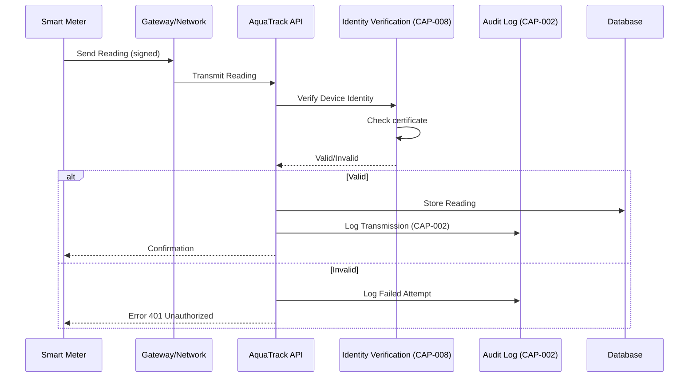

# US-010: Smart Meter Integration

## Story

**As a** treatment operator  
**I want** to integrate third-party IoT systems and smart meters with AquaTrack  
**So that** water utilities can leverage advanced metering infrastructure for real-time monitoring

## Acceptance Criteria

- [ ] Third-party IoT devices can authenticate with AquaTrack
- [ ] Devices can transmit meter readings in standard format
- [ ] System validates device identity (CAP-008)
- [ ] System accepts readings only from authorized devices
- [ ] Devices receive response confirmation
- [ ] Meter data is encrypted in transit
- [ ] System supports multiple meter types (analog, digital, smart)
- [ ] Device identity is included in audit logs (CAP-002)
- [ ] Integration token expires after configured period

## Dependencies

### Required Capabilities
| Capability | Purpose | Status |
|------------|---------|--------|
| CAP-008: Device Identity Verification | Verify meter identity | 🎯 Planned |
| CAP-001: Authentication | Device API keys | ✅ Available |
| CAP-002: Audit Logging | Log all meter transmissions | ✅ Available |

### Maps to Use Cases
- **UC-025: Integrate Smart Meters** - Primary use case
  - Device authentication
  - Reading transmission
  - Identity verification

### Implemented By Roadmap
- **ROAD-043: Smart Meter Integration Platform** - Complete implementation

## BDD Scenarios

Feature file: `stack-tests/features/api/water-service/06_smart_meter_integration.feature`

```gherkin
@US-010 @CAP-008 @CAP-001 @ROAD-043
Feature: Smart Meter Integration
  As a treatment operator
  I want to integrate smart meters
  So that meters automatically transmit readings

  Background:
    Given the Water Service context is initialized
    And a third-party metering system is registered
    And smart meter "MTR-001" is paired with customer account

  Scenario: Smart meter transmits reading
    Given "MTR-001" wants to send consumption reading
    When the meter sends reading with device certificate:
      """
      {
        "meterId": "MTR-001",
        "reading": "12450",
        "timestamp": "2026-01-31T10:00:00Z",
        "signature": "signed_with_device_key"
      }
      """
    Then the system should verify device identity (CAP-008)
    And the reading should be accepted and stored
    And the meter should receive confirmation response
    And the reading should be included in audit log (CAP-002)
    And customer's usage should be updated

  Scenario: Reject unauthorized meter
    Given a meter with invalid device certificate
    When the meter attempts to transmit reading
    Then the system should reject the reading
    And the error should indicate "Invalid device identity"
    And the error should reference business rule "METER-001"
    And no reading should be stored
    And incident should be logged for security review

  Scenario: Meter integration lifecycle
    Given a new smart meter is installed
    When it's paired with a customer account
    Then the system should generate device credentials
    And the meter should receive integration token
    And the token should expire after 90 days
    And the meter should request renewal before expiry
    And system should validate renewal request
```

## Flow Diagram



## Technical Notes

### Meter Reading Submission Endpoint
```http
POST /api/devices/readings
X-Device-Id: MTR-001
X-Device-Signature: signature_with_cert_key
Content-Type: application/json

Request:
{
  "meterId": "MTR-001",
  "reading": "12450",
  "unit": "gallons",
  "timestamp": "2026-01-31T10:00:00Z"
}

Response (Success):
{
  "status": "accepted",
  "readingId": "read_001",
  "customerId": "cust_abc123",
  "processedAt": "2026-01-31T10:00:01Z"
}

Response (Unauthorized):
{
  "status": 401,
  "error": "Invalid device identity",
  "message": "Device certificate expired or invalid"
}
```

### Device Pairing Endpoint
```http
POST /api/devices/pair
Authorization: Bearer {admin_api_key}
Content-Type: application/json

Request:
{
  "meterId": "MTR-001",
  "customerId": "cust_abc123",
  "meterType": "smart_meter",
  "manufacturer": "AquaSense"
}

Response:
{
  "deviceId": "dev_001",
  "integrationToken": "aqdev_...",
  "expiresAt": "2026-04-30T23:59:59Z",
  "publicKey": "-----BEGIN CERTIFICATE-----..."
}
```

## Verification

```bash
# Run BDD tests for this story
just bdd-tag @US-010

# Test device authentication flow
just test-device-auth

# Test meter integration
just test-meter-integration
```

## Related Documentation

- [CAP-008: Device Identity Verification](../capabilities/CAP-008-device-identity-verification)
- [CAP-001: Authentication](../capabilities/CAP-001-authentication)
- [CAP-002: Audit Logging](../capabilities/CAP-002-audit-logging)
- [ROAD-043: Smart Meter Integration](../roads/ROAD-043)
- [UC-025: Integrate Smart Meters](../ddd/07-use-cases#uc-025-integrate-smart-meters)

---

**ID**: US-010 | **Actor**: Treatment Operator | **Status**: Planned 🎯
