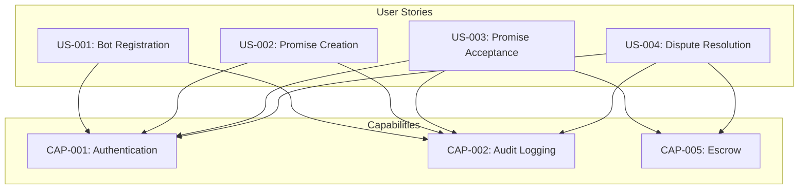
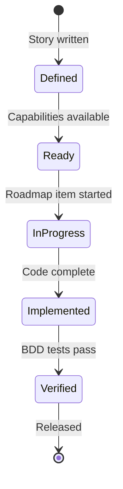

# User Stories

User stories describe **user needs** that depend on system capabilities. Each story follows the format:

> **As a** [persona]  
> **I want** [goal]  
> **So that** [benefit]  
> **Depends on** [capabilities]

## What is a User Story?

A user story captures a specific user need:
- Has a clear persona (who)
- Describes a goal (what)
- Explains the benefit (why)
- **Depends on specific capabilities** (how it's enabled)
- Maps to one or more use cases
- Implemented by roadmap items



## Story Catalog by Actor

### Bot Developer
Stories for developers registering and managing bots:

- [US-001: Register New Bot](./US-001-bot-registration) - Create bot account
- [US-005: View Bot Profile](./US-005-view-profile) - See bot details and reputation
- [US-006: Update Bot Profile](./US-006-update-profile) - Edit bot information
- [US-007: Rotate API Key](./US-007-rotate-api-key) - Security key rotation

### Provider Bot
Stories for bots offering compute capacity:

- [US-002: Create Promise](./US-002-promise-creation) - Offer compute capacity
- [US-008: List Promise](./US-008-list-promise) - Make promise visible
- [US-009: Execute Promise](./US-009-execute-promise) - Deliver compute service
- [US-010: Cancel Promise](./US-010-cancel-promise) - Withdraw unaccepted promise

### Consumer Bot
Stories for bots purchasing compute capacity:

- [US-003: Browse Promises](./US-003-browse-promises) - Search and filter listings
- [US-004: Accept Promise](./US-004-promise-acceptance) - Purchase compute capacity
- [US-011: Track Execution](./US-011-track-execution) - Monitor promise progress
- [US-012: Raise Dispute](./US-012-raise-dispute) - Challenge failed delivery

### Platform Admin
Stories for administrative functions:

- [US-013: Review Audit Logs](./US-013-review-audit-logs) - System oversight
- [US-014: Resolve Dispute](./US-014-resolve-dispute) - Arbitration
- [US-015: View Analytics](./US-015-view-analytics) - Platform metrics

## Dependency Matrix

| Story | Persona | Capabilities Required | Use Cases | Roadmap |
|-------|---------|----------------------|-----------|---------|
| US-001 | PER-001 | CAP-001, CAP-002 | UC-001 | ROAD-004 |
| US-002 | PER-002 | CAP-001, CAP-002, CAP-005 | UC-010 | ROAD-012 |
| US-003 | PER-003 | CAP-001 | UC-012 | ROAD-015 |
| US-004 | PER-003 | CAP-001, CAP-002, CAP-005 | UC-013 | ROAD-016 |
| US-005 | PER-002 | CAP-005 | UC-020 | ROAD-038 |
| US-006 | PER-002 | CAP-001, CAP-006 | UC-021 | ROAD-039 |
| US-007 | PER-002 | CAP-001, CAP-006, CAP-007 | UC-022 | ROAD-042 |
| US-008 | PER-001 | CAP-007 | UC-023 | ROAD-042 |
| US-009 | PER-002 | CAP-003, CAP-007 | UC-024 | ROAD-042 |
| US-010 | PER-002 | CAP-001, CAP-008 | UC-025 | ROAD-043 |

## Story States

Stories progress through states:



## Story Format

Each story document includes:

```markdown
---
id: US-XXX
title: Story Title
persona: [PER-001|PER-002|PER-003|PER-004|PER-005]
status: [defined|ready|in-progress|implemented|verified]
capabilities: [CAP-001, CAP-002, ...]
use_cases: [UC-XXX, ...]
roadmap: [ROAD-XXX, ...]
---

## Story
As a [actor], I want [goal], so that [benefit].

## Acceptance Criteria
- [ ] Criteria 1
- [ ] Criteria 2

## Dependencies
- **Capabilities**: CAP-001, CAP-002
- **Use Cases**: UC-XXX
- **Roadmap**: ROAD-XXX

## BDD Scenarios
Link to feature files covering this story.
```

## Creating New Stories

1. **Identify the actor** - Who needs this?
2. **Define the goal** - What do they want to do?
3. **Explain the benefit** - Why does it matter?
4. **Map capabilities** - What system abilities are needed?
5. **Link to use cases** - Which DDD use cases cover this?
6. **Create roadmap item** - Plan the implementation

---

**Related**: [Capabilities](../capabilities/index) • [Use Cases](../ddd/07-use-cases) • [Roadmap](../ROADMAP)
