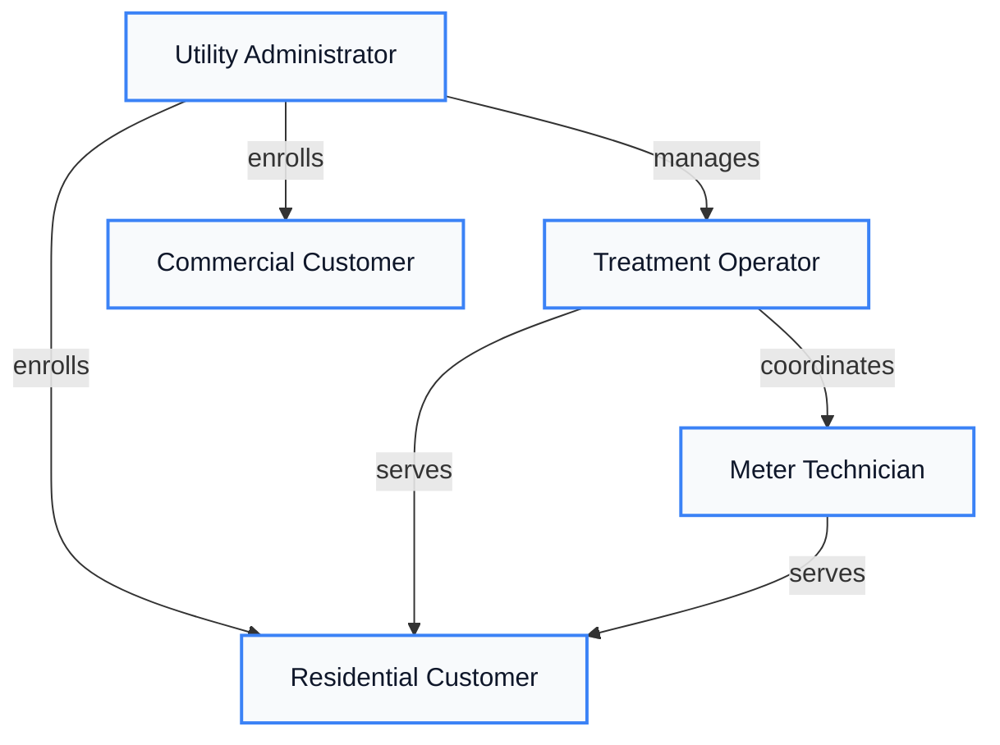

# Users & Personas

AquaTrack serves a diverse set of users across municipal water infrastructure. This section defines who uses the platform, what they need, and how their stories drive feature development.

---

## At a Glance

  

    
5

    
User Types

    
Distinct personas

  

  
  

    
10

    
User Stories

    
Defined workflows

  

  
  

    
4

    
Approved

    
Production-ready personas

  

  
  

    
8

    
Capabilities Used

    
Across all personas

  

---

## User Types

  

    

      
Utility Administrator

      Approved
    

    

      Manages water utility operations and customer accounts. Enrolls customers, manages service areas, and oversees platform operations.
    

    

      

        Archetype
        
Creator

      

      

        Frequency
        
Daily

      

      

        Skill Level
        
Intermediate

      

    

    

      <strong>Stories:</strong> Customer Enrollment, Service Activation, Service Area Lookup
    

  

  

    

      
Treatment Operator

      Approved
    

    

      Manages water treatment and distribution. Handles service activation, monitors usage patterns, and coordinates field operations.
    

    

      

        Archetype
        
Operator

      

      

        Frequency
        
Daily

      

      

        Skill Level
        
Advanced

      

    

    

      <strong>Stories:</strong> Service Activation, Usage History, Service Areas, Communication, Smart Meters
    

  

  

    

      
Residential Customer

      Approved
    

    

      Household consumers of water services. Monitor consumption, request service, and manage their water accounts through mobile app.
    

    

      

        Archetype
        
Consumer

      

      

        Frequency
        
Monthly

      

      

        Skill Level
        
Beginner

      

    

    

      <strong>Stories:</strong> Meter Reading, Service Requests, Technician Dispatch
    

  

  

    

      
Commercial Customer

      Approved
    

    

      Business and commercial water consumers. Require detailed usage analytics, bulk reporting, and multi-location account management.
    

    

      

        Archetype
        
Administrator

      

      

        Frequency
        
Weekly

      

      

        Skill Level
        
Intermediate

      

    

    

      <strong>Stories:</strong> Usage History, Service Area Lookup
    

  

  

    

      
Meter Technician

      Draft
    

    

      Field technicians who install, maintain, and repair water meters. Manage dispatch schedules and integrate with smart meter hardware.
    

    

      

        Archetype
        
Integrator

      

      

        Frequency
        
Daily

      

      

        Skill Level
        
Advanced

      

    

    

      <strong>Stories:</strong> Service Activation, Technician Dispatch, Smart Meter Integration
    

  

---

## How Users Interact

---

## User Stories Overview

Each user story follows the format: **As a** [persona], **I want** [goal], **so that** [benefit].

### Story Coverage by User Type

  

| Story | Title | Persona | Status |
|-------|-------|---------|--------|
| US-001 | Enroll New Customer | Administrator | Implemented |
| US-002 | Activate Water Service | Operator | Implemented |
| US-004 | Record Meter Reading | Res. Customer | Implemented |
| US-005 | View Usage History | Operator | Defined |
| US-006 | Service Area Lookup | Operator | Defined |

  

  

| Story | Title | Persona | Status |
|-------|-------|---------|--------|
| US-007 | Submit Service Request | Res. Customer | Defined |
| US-008 | Technician Dispatch | Administrator | Defined |
| US-009 | Customer Communication | Operator | Defined |
| US-010 | Smart Meter Integration | Operator | Defined |

  

### Story Progress

  

    

      Implemented
      3 of 10 (30%)
    

    

      

    

  

  
  

    

      Defined
      7 of 10 (70%)
    

    

      

    

  

---

## Capability Matrix

Which capabilities each user type depends on:

| Capability | Administrator | Operator | Res. Customer | Com. Customer | Technician |
|:-----------|:---:|:---:|:---:|:---:|:---:|
| **CAP-001** Authentication | * | * | * | * | * |
| **CAP-002** Audit Logging | * | * | * | * | |
| **CAP-003** Notifications | | * | * | * | |
| **CAP-004** Meter Access | | | * | | * |
| **CAP-005** Analytics | | * | | * | |
| **CAP-006** Service Areas | * | * | | * | |
| **CAP-007** Field Ops | | * | | | * |
| **CAP-008** Hardware | | * | | | * |

---

## Persona-to-Team Mapping {#persona-team-mapping}

Each persona is primarily served by one product team, with secondary teams providing supporting functionality.

| Persona | Primary Team | Secondary Teams | Primary Context |
|:--------|:-------------|:----------------|:----------------|
| [PER-001 Utility Admin](/docs/personas/PER-001-utility-administrator) | **[Customer Services](/docs/teams-overview#customer-services)** | Finance | Customer Account Mgmt |
| [PER-002 Treatment Operator](/docs/personas/PER-002-treatment-operator) | **[Operations](/docs/teams-overview#operations)** | Field Services | Usage Tracking |
| [PER-003 Residential Customer](/docs/personas/PER-003-residential-customer) | **[Customer Services](/docs/teams-overview#customer-services)** | Operations, Finance | Customer Account Mgmt |
| [PER-004 Commercial Customer](/docs/personas/PER-004-commercial-customer) | **[Customer Services](/docs/teams-overview#customer-services)** | Operations, Finance | Customer Account Mgmt |
| [PER-005 Meter Technician](/docs/personas/PER-005-meter-technician) | **[Field Services](/docs/teams-overview#field-services)** | Operations | Meter Operations |

---

## Persona-to-Context Mapping {#persona-context-mapping}

How each persona interacts with each bounded context:

| Persona | Customer Account Mgmt | Usage Tracking | Billing & Payments | Meter Operations |
|:--------|:---:|:---:|:---:|:---:|
| PER-001 Admin | Manages accounts | Reviews logs | Oversees billing | Approves work orders |
| PER-002 Operator | -- | Monitors readings | -- | Coordinates maintenance |
| PER-003 Residential | Enrolls, manages profile | Views usage history | Pays invoices | Requests service |
| PER-004 Commercial | Manages fleet accounts | Monitors consumption | Manages payments | Requests service |
| PER-005 Technician | -- | Records readings | -- | Installs, calibrates meters |

---

## User Story Traceability {#user-story-traceability}

Complete traceability from user story through to bounded context, capabilities, team ownership, and BDD coverage:

| User Story | Context | Capabilities | Owning Team | Est. BDD Scenarios |
|:-----------|:--------|:-------------|:------------|:---:|
| [US-001](/docs/user-stories/US-001-customer-enrollment) Customer Enrollment | Customer Acct Mgmt | CAP-001, CAP-002, CAP-006 | Customer Services | ~10 |
| [US-002](/docs/user-stories/US-002-service-activation) Service Activation | Customer Acct Mgmt | CAP-001, CAP-002, CAP-006 | Customer Services | ~8 |
| [US-004](/docs/user-stories/US-004-meter-reading) Meter Reading | Usage Tracking | CAP-002, CAP-007, CAP-008 | Operations | ~12 |
| [US-005](/docs/user-stories/US-005-view-usage-history) View Usage History | Usage Tracking | CAP-001, CAP-002, CAP-005 | Operations | ~10 |
| [US-006](/docs/user-stories/US-006-service-area-lookup) Service Area Lookup | Customer Acct Mgmt | CAP-006 | Customer Services | ~6 |
| [US-007](/docs/user-stories/US-007-submit-service-request) Submit Service Request | Meter Operations | CAP-001, CAP-002, CAP-005 | Field Services | ~8 |
| [US-008](/docs/user-stories/US-008-technician-dispatch) Technician Dispatch | Meter Operations | CAP-002, CAP-007 | Field Services | ~10 |
| [US-009](/docs/user-stories/US-009-customer-communication) Customer Comms | Customer Acct Mgmt | CAP-001, CAP-003, CAP-005 | Customer Services | ~8 |
| [US-010](/docs/user-stories/US-010-smart-meter-integration) Smart Meter Integration | Meter Operations | CAP-007, CAP-008 | Field Services | ~12 |

---

## Compliance Coverage {#compliance-coverage}

### BDD Coverage by Persona

Estimated BDD scenario coverage testing each persona's workflows:

  

    
PER-001 Admin

    
~25

    
scenarios

  

  

    
PER-002 Operator

    
~35

    
scenarios

  

  

    
PER-003 Residential

    
~45

    
scenarios

  

  

    
PER-004 Commercial

    
~30

    
scenarios

  

  

    
PER-005 Technician

    
~25

    
scenarios

  

### NFR Relevance by Persona

Which non-functional requirements most affect each persona's experience:

| NFR Category | PER-001 Admin | PER-002 Operator | PER-003 Residential | PER-004 Commercial | PER-005 Technician |
|:-------------|:---:|:---:|:---:|:---:|:---:|
| **Performance** (NFR-PERF) | Dashboard speed | Real-time feeds | Page load time | API response time | Field app speed |
| **Security** (NFR-SEC) | Admin auth, audit | Operational auth | Session security | API key auth | Device auth |
| **Reliability** (NFR-REL) | System uptime | Feed availability | Portal uptime | API availability | Offline capability |
| **Accessibility** (NFR-A11Y) | -- | -- | WCAG 2.1 AA | WCAG 2.1 AA | Mobile-first |

### ADR Impact on User Experience

| ADR | Decision | User Impact |
|:----|:---------|:-----------|
| ADR-004 | Next.js Frontend | Responsive UI for all personas, SSR for SEO |
| ADR-009 | API Key Auth | Secure session management for PER-001, PER-002 |
| ADR-019 | Tailwind CSS | Consistent visual design across all user interfaces |
| ADR-020 | shadcn/ui Components | Accessible, keyboard-navigable UI for PER-003, PER-004 |
| ADR-021 | Clerk Auth | Streamlined login for residential/commercial customers |

---

## Next Steps

- [Personas Index](./personas/index) -- Full persona catalog with detailed profiles
- [User Stories Catalog](./user-stories/index) -- Complete user story reference
- [Bounded Contexts](./ddd/bounded-contexts) -- How the domain is structured
- [Use Cases](./ddd/use-cases) -- Technical use cases derived from stories

---

**Related**: [Teams & Ownership](./teams-overview) | [System Architecture](./system-overview) | [Capabilities](./capabilities/) | [BDD Feature Index](./bdd/feature-index) | [Domain Overview](./ddd/domain-overview) | [ADR Catalog](./adr/README) | [NFR Index](./nfr/)
